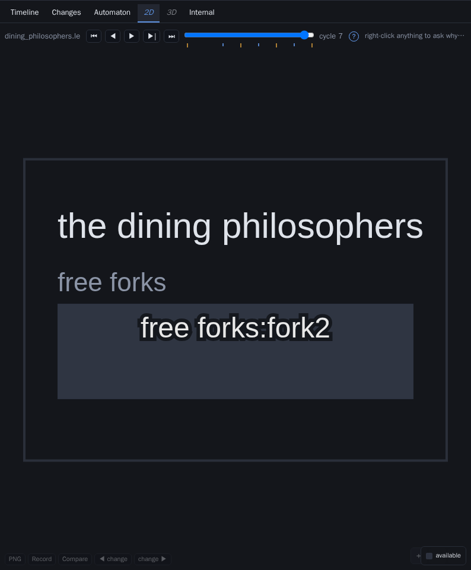
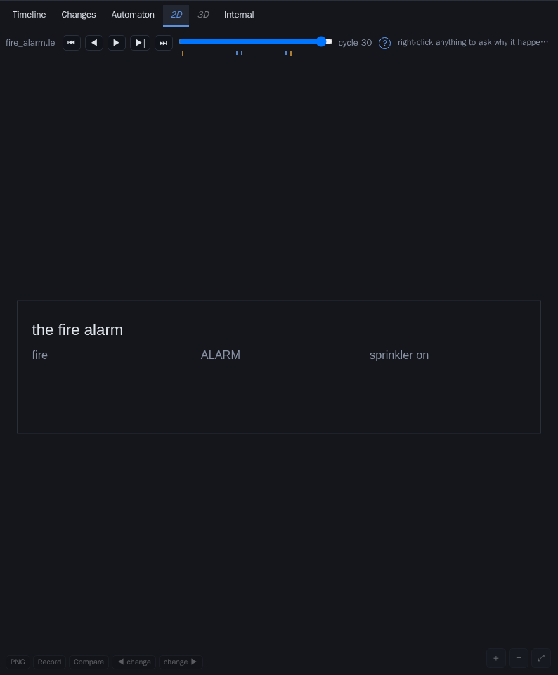
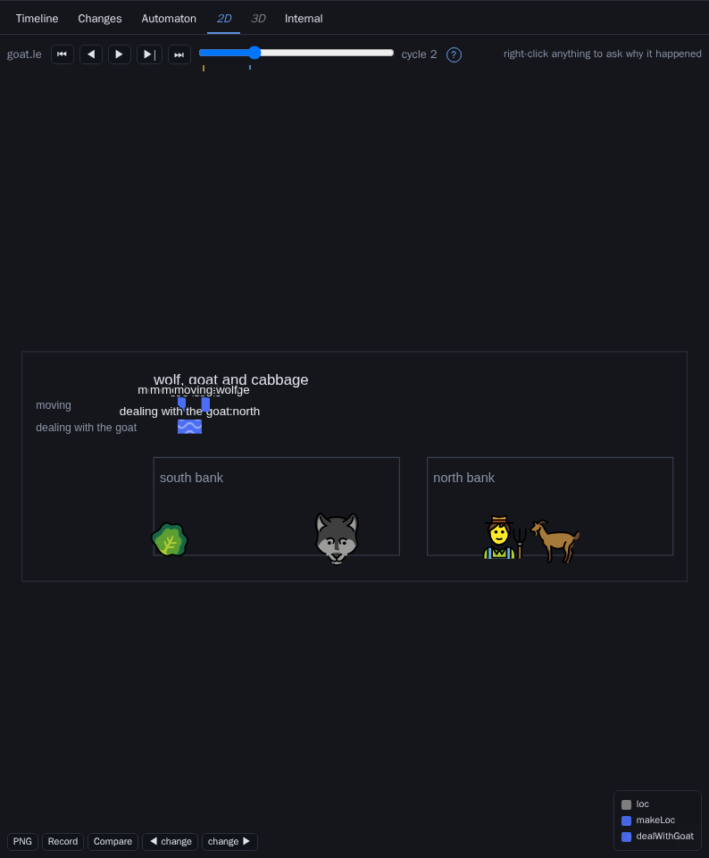
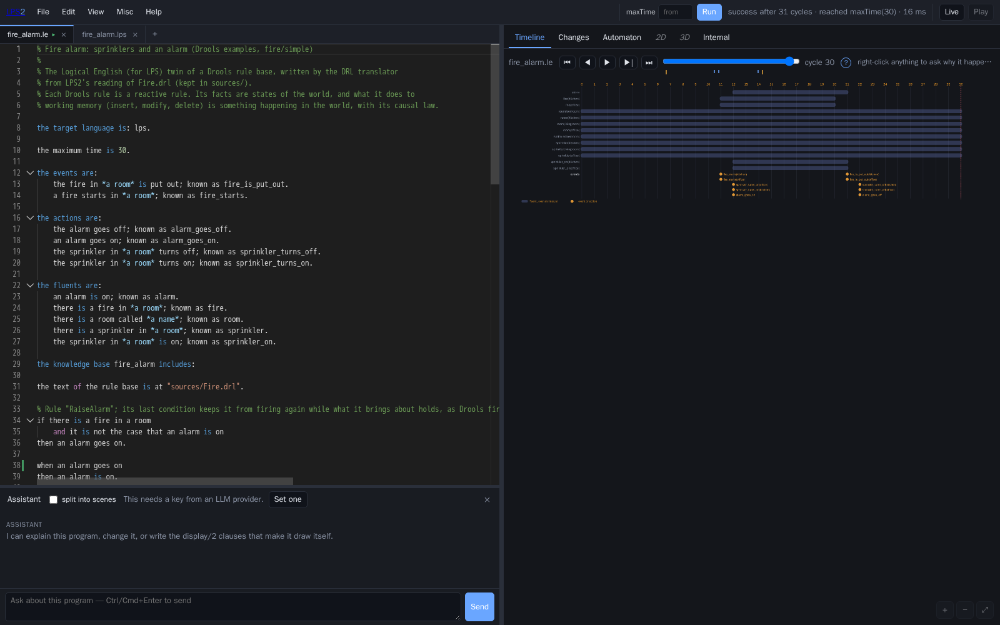
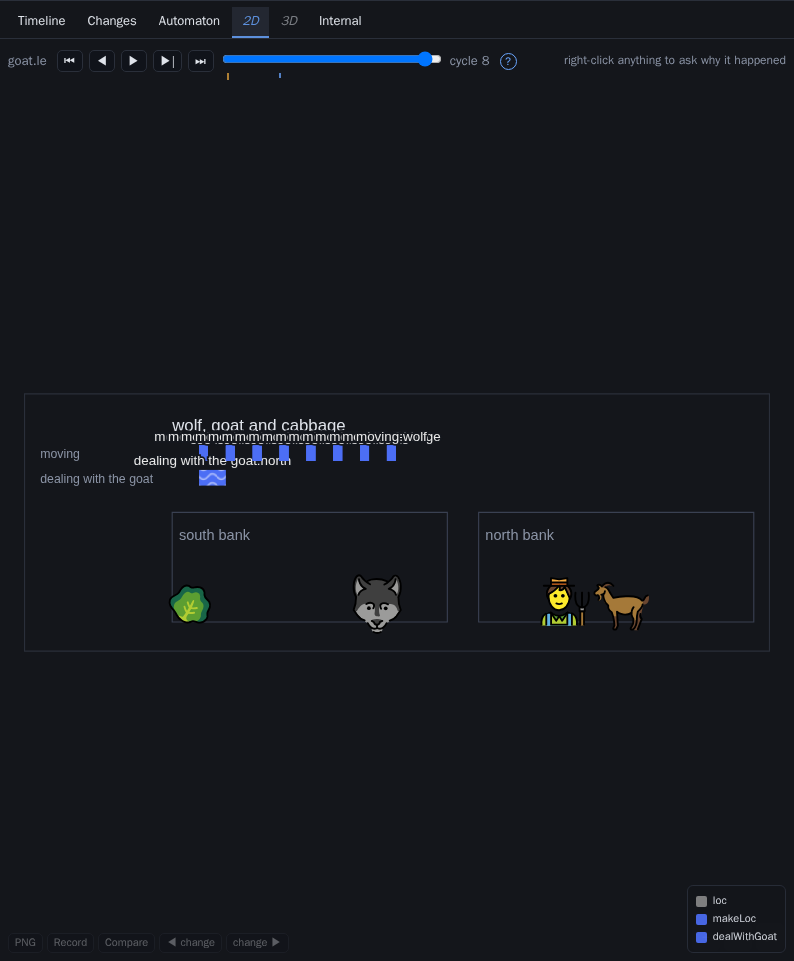

# A teacher's review of the LPS2 animations

*Kind: review · Author: a visiting reviewer preparing a course · 2026-09-20 ·
Against: LPS2 at `docs/project/plans/AnimationPlan.md` §§4–8 (all built)*

> **Note added afterwards.** All twelve requirements below were acted on; what
> each one changed is recorded in `docs/project/plans/AnimationPlan.md` §9. The
> review is left exactly as it was written.

I am preparing a lesson on **reasoning about change** — events, fluents,
constraints, and what a run of a program *means* — and I came to LPS2 because
its documentation promises something rare: pictures that are computed from the
program rather than drawn by hand, and a run laid out as a strip of scenes. This
is a review of that promise, made by using the system as a student would.

**What I did.** I ran the IDE (`./lps ide`, with `LPS_LE2_LIB` so that Logical
English compiles, and with OpenAI/Groq keys so the assistant works), and worked
through five packaged examples written in the friendly Logical English syntax —
three classics and two conversions from other systems:

| Program | Why I chose it |
|---|---|
| `examples/le/goat.le` | the wolf, goat and cabbage: the most famous puzzle in the literature, and the only example with **composite events** |
| `examples/le/bank_transfer.le` | the canonical contract: an obligation that fires on a transfer |
| `examples/le/dining_philosophers.le` | the concurrency classic: five forks, five philosophers |
| `examples/migration/drools/fire_alarm/fire_alarm.le` | a **Drools** rule base, converted: rules as reactive rules, working memory as the world |
| `examples/migration/solidity/vault/vault_oracle.le` | a **Solidity** contract, converted: a collateral vault reading a price feed |

For each one I opened it, ran it, read the timeline, the changes and the
automaton, asked *why* of things on the screen, then animated it in two and
three dimensions, and looked at each picture both as a single scene and with
**split into scenes** on. Everything below is what I saw; every figure is a
screenshot of the pane as it was.

---

## 1. What is already very good

I want to be clear about this before I complain, because the foundations here
are better than in anything else I have taught with.

- **The keyframes are the right idea, and they work.** A 31-cycle run of the
  fire alarm is five pictures; an 11-cycle bank transfer is ten; and the
  pictures are exactly the moments where something happened. My students spend
  their time reading, not scrubbing.
- **The strip reads as a story** (figure 7). The fire starts, the alarm goes on,
  the sprinklers come on, the fire goes out, the alarm goes off — visible at
  thumbnail size, without reading a single term.
- **The model never writes a coordinate.** This is the single best decision in
  the design, and it shows: nothing overlaps *positionally*, ever.
- **Patterns and 3D objects are a real gain.** The Solidity vault (figure 6) —
  green brickwork for collateral, red hatching for debt — is a picture I would
  put on a slide as it stands.
- **The migration twins animate like anything else.** A Drools rule base and a
  Solidity contract drawn by the same machinery as a 1970s AI puzzle is a
  genuinely teachable point about what LPS *is*.

## 2. What must be fixed before I could teach with it

### R1 — One box for many things: the pictures are *wrong*, not merely thin
**Severity: blocks a lesson.**



Five forks are free. The picture says **`free forks: fork2`** — one box, one
value, the other four painted on top of each other underneath it (you can see
their ghosts). A student reading this learns something false.

The same failure, three times over:

- **`bank_transfer`** — two balances, one box (figure 2). Each frame of the
  strip shows a single `balance:90` and the reader cannot tell *whose*.
- **`fire_alarm`** — two rooms on fire, one box, labels colliding into
  `fireOffice`.
- **`dining_philosophers`** — as above.

The cause is structural, not cosmetic: a **gauge** is one box per *template*,
and `display/2` draws only the first solution per subject. But almost every
interesting fluent in a real program is **keyed**: `balance(Who, Amount)`,
`available(Fork)`, `fire(Room)`, `collateral(Account, Amount)`. The plan
grammar has no way to say "one of these per key".

> **Requirement.** A gauge or lamp must be able to say which argument is its
> **key**, and get one box per key value, captioned by the key — exactly as a
> layer already gets one slot per (container, member) pair. The key values are
> in the run; the generator already computes a slot table; this is the same
> arithmetic applied to a row.

### R2 — A lamp that is off leaves a caption with nothing under it
**Severity: blocks understanding.**



That is the fire alarm at the *end* of its run: no fire, no alarm, no
sprinklers. What the pane shows is three captions floating over an empty
rectangle. A reader cannot tell "everything is off" from "the picture is
broken" — and in a lesson about state, "off" is exactly as important as "on".

> **Requirement.** Draw the lamp's **empty socket** in the backdrop: a dim
> outline where the box will be when it holds. Then off looks off.

### R3 — Once you click into a scene, you cannot get back to the strip
**Severity: hurts every session.**



The strip says "click one to open it", and it opens — and then the toolbar
offers `PNG · Record · Compare · ◀ change · change ▶` and nothing about the
strip. The way back is: *find the Assistant panel, open it, tick a checkbox*. I
lost the strip four times before I learned that.

> **Requirement.** The zoom must be reversible where it happened: a
> **◀ Scenes** button in the pane's own toolbar, and the strip's scroll
> position remembered.

### R4 — The strip's switch is in the wrong room
**Severity: hurts discoverability; embarrassing without an API key.**

`split into scenes` lives in the **Assistant** dock, beside *Animate in 2D*.
But the strip has nothing to do with the assistant: it works on hand-written
`display/2` clauses, and it changes what the **2D and 3D panes** draw. Two
consequences:

- it is invisible until you open a panel you have no other reason to open;
- **with no LLM key**, the assistant's head collapses to *"This needs a key
  from an LLM provider · [Set one]"* — and the checkbox is still there, stranded
  beside a message about API keys, with the buttons it was next to gone:



> **Requirement.** Put the control where it acts: in the scene panes' own
> toolbar (one control, still one setting), and in the View menu. Nothing about
> reading a run should live in the assistant's panel.

### R5 — A program written in English is described in Prolog
**Severity: hurts the whole pitch.**

This is the finding I care about most, pedagogically. Logical English's promise
is that a program is a text a lawyer or a domain expert can read. Then the
picture of it says:

```
transfer(fariba,10,bob) · → balance(bob,0) → balance(bob,10), balance(fariba,100) → balance(fariba,90)
```

and the legend says `loc`, `makeLoc`, `dealWithGoat` (figure 9). Every caption,
every transition label, every legend entry and every tooltip is in the internal
syntax — in a document whose own declarations say, in as many words,

```
*an object* is at *a place*; known as loc.
*a payer* transfers *an amount* to *a payee*; known as transfer.
```

The mapping from `transfer(fariba,10,bob)` to *"fariba transfers 10 to bob"* is
sitting in the buffer, three lines above.

> **Requirement.** When the program in the pane is a Logical English document,
> say its terms **in its own words** — in the strip's captions and transitions,
> in the legend, and in the scene tooltips — falling back to the term when no
> template matches. This costs one small reader over the `known as`
> declarations and no round trip to anything.

### R6 — "Animate in 2D" on a Logical English program applies nothing
**Severity: blocks the feature. A one-line bug.**

The assistant writes the picture into the `.lps` **companion** of a `.le`
document — that is the documented design, and the job does produce it. But the
HTTP reply of `assistant_status` carries `status, output, explanation,
new_content, error` and **not `new_companion`**, while the browser's
`pendingEdit` reads exactly `r.new_companion`. So *Apply to editor* appears and
applies nothing to the companion; the 2D tab stays dimmed; nothing happens.

It passes every gate because `tools/ide_check.cjs` **stubs** the reply — with a
`new_companion` field the real server never sends — and `tools/m8a_test.pl`
calls the tool directly, below HTTP.

> **Requirement.** Return `new_companion` from the status operation, and test
> the reply's *shape* against the browser's expectations, not against a mock
> that encodes the intention.

### R7 — A plan that draws nothing is reported as a success
**Severity: blocks the feature for weaker models.**

I asked the system to animate the goat with `gpt-4o-mini`, which is the kind of
model a student's free key gets. Verbatim:

> *I planned the scene — 2 container(s), 4 thing(s) — and wrote it as `display`
> clauses in `goat.lps`. …*
> **Notes on the plan:**
> *a layer was skipped: it needs template, group_var and member_var, and both
> variables must appear in the template
> (`template:"loc(wolf, Where)", member_var:"Object"`)* — **four times**, and
> *the plan has containers but no layer putting anything in them*.

Every layer was skipped. The picture is two empty boxes. The summary says four
things were drawn. The same happened on the fire alarm (`template:"fire(A)"`,
`member_var:"fire"`). With `gpt-4o` the same prompt produced a clean plan — so
this is a *robustness* problem, not a model problem: the system is one careless
model away from a confident lie.

Two things are wrong:

1. **The coverage check reads the plan, not the picture.** `layout_gaps`
   matched `loc/2` from the templates of layers that were *thrown away*, so it
   reported full coverage of a scene that drew nothing.
2. **A skipped shape is a warning, and the turn ends.** The model is never told;
   the user is told the opposite.

> **Requirement.** (a) Measure coverage on what the generator **accepted**, and
> hand the plan back — with the diagnostics — when a discriminating fluent ends
> up undrawn. (b) Do not claim containers and things that were skipped.
> (c) **Forgive the near-misses**, as `promote_stacks` already forgives the
> containers/stack confusion: a layer whose template has a constant where a
> variable was promised (`loc(wolf, Where)`), or a `member_var` that is not one
> of its variables, is a *keyed* shape over the one variable it does have —
> which is R1's new shape, and which is what both models were reaching for.

### R8 — The span lanes are unreadable on the one example that has spans
**Severity: hurts; and it is the feature's showcase.**



The goat is the only packaged program with composite events, and its "moving"
lane is twenty overlapping bars with their labels piled into
`m m m m moving:wolfge`. The reason is that `makeLoc(thing, place)` is recorded
for every thing at every cycle, and most of those acts are **instantaneous**
(start = end): they are not acts at all, they are points.

> **Requirement.** A span lane is for things that *take time*: draw a bar only
> when the act spans cycles, draw an instantaneous one as a tick, and never
> print a label on a bar narrower than the label. (The timeline already lists
> every occurrence for anyone who wants them.)

## 3. What I would also like, in order of how much it would help

### R9 — The 3D thumbnails do not frame their content
In the strip, each 3D frame is photographed with the scene's **declared
camera**, which was chosen for a full pane. In a 220×150 thumbnail the subject
is a few pixels across. Frame each snapshot on what it actually contains.

### R10 — Labels collide in three dimensions
`north` over `goat`, `south bank` over `wolf` (figure 5). Put a container's
label at the edge of its slab rather than at its centre, and lift an object's
label clear of its neighbours.

### R11 — The strip has no toolbar
No PNG of the strip (the one picture I would put in a handout), no legend, no
hover, no right-click *why*. The single scene has all four.

### R12 — Smaller things I noticed
- The transition label between frames wraps mid-word (`transfer(far iba,10,bob)`).
- The events appear twice: once between the frames and again at the head of the
  next caption.
- Every frame repeats the title of the scene; in a strip it is noise.
- Nothing says the strip scrolls sideways when it runs off the pane.
- After *Apply to editor*, the 2D tab stays disabled until the re-run finishes;
  if the re-run fails there is no explanation on the tab.
- `Compare` and `Record` do nothing sensible while the strip is showing.
- The goat's own run stops after one crossing (the picture makes this obvious —
  which is a point *for* the picture, and a question for whoever ported the
  example).

---

## 4. The requirements, in the order I would do them

| # | Requirement | Why now |
|---|---|---|
| R1 | Keyed gauges and lamps — one box per key | the pictures are *wrong* without it |
| R2 | An empty socket for a lamp that is off | "off" must look like off |
| R6 | Return `new_companion` from `assistant_status` | the headline feature does nothing on `.le` |
| R7 | Coverage measured on the generated scene; forgive near-miss plans; do not claim what was skipped | one careless model away from a confident lie |
| R3 | ◀ Scenes: get back from a zoomed frame | lost four times in one session |
| R4 | Move *split into scenes* to the pane toolbar | it is not the assistant's business |
| R5 | Say the terms in the program's own words | the whole point of Logical English |
| R8 | Spans: bars for acts, ticks for instants, no labels on slivers | the showcase example is unreadable |
| R9–R12 | Framing, labels, the strip's toolbar, polish | after the above |

## 5. The lesson I would teach if these were fixed

1. **What a run is** — `bank_transfer`, in the strip: ten pictures, one per
   thing that happened, each captioned in the program's own English.
2. **State versus event** — the fire alarm: lamps for the fluents, the
   transitions between frames for the events; the empty sockets make the
   difference visible.
3. **Concurrency** — the philosophers, with one lamp per fork: five sockets,
   lighting and going dark, is the clearest picture of contention I know.
4. **Acts that take time** — the goat's `dealWithGoat` bar spanning two cycles,
   over the instants inside it.
5. **The same machinery on real systems** — the Drools rule base and the
   Solidity vault, animated by the same four shapes. That is the slide that
   makes the case for LPS to an engineering audience.

*Everything in this review was produced against the working tree of 2026-09-20,
with `LPS_LE2_LIB` pointing at the Logical English checkout and provider keys in
the environment; the scenes were generated by the system's own plan → geometry
path, and the two model runs quoted in R7 are verbatim from `gpt-4o-mini` and
`gpt-4o`.*
