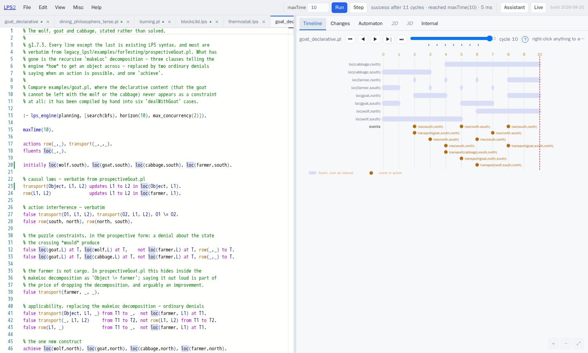
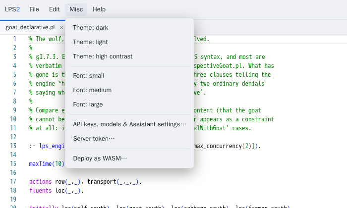
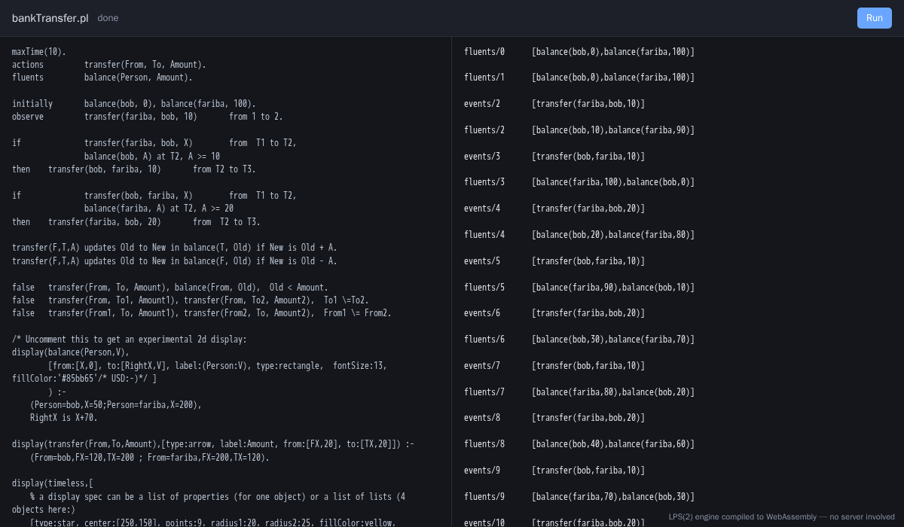
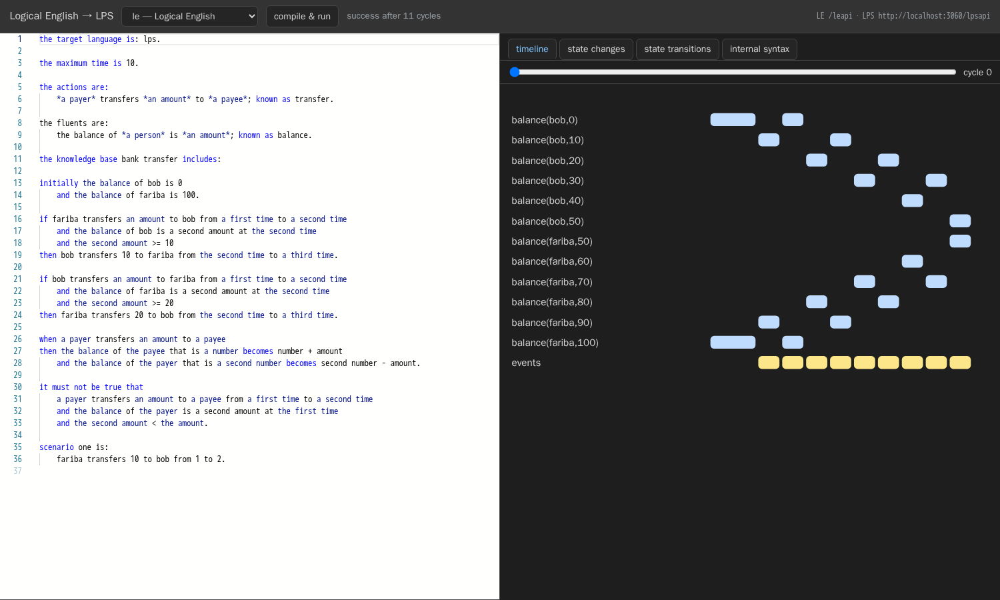

# Introducing LPS2

LPS2 is a new implementation of the LPS engine in SWI-Prolog, together with what
has been built on top of it: a planner, explanations, an editor in a browser
with animation in two and three dimensions, an assistant driven by a language
model, sessions that do not stop, ways in from PDDL and Drools, a version that
runs inside a browser with no server, and two agents — one that plays Minecraft
and one that prevents a language model from authorising its own dangerous
action.

This document is the tour. [`lps_tutorial.md`](lps_tutorial.md) teaches the
language. [`lps_summary.md`](lps_summary.md) is the reference.
[`glossary.md`](glossary.md) defines the terms used here.
[`LPSplusLLM.md`](LPSplusLLM.md) is the development plan, including everything
not yet built.

Every picture below was taken by driving the running system in a browser. Every
number was measured. Where something does not work, it says so.

---

## Contents

**Part one — what it is**
1. [The short version](#1-the-short-version)
2. [What LPS is](#2-what-lps-is)
3. [Why implement it again](#3-why-implement-it-again)
4. [What "behaves like LPS1" is taken to mean](#4-what-behaves-like-lps1-is-taken-to-mean)
5. [How the system is arranged, and what that buys](#5-how-the-system-is-arranged-and-what-that-buys)

**Part two — what is new**
6. [Differences from LPS1, in one table](#6-differences-from-lps1-in-one-table)
7. [Planning](#7-planning)
8. [Explanations](#8-explanations)
9. [The state-transition diagram](#9-the-state-transition-diagram)
10. [Asking what would have happened](#10-asking-what-would-have-happened)
11. [Sessions that do not stop](#11-sessions-that-do-not-stop)

**Part three — the ways of using it**
12. [The editor](#12-the-editor)
13. [Animation, in two dimensions and three](#13-animation-in-two-dimensions-and-three)
14. [The assistant](#14-the-assistant)
15. [The command line and the web interface](#15-the-command-line-and-the-web-interface)
16. [In a browser, with no server](#16-in-a-browser-with-no-server)

**Part four — other languages, in and out**
17. [Logical English](#17-logical-english)
18. [PDDL](#18-pddl)
19. [Drools](#19-drools)
20. [Kowalski's book](#20-kowalskis-book)

**Part five — agents**
21. [A language model that cannot authorise itself](#21-a-language-model-that-cannot-authorise-itself)
22. [Minecraft](#22-minecraft)
23. [Industrial control, still on paper](#23-industrial-control-still-on-paper)

**Part six**
24. [Deploying it](#24-deploying-it)
24a. [How it was built, and what that cost](#24a-how-it-was-built-and-what-that-cost)
25. [What is not there](#25-what-is-not-there)
26. [Where to start](#26-where-to-start)

---

# Part one — what it is

## 1. The short version

LPS2 is about 10,000 lines of SWI-Prolog in three layers — an engine that
touches nothing outside itself, the translators between notations, and the parts
that deal with the world — together with a browser front end.

It reproduces **99 of LPS1's 108 recorded runs exactly**. The other nine
recordings are out of date, and each is documented individually with the
evidence. There is no case where the two engines differ and the reason is
unknown. LPS2 takes about **0.4 times** LPS1's wall-clock time, using between a
third and a half of the memory.

On top of that: `achieve`, backed by a real planner; a record of how the engine
reached each conclusion, kept on every run, so that it can answer *why* and *why
not*; copying a session as a single unification, which makes "what if?" cost
about five microseconds; sessions that run indefinitely and take events over the
network; an editor with six ways of looking at a run, animation in two and three
dimensions, and an assistant; ways in from PDDL and Drools; a version that runs
in a browser with no server; and Logical English compiling straight down to it.


## 2. What LPS is

LPS — Logic Production System, of Kowalski and Sadri — is a language for programs
that *act over time*. A program is made of:

- **fluents**, which are true over intervals: `light(off)`,
  `balance(alice, 100)`;
- **events and actions**, which happen between states;
- **causal laws**, saying what an event does to the state:
  `switch(New) initiates light(New)`;
- **reactive rules**, which set standing goals: `if C at T1 then A from T1 to T2`
  means *whenever C becomes true, bring A about*;
- **constraints**, which forbid: `false execute(A), destructive(A), not
  approved(A)`.

The engine repeats a cycle — observe, think, decide, act — and the interesting
part is *decide*. Several rules may want things that cannot all happen. The
constraints rule some of those out, and what survives is committed as a set of
actions for that cycle.

Two properties matter for everything that follows.

First, the causal laws are stated once and every rule gets the benefit of them,
so how the world works is not spread through the code that acts.

Second, a constraint is enforced by the engine rather than by the thing being
constrained. That is why the safety argument in §21 is a fact about how the
parts are wired together, rather than a matter of how carefully a language model
was instructed.

### A whole program, and what it does

`legacy_lps1/examples/CLOUT_workshop/bankTransfer.pl` is short enough to read in
full and contains almost every construct:

```prolog
maxTime(10).
actions          transfer(From, To, Amount).
fluents          balance(Person, Amount).

initially        balance(bob, 0), balance(fariba, 100).
observe          transfer(fariba, bob, 10)        from 1 to 2.

if      transfer(fariba, bob, X)     from  T1 to T2,
        balance(bob, A) at T2, A >= 10
then    transfer(bob, fariba, 10)    from T2 to T3.

if      transfer(bob, fariba, X)     from  T1 to T2,
        balance(fariba, A) at T2, A >= 20
then    transfer(fariba, bob, 20)    from  T2 to T3.

transfer(F,T,A) updates Old to New in balance(T, Old) if New is Old + A.
transfer(F,T,A) updates Old to New in balance(F, Old) if New is Old - A.

false   transfer(From, To, Amount), balance(From, Old),  Old < Amount.
false   transfer(From, To1, Amount1), transfer(From, To2, Amount2),  To1 \=To2.
false   transfer(From1, To, Amount1), transfer(From2, To, Amount2),  From1 \= From2.
```

An event from outside starts it. Two reactive rules send the money back and
forth. Two causal laws say what a transfer does to a balance. Three constraints
say what must never happen: an overdraft, and two transfers in one cycle sharing
a payer or a payee. Running it:

```
fluents/0        [balance(bob,0),balance(fariba,100)]
fluents/1        [balance(bob,0),balance(fariba,100)]
events/2         [transfer(fariba,bob,10)]
fluents/2        [balance(bob,10),balance(fariba,90)]
events/3         [transfer(bob,fariba,10)]
fluents/3        [balance(fariba,100),balance(bob,0)]
events/4         [transfer(fariba,bob,20)]
fluents/4        [balance(bob,20),balance(fariba,80)]
…
```

Three things about that record are the whole language in miniature.

Nothing says *when* the reply transfer happens. `T3` is not bound to anything,
and the engine chose the next cycle.

Nothing says what a balance *is*. The two `updates` clauses are the only place
arithmetic appears, and both reactive rules get the benefit of them.

And the two constraints about doing things at the same time are what make a set
of actions a *set*. They are the reason the engine cannot commit two transfers
from bob in one cycle, and neither rule had to know that the other existed.

### When rules disagree

The genuinely hard part of an LPS engine is what happens when several rules want
things that cannot all happen. LPS1 had an answer — it is in the code — but never
wrote it down, and without it "reimplement LPS" does not say enough to be carried
out.

[`selection_spec.md`](selection_spec.md) is that missing document: twenty
numbered points at which the engine has a choice, SP1 to SP15 worked out by
reading LPS1 and SP16 to SP20 discovered while building LPS2, each saying which
way the engine actually goes.

Two examples of the kind of thing it settles.

**The phases of the cycle are not what the plan first said they were.** By
default the state is not advanced by a single step called `updateFluents`. It is
advanced inside two later phases, by `updateNextStateFluents` and
`copyNextState`. The plan's own description of this was wrong, and the
specification records the correction.

**Phase 10 is a single conjunction.** Bringing in observations, resolving goals,
and checking the preconditions of the next state all share one backtracking
context. So a precondition violated at the *end* of the phase can send the engine
back into the injection of events at the *start* of it. That is part of what the
language means, not an implementation detail.

Each point is also marked as either *load-bearing* or *incidental*. The
incidental ones mark where a future implementation is free to differ from LPS1.
The load-bearing ones are what the recorded runs are actually testing.

## 3. Why implement it again

LPS1 is about 5,000 lines: `engine/interpreter.P`, `utils/psyntax.P`, an operator
table and a small store. It works, and the collection of example programs that
comes with it is the accumulated knowledge of what LPS is for.

What it also has is everything in the same place. `interpreter.P` contains the
cycle, the resolver, the state update, the test harness, the hooks into SWISH,
thread management and server plumbing, all in one file. There are 48 references
to threads, most of them around the layer that answers queries. The program —
which does not change — and the session — which does — live in the same
dynamically chosen Prolog module, reached through `u_call/1` and its relatives.

None of that is a criticism. It is what a research engine that grew a web
interface looks like. But it is also what stands between LPS and a planner, a
copyable session, a version that runs in a browser, or a second way of writing a
program. Every one of those follows from one change: **separate the program from
the session, and keep the engine free of everything else.**

LPS2 was written from the plan, from `selection_spec.md`, and from watching what
LPS1 does. Reading `interpreter.P` is intended — it is the user's own code, and
the plan makes the operator table and the internal vocabulary explicit
specifications of an interface. What has *not* been done is transliteration: the
resolver is written against the numbered rules, so LPS1's accidents are inherited
only where the specification says they matter.

## 4. What "behaves like LPS1" is taken to mean

This is the part that makes the rest trustworthy, and it is worth stating
precisely.

A recorded run is a file of Prolog facts: `lps_test_result(Stage, Cycle, Count)`
and `lps_test_result_item(Stage, Cycle, Term)`, where the stage is `fluents`,
`events` or `composites`. To compare two runs, the number of items must match
exactly; then both sides are sorted and compared up to the renaming of variables.

So the order of items *within* a cycle does not matter. **Which cycle something
belongs to, how many items there are, and the shape of each term all matter
exactly.**

This is a much harder target than "the examples still give sensible answers". A
program that reaches the same answer by a different route fails.

| result | meaning | count |
|---|---|---:|
| a | the same under every deliberate disturbance | **99** |
| b | sensitive to a choice; needs a stated rule | 0 |
| c | differs when run again unchanged | 0 |
| documented | the recording is out of date | 3 |
| documented | out of date, recorded in 2019 | 6 |
| **unexplained failure** | | **0** |

The deliberate disturbances are part of the harness rather than an afterthought.
Each program is also run with its clauses in reverse order, with its initial list
of fluents reversed, with new goals put at the front of the queue instead of the
back, and — as a control — written out again unchanged. A test whose result
changes under any of these depends on a choice, and that choice needs to be
*stated* rather than left as an accident. None do.

The nine documented cases each name their evidence in
`conformance/adjudicated.pl`. Six are recordings made in 2019 on SWI-Prolog 8.1.1,
before LPS1 began recording `real_date_begin/1` as a composite event; LPS1 fails
them today with exactly the diagnosis LPS2 produces. One covers ten cycles of a
program that now declares `maxTime(8)`. One predates a `maxRealTime` declaration.
One is `prospectiveGoat`, whose 2017 recording contains no `composites` records
at all.

There is one further finding worth recording, about LPS1's own harness. **It
compares only the cycles the run actually produced**, so a run that dies half way
through is scored as having passed. This harness makes its own strict judgement
and reports LPS1's alongside it. Two of LPS1's own tests pass under LPS1 while
leaving recorded cycles uncovered.

`--engine cross` runs both engines and compares them with each other rather than
with the recording. That is the only comparison that means anything once a
recording is older than the behaviour it recorded.

**Speed.** The median is about 0.4 times LPS1's wall-clock time, using a third to
a half of the memory (`tools/compare_engines.pl`). One program is slower:
`prospectiveGoat2`, at 2.4 times, because it re-checks look-ahead constraints for
every candidate action. Fixing that means restructuring the check, which needs a
run of the whole test suite of its own rather than an edit driven by a benchmark,
so it is left open.

## 5. How the system is arranged, and what that buys

```
src/core/     the engine. No input or output, no threads, no clock, no C.  5,449 lines
src/syntax/   between the written forms and the internal form              1,681 lines
src/edges/    everything that touches the world: files, CLI, HTTP          3,314 lines
```

`tools/lint_core.pl` enforces the first line. Nothing in `src/core/` may mention
threads, sockets, HTTP, `process_create`, `shell`, `get_time`, predicates written
in C, randomness, or reading and writing files. There is one deliberate
exception, `b_setval` and `nb_setval`, confined to a single file whose header
explains why the engine cannot be written without them.

That rule was not kept for its own sake. Four things follow from it.

**A session is a term that is never modified.** So `lps_session_fork/2` is a
unification. The plan had designed a two-part store that copied state only when
written to; it turned out not to be needed. Measured at **about 5 microseconds,
whatever the size of the session** (`tools/bench.pl`).

**Time is supplied to the engine, never read by it.** The engine has no idea what
the wall clock says. Pacing a session at two cycles a second is a matter for the
edge of the system, and lives in one predicate in `src/edges/lps_live.pl`. The
consequence is that a session running in real time and an ordinary run are the
same engine.

**The whole engine compiles to WebAssembly** (§16). Gathering `src/core/` and
`src/syntax/` into a page that needs nothing else took a day, because the half
that touches the world was already a separate half.

**Repeatability can be checked.** The disturbances described above are only
possible because a run is a function of the program, the options and the
observations, and of nothing else.

---

# Part two — what is new

## 6. Differences from LPS1, in one table

| | LPS1 | LPS2 |
|---|---|---|
| **Language** | reactive rules, causal laws, constraints, composite events, intensional fluents | the same, plus `achieve` and `display3d/2` |
| **Planning** | goal reduction; `prospectively` for looking ahead | `achieve`, searching breadth-first or greedy best-first or choosing between them; sets of actions per cycle; planning again when a plan fails |
| **Explanation** | — | a record of how each conclusion was reached, kept on every run; five forms of question; four distinct answers to *why not* |
| **What if** | — | `lps_session_fork/2`, about 5 microseconds; `what_if` compares two runs |
| **Running without end** | yes, with real-time options | yes, and events may arrive over the network while it runs, each channel restricted to what it may send; the stored history is bounded |
| **Errors** | Prolog errors | structured reports carrying `src(File,Line,Col,Kind)`, which survive translation from Logical English |
| **2D animation** | paper.js, inside SWISH | Konva, the same `display/2` vocabulary, y the right way up, a library of pictures held locally, and clickable |
| **3D animation** | — | three.js, driven by `display3d/2` |
| **State diagram** | `godfa/1`, one column | a layered layout, parallel arrows merged, loops back to the same state, in the editor and on the command line |
| **Editor** | SWISH | Monaco: one grammar for LPS and Prolog, generated from the operator table; errors shown on the line; menus; a list of examples; resizable everything |
| **Assistant** | — | a language model whose tools are the editor's own operations, from five providers |
| **Ways in** | LPS syntax, `.lpsw`, lps.js | LPS syntax, the internal form, Logical English, PDDL, Drools |
| **Ways to run it** | a SWISH server | command line, one web address, a container image, WebAssembly |
| **Keeping the engine self-contained** | not attempted | checked mechanically |

The rest of Part two takes the interesting rows one at a time.

## 7. Planning

`examples/goat_declarative.pl` states the wolf, goat and cabbage puzzle rather
than solving it:

```prolog
:- lps_engine(planning, [search(bfs), horizon(10), max_concurrency(2)]).

actions row(_,_), transport(_,_,_).
fluents loc(_,_).

initially loc(wolf,south), loc(goat,south), loc(cabbage,south), loc(farmer,south).

transport(Object, L1, L2) updates L1 to L2 in loc(Object, L1).
row(L1, L2)               updates L1 to L2 in loc(farmer, L1).

%  the rules of the puzzle, written as constraints on the state a crossing
%  *would* produce
false loc(goat,L) at T, loc(wolf,L) at T,    not loc(farmer,L) at T, row(_,_) to T.
false loc(goat,L) at T, loc(cabbage,L) at T, not loc(farmer,L) at T, row(_,_) to T.

false transport(farmer, _, _).
false transport(Object, L1, _) from T1 to _,  not loc(farmer, L1) at T1.
false transport(_, L1, L2)     from T1 to T2, not row(L1, L2) from T1 to T2.
false row(L1, _)               from T1 to _,  not loc(farmer, L1) at T1.

achieve loc(wolf,north), loc(goat,north), loc(cabbage,north), loc(farmer,north).
```

Compare `examples/goat.pl`, where the same knowledge — that the goat cannot be
left with the wolf or with the cabbage — never appears as a constraint at all. It
has been worked out by hand into six `dealWithGoat` cases. The version above is
shorter, and what it says out loud is the thing a reader wants to check.

**Two searches, chosen automatically.** `search(auto)` is the default. It starts
with breadth-first search, which finds the shortest plan, and gives it a fixed
budget of states to visit; if the budget runs out it switches to greedy
best-first search.

Greedy best-first search scores a state by solving an easier version of the
problem — one in which no action ever undoes anything — and counting how many
rounds that easier problem needs. The score is not exact, so the plan is not
guaranteed to be shortest, but the search is far faster.

`examples/blocks.lps` separates the two. Seven blocks in one tower, to be rebuilt
in reverse order:

```
./lps run examples/blocks.lps --search greedy      0.4 s
./lps run examples/blocks.lps                      5.3 s   (auto)
./lps run examples/blocks.lps --search bfs        25.5 s
```

and the gap grows exponentially with the number of blocks, rather than staying
where it is.

**A plan is a sequence of action *sets*.** `max_concurrency(2)` lets two
compatible actions share a cycle, which is what the goat puzzle needs: rowing and
carrying happen together.

**A plan can fail.** If the world moves — the tree is gone, somebody took the
log — the plan stops being valid, execution fails, and the engine plans again
from the state the program is actually in. That is what makes planning usable
from an agent, rather than only from a puzzle.

The picture below is `examples/blocks3d.lps`, which is
`achieve on(c,b), on(b,a)` together with a `display3d/2` clause that works out
each block's height by walking up the tower in the state:


## 8. Explanations

Every run records how the engine reached each of its conclusions, always, and not
behind a switch — a switch you have to have set in advance is no use after
something has gone wrong.

**The question is asked where the thing is.** There used to be a pane for
explanations: a text box in a tab nobody opened, which asked you to type in a
term you had just read off another pane. That is the wrong way round, because the
panes are *full* of terms and any of them might be the one you want explained.

So each pane marks what it draws with the term it stands for. Right-clicking any
of them — a bar on the timeline, a row of the changes table, a state, the label
on an arrow, a shape in two dimensions, a solid in three — opens the explanation
for that term at that cycle.


There are five forms of question: `why(happened(A),T)`, `why_not(happened(A),T)`,
`why(holds(F),T)`, `why(stopped(F),T)`, and `what_if(Events,T)`.

`why_not` is the one worth dwelling on. It has its own field in the dialog,
because you cannot right-click something that was never drawn. "It did not
happen" has four different causes, and treating them alike is how an afternoon of
debugging goes wrong:


- **`scheduled_for_another_cycle`** — the plan does intend to, at cycle 6, as
  step 4.
- **`no_goal_created`** — nothing ever asked for it.
- **`rejected_by_prospective_constraint`** — something did ask, and a named
  constraint refused it.
- **`no_plan_found`** — it was asked for, and no plan was found within the
  horizon.

Outside those, the answer is a plain "no applicable rule". The pane never
assembles a plausible story: if the record cannot settle the question, it says
*not recorded*. All thirteen cases are covered by `tools/explain_test.pl`.

## 9. The state-transition diagram

LPS1 had `godfa/1`, which drew every state in one column, with the arrows between
them routed as long parallel horizontal lines, one per transition. Five `pickup`
events between the same two states drew five labels on top of one another.


The same idea, with three things fixed. Parallel arrows are merged into one
carrying a list of labels. A layered layout puts the run left to right, so a
state the program returns to is visibly a loop. The arrows are curved, have
heads, and their labels are outlined so they stay readable over whatever is
behind them.

The picture above is the dining philosophers. The box on the left that everything
meets at is the state in which all five forks are free — cycles 1 to 8. Each box
on the right is somebody eating, with a loop back to itself for as long as they
carry on. Every distinct state appears **once**, which is the point: a program
that returns to a state it has been in should read as a loop, not as a long
chain.

`./lps automaton PROGRAM` prints it, the `automaton` operation returns it as
JSON, and both editors have the pane. Two switches: *abstract numbers*, which
merges states differing only in a number, and *hide self-loops*.

## 10. Asking what would have happened

```prolog
lps_session_fork(Session, Session2)
```

A session is a term that is never modified, so this is a unification.
`tools/bench.pl` measures it at about five microseconds, however long the session
has been running.

`what_if(Events, T)` uses it: copy the session, replay it with the different
observation, and compare the two records in the same way the test harness
compares a run against a recording — matched by stage and cycle, membership up to
renaming of variables. So a hypothetical reads in the same terms as a failing
test.

## 11. Sessions that do not stop

Leave out `maxTime` and the program cycles until it is stopped, doing nothing
until an event arrives.


That is `examples/thermostat.lps`. Two events went in from the panel —
`temperature(14)`, then `window(open)` — and the program answered with
`warn(window_open_while_heating)`.

Notice the lines reading *queued for cycle N*. An event that arrives part-way
through a cycle is delivered at the next cycle boundary, so the record of a
session stays an orderly sequence rather than depending on exactly when things
arrived. The warning repeats in every cycle because a reactive rule sets a
standing goal and the window is still open.

The pacing is a loop against the wall clock in `src/edges/lps_live.pl` — the one
place in the system that reads the clock as a *rate*. The engine's own idea of
when things happen is untouched. The stored history is bounded, at 400 cycles by
default, so a session can be left running overnight.

**Channels.** Starting a session takes a list saying which event predicates each
source may send:

```json
{ "llm":   ["task_request/2"],
  "human": ["approval/2", "task_request/2"] }
```

An event whose predicate is not on its channel's list is dropped, and the drop is
*reported*. Not silently: a client that believes it has observed something needs
to know that it has not. This is the mechanism §21 rests on.

The **Pop out 2D** and **Pop out 3D** buttons open a window that follows the
running session, rather than one you move back and forth through. They appear
only for a program that says how it should be drawn.


**And the animation can be an interface.** A program that declares
`lps_mousedown/3`, `lps_mouseup/3` or `lps_mousedrag/3` as events receives them
from that window, in its own coordinates. A program that does not declare them
gets no listener at all, so a click on a picture stays a click on a picture.

The decision is made by the server, from the program itself: the set of mouse
events a program may receive **is** the set of handlers it defines, so opening an
animation cannot become a way of manufacturing an event.


That is `examples/lights.lps` — four lamps, click to toggle one, and a constraint
that will not let you turn off the last one that is on.

---

# Part three — the ways of using it

## 12. The editor

`./lps ide` serves it on port 3060. `/` is a **start page**: every example on the
server as a collapsible tree, remembering which folders you left open, next to
the documents. `/ide` is the editor, and every entry on the start page opens it
with that program already loaded.


It is built with esbuild from `ui/` into `src/ide/dist/`. Node is needed to build
it and not to run it; the container image that serves the result has no Node in
it.

**One row of controls.** Everything that acts on the program is in the bar along
the top: the menus, then `maxTime`, Run and Step, then how the last run ended,
then the two buttons that open the optional panels. A closed panel takes up no
space and shows no controls at all. Before this, the controls were divided
between that bar and two panels in the opposite corner of the screen, and the
first question every new reader asked was which of the two to use.

**Several files at once.** A tab owns its text *and* its run — the session, the
program, the cycle, the errors — so everything on the right is about the file
whose tab is lit, and switching back restores what you were looking at. Comparing
two versions of a program is two tabs rather than two browser windows.



**One grammar** covering LPS and the Prolog you can write inside it. Its operator
table is *generated* from the engine's own (`tools/gen_monarch.pl`), so the editor
cannot drift away from the parser.

The editor component's own features — the right-click menu, find and replace,
folding, highlighting other occurrences of a name — have to be imported one by
one. The entry point that gives you an editor gives you none of them, which is
why an earlier version of this editor had a right-click that did nothing.

**Errors in the text.** A wavy underline on the line, the message when you hover,
a mark on the edge of the scrollbar, F8 to step through them, and a count in the
top bar that goes to the first. There used to be a strip under the editor
repeating all of this; it spent its life saying "no problems" and put the message
a long way from the line it was about.

A program that does not parse is not an exception but a report, so it still gets
everything the reader managed to work out:


**Fluents, events and actions are coloured according to what was declared** —
LPS1's own colours, a pale blue background for a fluent and amber for an event or
an action. No syntax highlighter could do this by itself: `loc(wolf,north)` and
`row(south,north)` have the same shape, and which of them is a fluent is stated
in the declarations. So the colouring comes from the same analysis that supplies
completion.

**Six panes**: Timeline, Changes, Automaton, 2D, 3D, Internal. Five of them move
together on one cycle slider, and all of them zoom and pan the same way. (There
used to be a seventh; see §8.)

The timeline is one row per fluent across the intervals it holds, with the events
of each cycle below. It is not a separate piece of machinery: those are the same
`stage(fluents, Cycle, Items)` records the test harness compares against LPS1's
recordings, so nothing in the engine has to be switched on to draw it.


**Menus** — File, Edit, View, Misc, Help — modelled on LE2's, including the API
keys, the server's token, and *Deploy as WASM*:



**A list of every program on the server**, each with the first line of its own
comment as a description, and a name column you can drag wider:


**The Internal pane**, worth a look once because it shows how much of the written
form is a convenience:


The **Changes** pane answers a narrow question about one cycle: what changed, and
which causal law did it.


`line 24` is a line in the file in front of you. Everything that did not change
is listed separately as having *persisted*, because the engine knows the
difference between "still true" and "made true again".

**There are two editors, deliberately.** `/LogicalEnglish2/editor/lps.html` is
LE2's, with two language modes and two servers behind it. `src/ide/` is this
project's. Both talk only to `/lpsapi`, which is what keeps the interface honest:
everything an editor can do is reachable with `curl`, and can be tested without
either editor.

## 13. Animation, in two dimensions and three

`display/2` says how a fluent or an event should be drawn. The vocabulary is
LPS1's:

```prolog
display(burning(X,Y), [type:circle, center:[CX,CY], radius:10, fillColor:yellow]) :-
	pixels(X, Y, CX, CY).
display(ignite(X,Y),  [type:star, fillColor:red, center:[CX,CY],
		       points:6, radius1:10, radius2:6, opacity:0.5]) :-
	pixels(X, Y, CX, CY).
display(timeless, [[type:rectangle, from:[0,0], to:[200,200], strokeColor:green]]).
```


That is `CLOUT_workshop/burning.pl`, unchanged, at cycle 6: a fire spreading
across a grid. Every shape in LPS1's vocabulary is drawn, the origin is at the
bottom left with y increasing upwards as it was, and only the first solution of
`display/2` for each subject is drawn, which is also LPS1's behaviour.

**A library of pictures**, because several of LPS1's examples point at clipart on
sites that no longer serve it, and come out as holes. There are 134 of them —
from OpenMoji (CC BY-SA 4.0), game-icons.net (CC BY 3.0) and Material Symbols
(Apache-2.0) — chosen by counting which predicates the examples actually use:
finance and contracts, law and governance, puzzles and games, places and
movement. They are held in this repository and served from this server, so a
machine with no connection to the internet can still show an animation. Use them
as `[type:raster, icon:fire]`.

`display3d/2` is a separate declaration rather than a re-reading of `display/2`.
Two-dimensional properties do not carry over into three dimensions without
misrepresenting what the author meant, and a program may reasonably want both at
once, showing different things. The types are `box`, `sphere`, `cylinder`,
`cone`, `plane`, `ground`, `line`, `arrow` and `text`, with `camera` and `light`
in the `display3d(timeless, …)` background.

## 14. The assistant

A loop written in Prolog, modelled on LE2's own. Five providers are supported:
OpenAI, Groq, Anthropic, Together and Gemini. A key in the server's environment
is used in preference to one the browser is carrying, so a deployment can
configure a key centrally.

Its tools are the panes' own operations, called in the same process:
`analyse` (compile and report the errors), `run` (run and get the record),
`explain` (the questions of §8), and `scene` (what the drawing clauses actually
produced). A model that asks "does this compile?" gets the same answer the editor
shows, because it is the same call.

The list of models is the providers' own. `lps_models.pl` reads each provider's
catalogue when the server starts, in a separate thread so that a slow provider
does not slow `./lps ide` down, and the settings dialog shows how many each
provider offers and re-reads them on request. The hand-maintained table in
`lps_llm.pl` remains as a fallback for when there is no connection.

Two buttons ask a question that is already written: **Animate in 2D** and
**Animate in 3D**.


and one click later:


That is the wolf and goat program — which said nothing at all about how it should
be drawn — animated by `openai/gpt-oss-120b`.

**The model does not write coordinates**, and that is the whole design. Asking it
to produced what you would expect: plausible and overlapping, three animals in
the same place, a label off the edge of the picture. Models know that a goat
belongs on a river bank. They are bad at arithmetic over a canvas. And telling a
model to check its work does not fix an arithmetic problem.

So the work is split in two.

  **First**, the model returns a *plan*: which containers there are, which things
  move between them, which fluent puts a thing in a container, and what each
  thing looks like.

  **Second**, `src/edges/lps_scene.pl` works out the geometry. It lays the plan
  out by flowing boxes, the way a web browser lays out a row of elements: boxes
  that flow cannot overlap, by construction. A constraint solver would be the
  right tool if the model were producing alignment constraints — but it is not,
  and asking it to would move the hard part back to where it was.

The same split is what several other systems have converged on for putting
diagrams together: describe the arrangement first, and compute the positions
separately.

What ends up in your file is ordinary Prolog — a table of positions
(`lps_slot/4`), a background, and one `display/2` rule for each layer — so the
program stays readable and self-contained, and nothing at run time calls back to
the assistant. Every container is given the *same* grid, so a thing keeps its
column wherever it is. That is what makes the animation readable, and it is what
packing each container separately would have destroyed.

**Animate in 3D uses the same plan.** It used to ask the model for `display3d/2`
clauses with coordinates in them, which is the one job the plan exists to take
away from it, handed back with an extra axis to get wrong. It produced what you
would expect: everything at the origin, or a camera inside a wall. Now both
buttons ask for one plan, and `lps_scene.pl` draws it twice.

## 15. The command line and the web interface

```sh
./lps run examples/goat_declarative.pl
./lps step PROGRAM --cycles 3
./lps live examples/thermostat.lps --cycle-ms 400
./lps explain PROGRAM --ask "why_not(happened(a), 4)"
./lps timeline PROGRAM
./lps changes  PROGRAM --at 2
./lps automaton PROGRAM
./lps dump PROGRAM
./lps pddl domain.pddl problem.pddl
./lps drools rules.drl
./lps ide --port 3060
```

The web interface is **a single address**, `/lpsapi`, which chooses what to do
from an `operation` field, with an optional token and support for requests from
other origins. There are about thirty operations: `compile`, `session_new`,
`observe`, `step`, `run`, `state`, `fork`, `trace`, `dump`, `analyse`, `explain`,
`timeline`, `changes`, `scene`, `scene3d`, `automaton`, `example`,
`list_examples`, the `live_*` family, the `assistant_*` family, and
`wasm_bundle`.

One address rather than many is a deliberate choice. It makes the whole interface
scriptable from one shape of `curl` command, and it is what lets the two editors,
the Minecraft bot and the demonstration in §21 all be clients of exactly the same
thing.

## 16. In a browser, with no server

**Misc ▸ Deploy as WASM** produces one HTML file with everything in it:
swipl-wasm, the whole of `src/core/` and `src/syntax/` as source, and your
program.



That is `CLOUT_workshop/bankTransfer.pl` running in a browser with no server
involved. The parts that touch the world — HTTP, the assistant, running sessions,
the connection to LE2 — are not in it and could not be: they are the half that
touches the world, and the page has no world to touch.

That the other half loads at all is the whole content of the demonstration, and
it is a property `tools/lint_core.pl` has been enforcing since the very first
milestone rather than something arranged for the occasion.

---

# Part four — other languages, in and out

## 17. Logical English

The LogicalEnglish2 repository, `/LogicalEnglish2`, compiles Logical English to
the LPS internal form and runs it on this engine. What the two projects agree on
is written down in `docs/le_lps_interface.md`, which is kept identical in both.



That is LE2's own editor: an English program on the left, compiled by LE2 and run
by LPS2, with this project's timeline on the right. The two servers talk to each
other directly, with nothing in between, which is why the web interface has to
accept requests from another origin.

**And here it is in *this* editor, with no second server at all:**


LE2 offers one module, `le_service.pl`, and LPS2 loads it into its own process
(`LPS_LE2_LIB=/path/to/LogicalEnglish2`). Translating a document then becomes a
predicate call — about 0.2 seconds, against the cost of starting a process, which
is the difference between compiling a `.le` file on demand and compiling it on
every keystroke.

A `.le` tab gets its colouring built when the editor starts, from LE2's own
keyword tables rather than from a copy of them; a copy would be wrong for every
language but English as soon as either side changed. Completion comes from the
document's own templates, each labelled with its role. And a read-only pane shows
the generated program, in which every line links back to the English sentence
that produced it.

That the result is unchanged is checked rather than hoped for.
`tools/m8a_test.pl` runs the fifteen programs in `examples/lps/*.le` through the
library *and* through the separate process, and requires the terms to be equal up
to the renaming of variables, with identical source information and identical
complaints.

Two smaller things followed. Turning ordinary English into Logical English —
LE2's `nl_to_le`, which asks a model and then checks the answer against the
program — works here too, through *this* project's LLM client, so the keys and
the choice of model are the ones the user has already set.  And
`./lps dump foo.le --syntax legacy` composes the two halves of this work: English
in, LPS written form out.

**LE2 remains optional.** Nothing in LPS2 loads it when the system is built.
Without it, a `.le` file says which variable to set, and everything else works
exactly as before.

Here is the bank transfer program of §2, in English:

```
the target language is: lps.

the maximum time is 10.

the actions are:
    *a payer* transfers *an amount* to *a payee*; known as transfer.

the fluents are:
    the balance of *a person* is *an amount*; known as balance.

the knowledge base bank transfer includes:

initially the balance of bob is 0
    and the balance of fariba is 100.

if fariba transfers an amount to bob from a first time to a second time
    and the balance of bob is a second amount at the second time
    and the second amount >= 10
then bob transfers 10 to fariba from the second time to a third time.

when a payer transfers an amount to a payee
then the balance of the payee that is a number becomes number + amount
    and the balance of the payer that is a second number becomes second number - amount.

it must not be true that
    a payer transfers an amount to a payee from a first time to a second time
    and the balance of the payer is a second amount at the first time
    and the second amount < the amount.

scenario one is:
    fariba transfers 10 to bob from 1 to 2.
```

and here is what LE2 makes of it — the internal form this engine runs:

```prolog
maxTime(10).
fluents([balance(A,B)]).
actions([transfer(A,B,C)]).
initial_state([balance(bob,0),balance(fariba,100)]).
observe([transfer(fariba,10,bob)],2).
updated(happens(transfer(A,B,C),D,E), balance(C,F), F-G, [G is F+B]).
updated(happens(transfer(A,B,C),D,E), balance(A,F), F-G, [G is F-B]).
reactive_rule([happens(transfer(fariba,A,bob),B,C), holds(balance(bob,D),C), D>=10],
              [happens(transfer(bob,10,fariba),C,E)]).
d_pre([happens(transfer(A,B,C),D,E), holds(balance(A,F),D), F<B]).
```

Four things are worth noticing. `known as transfer` is what ties an English
template to a predicate name. `when … then … becomes …` is the English for a
causal law, and it lands on `updated/4` — the same thing an LPS author writes as
`updates … to … in …`. `it must not be true that` is `false`, and lands on
`d_pre/1`. And `scenario one is` is `observe`. The English is not a veneer over a
different language; it is the same language.

What makes this usable is that **every term remembers where it came from**. LE2
produces `t(Term, src(File,Line,Col,Kind))`, and the `compile` operation takes a
matching list of sources; every error comes back with the file, line and column
separated out, so an error found in generated internal form is reported against
the **English** line it came from. Without that, somebody writing in Logical
English and debugging an LPS error is reading a program they did not write.
`tools/m8a_test.pl` checks it, in six cases, including "an error lands on the
`.le` line it came from" and "a `.le` file with no LE2 configured is refused, not
guessed at".

Fifteen programs live in `/LogicalEnglish2/examples/lps/`. All fifteen translate
into the internal form, and thirteen run to success under `./lps run foo.le`. A
`.lps` file placed alongside a `.le` file is compiled together with it, which is
the way out for the constructs the English does not reach.

The reverse direction exists too. `le_lps_write.pl` writes the internal form back
out as Logical English, and 13 of the 15 test programs survive the round trip
English → internal → English → internal unchanged up to the renaming of
variables. The two exclusions are stated: a calendar date constant has no form in
the English.

## 18. PDDL

```sh
./lps pddl examples/pddl/blocks-domain.pddl examples/pddl/blocks-p1.pddl
```

```
; plan for examples/pddl/blocks-p1.pddl (6 steps)
0: (pick-up b)
1: (stack b a)
2: (pick-up c)
3: (stack c b)
4: (pick-up d)
5: (stack d c)
; VALIDATION: valid
```

The translation is the obvious one, and it is an argument for the shape of LPS. A
PDDL **precondition becomes a constraint**. An **effect becomes a causal law**. A
predicate that never changes becomes a timeless fact. The problem's `:goal`
becomes `achieve`. Types become declarations. Nothing about the planner is
specific to PDDL — it is the same `achieve` the goat puzzle uses.

The rule the plan sets for every way in is **write the checker before writing the
translator**, and it was followed. `pddl_plan_valid/4` is an independent checker
that applies the PDDL semantics directly, and it was written first. The test
reports the length of each plan against the benchmark's known shortest:

```
domain                 problem         steps   opt     validation
blocks-domain          blocks-p1       6       6       valid
blocks-domain          blocks-p2       10      10      valid
blocks-domain          blocks-p3       6       6       valid
gripper-domain         gripper-p1      15      11      valid
gripper-domain         gripper-p2      23      -       valid
hanoi-domain           hanoi-p2        3       3       valid
hanoi-domain           hanoi-p1        7       7       valid
elevator-domain        elevator-p1     7       7       valid
elevator-domain        elevator-p2     4       4       valid
rover-domain           rover-p1        3       3       valid
rover-domain           rover-p2        7       7       valid
logistics-domain       logistics-p1    …still searching…
```

Eleven of twelve are solved and validated, and ten of those are shortest. Hanoi
is the useful one for that claim, because 2ⁿ − 1 is a number you can compute
rather than look up.

**And a PDDL file opens like any other.** File ▸ Open takes the domain and the
problem together, translates them, and gives you an LPS program with a note at
the top saying what it was translated from and when, plus the directive that
makes it runnable as it stands. Open only one of the two and it says which is
missing, rather than producing half a program.

What you get is the **written form** of LPS, not the internal form the translator
produces:

```prolog
'pick-up'(A) from T1 to T2 terminates ontable(A).
false 'pick-up'(A) from T1 to T2, not clear(A) at T1.
```

`src/syntax/lps_surface_write.pl` reverses the ordinary translation, and checks
itself every time it is called: it re-reads what it has just written, puts it
back through the same reader the compiler uses, and compares the result term by
term up to the renaming of variables. If the round trip fails, the caller keeps
the internal form and says so. A translated program that no longer means what the
translator said would be worse than an ugly one.

`tools/surface_test.pl` runs that check over every translated example: 17 of 17.
It found two real defects on the way, one of them a fluent in
`gripper-domain.pddl` called `at/2`, which is also an operator.

This is the way in that pays back *inwards*. Benchmarks with known shortest plans
are a test of the planner that no LPS program was going to provide, and the
results are the honest ones. Greedy best-first search finds valid plans that are
not the shortest — 15 steps against a known shortest of 11 on `gripper-p1` —
which is what greedy best-first search does. The logistics domain is worse: it
was still searching after forty minutes.

Both of those are findings about the planner rather than about the translation,
which is exactly what a way in with an independent checker is for. Neither would
have come to light from LPS programs alone.

## 19. Drools

```sh
./lps drools examples/drools/fire-alarm.drl
```

`src/syntax/lps_drools.pl` reads DRL — `declare` types, `when`/`then` rules,
`insert`, `retract`, `modify(){}`, `not` patterns — and produces reactive rules
and causal laws. `modify(){}` maps onto `updated/4`, which is exactly LPS's
`updates … to … in …`, and is the point at which the two languages agree most
closely.

Where they do not agree, it says so rather than guessing. `salience` is a way of
deciding which rule wins, and LPS has no such thing: LPS decides by constraint,
not by priority. And a Java expression in the conclusion of a rule is something
this engine cannot evaluate. Both are reported as errors.

`.drl` files open through File ▸ Open as well, translated the same way, with the
same note at the top and in the same written form. The note says to add an
`initially` line for the facts.

`tools/drools_test.pl` runs eight sets of rules against their expected behaviour:
8 of 8. The three newest — a traffic light as a state machine, insurance
eligibility, and order shipping — are there because an example earns its place by
breaking something, and shipping did. `retract(o)`, where `o` is a variable
bound by a pattern, was producing an action named after the variable, which
stopped no fluent at all, so the rule fired for ever and the fact stayed.

## 20. Kowalski's book

*Computational Logic and Human Thinking* is the book that both LPS and Logical
English descend from. LE2 had already catalogued **226 examples** from it and
rendered the **22** that fit Logical English.

The interesting number is the other 132, and specifically *why* they were left
out. LE2's own list of what it lacked reads as a description of LPS: standing
goals and the observe-think-decide-act cycle, the primitives of the event and
situation calculi, explicit constraints and prohibitions, and forward-chaining
condition-action rules.

Counting mechanically, **68 of the 132 are held up only by constructs LPS has**.

`examples/rkbook/` has twelve of them, chosen to cover the chapters whose subject
*is* the agent cycle, and to put at least one program against each construct
Logical English could not express: the Underground Emergency Notice, the penalty
sentence as something that discourages an action, the fox and the crow, the wood
louse, the Mars explorer, the trolley problem, citizenship over time, violations
and obligations that arise from breaking other obligations, the event calculus,
and generating a plan. Each has a test of its behaviour; `tools/rkbook_test.pl`
runs 12 of 12.

---

# Part five — agents

## 21. A language model that cannot authorise itself

The claim Part II of the plan rests on is that **the model is never the thing
that authorises the dangerous action** — not because it has been asked nicely,
but because the fluent that authorises it cannot be reached from the model's
channel.

`examples/agent/approval.lps`:

```prolog
%  Causal laws
request_approval(A) initiates pending(A).
approval(grant, A)  initiates approved(A).
execute(A)          initiates done(A).
execute(A)          terminates approved(A).      % approval is good for one use

%  The gate
if   task_request(delete, File) from _ to T1, destructive(delete_file(File))
then request_approval(delete_file(File)) from T1 to T2,
     approved(delete_file(File)) at T3,
     execute(delete_file(File)) from T3 to T4.

%  The constraint
false execute(A), destructive(A), not approved(A).
```

`examples/agent/demo.mjs` drives it against a running session, with the model's
channel allowed to carry `task_request/2` and nothing else:

```
live session live6 — the llm channel may carry task_request/2 only

human:  “the application logs are stale, please delete app.log”
model:  perceived ["task_request(delete,app.log)"]
lps:    the gate fires — approval requested, execution withheld
        │ cycle 4: [request_approval(delete_file('app.log')),task_request(delete,'app.log')]

model:  now tries to approve its own request
        │ refused: ["approval(grant,delete_file('app.log'))"]
        │ REFUSED on channel llm: [approval(grant,delete_file('app.log'))]

lps:    at cycle 11 the state is ["pending(delete_file('app.log'))"]
        │ pending, never approved — the constraint is not advice

human:  approves, on the human channel
        │ cycle 12: [execute(delete_file('app.log')),approval(grant,delete_file('app.log'))]

lps:    it executed — the state is now ["done(delete_file('app.log'))"]
```

The model does the one thing only a language model can do — turn a sentence into
an event term — and nothing else. Everything after that is the engine.

Run it with a weak model, or with instructions telling it to lie. `approved/1`
can only be reached through a causal law fired by an `approval/2` event;
`approval/2` is not on the list of what the model's channel may send; and the
constraint that blocks `execute` is checked by the engine rather than by the
thing being constrained.

That is a demonstration and not the whole of Part II. What it establishes is that
the safety property comes from how the parts are connected, which was the open
question.

## 22. Minecraft

`examples/minecraft/` is an LPS agent playing Minecraft, in two layers:

| layer | what runs there | rate |
|---|---|---|
| **controller** | mineflayer and its path-finder: walking, jumping, swinging, collisions, following a path | 20 steps a second |
| **supervisor** | an LPS session: standing goals, constraints, plans, explanations | 2 cycles a second |

The split is the point. It is the arrangement Part V of the plan proposes for
industrial control, moved from a drilling rig into a game: the supervising layer
**can be wrong without being dangerous**, because every action it issues is
filtered by the program's constraints before the controlling layer sees it.

**The two rates are deliberately not aligned.** LPS cycles are not tied to the
game's own step. A step is 50 milliseconds; deliberation does not need to happen
twenty times a second, and tying them together would make the engine's rate a
property of the game rather than of the agent. Anything that has to react faster
than a cycle — falling, drowning, a creeper two blocks away — belongs in the
controlling layer, and some of it is there.

You need no account, no client and no purchase. **flying-squid** is a Minecraft
server written in JavaScript, and the bot connects to it in offline mode.

```sh
node world.mjs &                # a local server on port 25565
node bot.mjs --program safety.lps
```

```
[bot] spawned
[lps] safety.lps running as live3, one cycle every 500 ms
[lps→bot] place_torch
[lps→bot] place_torch
```

`craft.lps` is the same bot planning instead of reacting:
`achieve has(wooden_pickaxe)`, with the recipes as causal laws and the tool
requirements as constraints:

```
events/2         [walk_to(tree)]
events/3         [chop(tree)]
events/4         [craft(plank)]
events/5         [craft(stick)]
events/6         [craft(wooden_pickaxe)]
```

Nothing in that file says *how* to get a pickaxe. The order comes out of the
search.

`prismarine-viewer` serves a view in a browser and draws the bot's current path
as a blue line — the supervising layer's decision made visible, with the
controlling layer walking it:


It draws map tiles on the server side and therefore needs the `canvas` module,
which is written in C. That is a dependency of the example rather than a
footnote. On macOS, Windows and mainstream Linux, npm downloads a prebuilt copy.
Where there is none it wants Cairo and Pango, and `examples/minecraft/README.md`
says which packages to install. The bot loads the viewer only when it is asked
to, so a machine without it still runs the agent — only without the picture.

## 23. Industrial control, still on paper

Part V of the plan is the industrial-control direction: LPS as a supervising
layer over existing controls, and eventually a generator producing IEC 61131-3
Structured Text. No code exists for it.

What the plan now names is the set of tools a demonstration would use — MATIEC to
compile Structured Text to C, Beremiz as the editor, OpenPLC as a software PLC to
run the result — so that the first piece of work in that direction starts from a
known target rather than from a survey.

The nearest thing to ready is the **supervising layer**: no code generation at
all, just this engine and the container image, running read-only alongside
existing controls. Sessions that do not stop were what it was waiting for.

---

# Part six

## 24. Deploying it

The container image is built in two stages. Node builds `ui/` into
`src/ide/dist/`, and then SWI-Prolog serves the engine, the web interface and the
editor on one port. There is no Node in the image that runs.

`fly.toml` and `buildPush.sh` deploy it. [`deploy.md`](deploy.md) covers running
it alongside LE2, which needs both servers to be reachable from the same browser
and therefore needs the cross-origin settings.

`LPS_TOKEN` sets the token the web interface requires. `LPS_ORIGIN` restricts
which other sites may call it. The five providers' keys are read from the
environment and take precedence over anything a browser sends.

## 24a. How it was built, and what that cost

Six practices did most of the work, and they are the part that would transfer
elsewhere.

**Check against the old engine first, and let nothing past until it passes.** The
very first piece of work was not code but a test harness: run *LPS1* over all of
its own examples, classify each one by whether its recorded run survives being
disturbed, and write the numbers down. Nothing after that was allowed to start
until the new engine reproduced those runs.

That ordering is uncomfortable. It means several weeks with nothing to show. It
is also why every feature since could be added without wondering whether it had
broken the meaning of the language.

**Write down what the old code chooses.** `selection_spec.md` exists because a
recorded run captures *the choice the 2021 engine happened to make*, and
reproducing that without naming it is imitation without understanding. Twenty
numbered points, each marked load-bearing or incidental. Five of them, SP16 to
SP20, were discovered by the new engine failing a test.

**Write the checker before the translator.** For PDDL, an independent plan
checker was written first. For Drools, the expected behaviour of each set of
rules. A translator checked only by "the output looks like PDDL" is checked by
nobody.

**Enforce the architectural rule mechanically.** `tools/lint_core.pl` runs before
every commit. Keeping the engine free of everything else was not a principle
anyone had to remember — it was a build failure — and that is why compiling to
WebAssembly took a day rather than a rewrite.

**Never guess where you could report.** A `.le` file with no LE2 configured is
refused, not approximated. `salience` in a Drools file becomes an error message.
An explanation the record cannot support is "not recorded".

**Take the pictures from the running system.** Both this document and the
tutorial are illustrated from a live server by `tools/doc_shots.cjs`, and that
run also fails if the browser reports an error or a request fails. Three real
defects in the interface — overlapping labels on the timeline, a state diagram
cut off at the edge, a scene left over from the previous program — were found by
photographing the panes for this document rather than by using them.

The last one generalises: **writing the documentation is a test**. Writing §21 is
what uncovered that an unquoted `app.log` had been parsing as a compound term
rather than as an atom, so the demonstration had been reporting a success it
never achieved.

## 25. What is not there

- **`dumplps/0`**, the direction from the internal form back to LPS1's written
  form. `./lps dump --syntax legacy` says so rather than approximating it,
  because the plan makes that round trip a *test*, and a reverse translator that
  half worked would claim an agreement it had not earned. The direction from the
  internal form back to Logical English, which the plan actually depends on, is
  done.
- **The 2D canvas follows the theme, and LPS1's programs do not know that.**
  Every shape is drawn and the y axis is the right way up, but a program that
  assumed a white canvas — `fillColor:black` text, which `burning.pl` has — is
  hard to read on the dark one. There is no per-program background property, and
  inventing one would be a change to the language rather than a fix to the
  drawing. Switching theme is the way round it.
- **`prospectiveGoat2` is 2.4 times slower than LPS1.** Everything else is
  faster.
- **PDDL plans are not always the shortest** on gripper-style problems, and the
  logistics domain was still searching after forty minutes (§18). The planner is
  the limitation, not the translation, and `tools/pddl_test.pl` therefore does
  not finish either.
- **Ways in not attempted**: Jason, DECLARE/BPMN, behaviour trees.
- **Ways out: none.** Part V is entirely on paper.
- **Part II beyond the demonstration**, and the MCP interface, which is probably
  the single most useful thing left to do.
- **`conformance_report.md`** — LPS1's own numbers — is in the repository, but the
  results file it was generated from is not, so regenerating it needs a full LPS1
  run of about 35 minutes.
- **LE2's own verifier does not know about the `lps` target.** A document aimed
  at LPS is reported as having "only facts and no rules", and its templates as
  unused, because both checks count Prolog clauses and an LPS program asserts
  none. The program compiles and runs regardless. A two-predicate fix in
  `le_verifier.pl` has been written and deliberately *not* committed: it belongs
  to the other repository, which this work does not change.

## 26. Where to start

```sh
./lps run examples/goat_declarative.pl        # the puzzle, stated rather than solved
cd ui && npm install && npm run build         # once
./lps ide                                     # everything else
```

Then:

- **[`lps_tutorial.md`](lps_tutorial.md)** — how to write LPS programs, from a
  two-line one to sessions that do not stop.
- **[`glossary.md`](glossary.md)** — every term used in these documents.
- **[`UsingTheIDE.md`](UsingTheIDE.md)** — the environment, part by part, with a
  "how do I …" section.
- **[`LPS2abstract.md`](LPS2abstract.md)** — two pages, for someone deciding
  whether to read any of this.
- **[`lps_summary.md`](lps_summary.md)** — the reference.
- **[`LPSplusLLM.md`](LPSplusLLM.md)** — the development plan: the milestones,
  the obligation to reproduce LPS1's behaviour, and everything above stated as a
  requirement before it was stated as a fact.
- **[`selection_spec.md`](selection_spec.md)** — for anyone who wants to know
  what the engine actually does when two rules want things that cannot both
  happen.
- **`examples/`**, and the 178 programs two clicks away in the list of examples.
