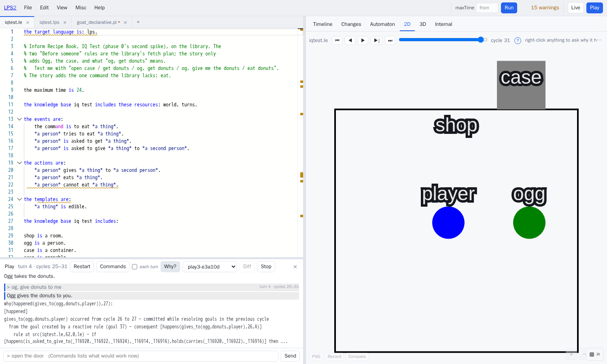
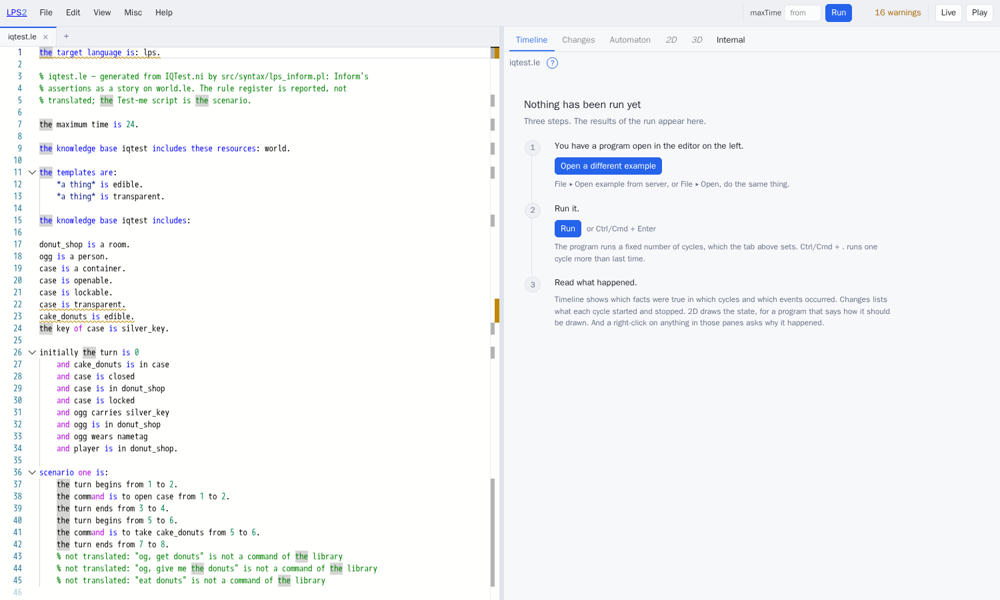
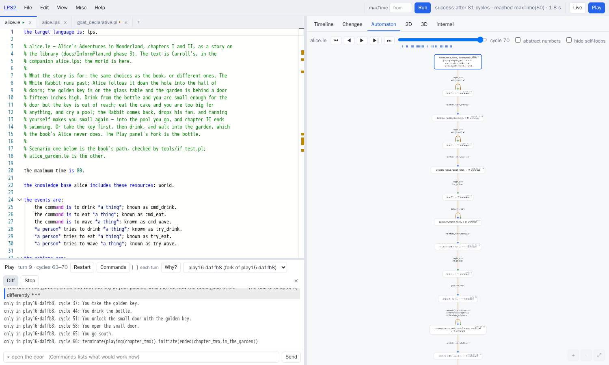
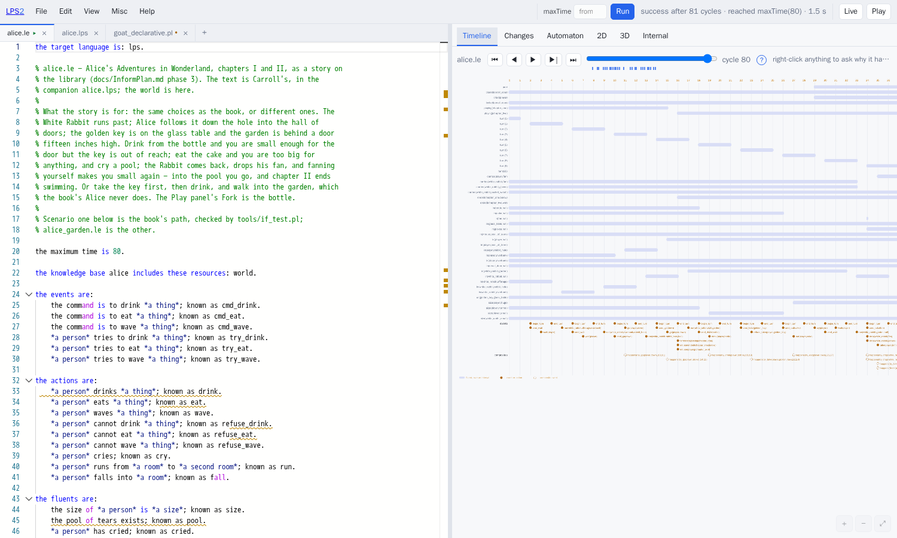
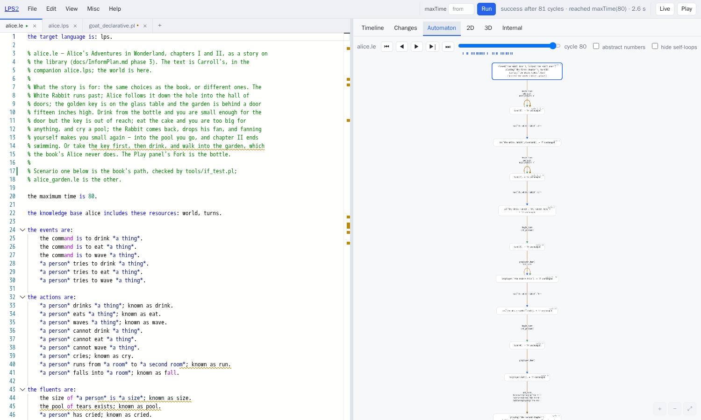
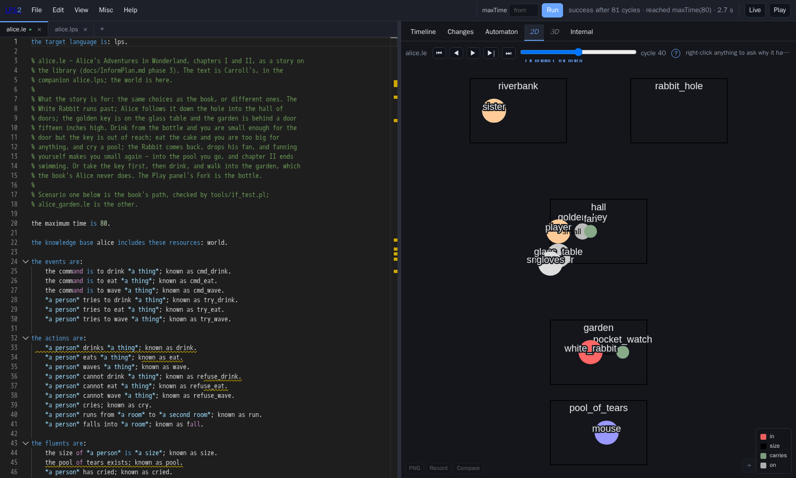
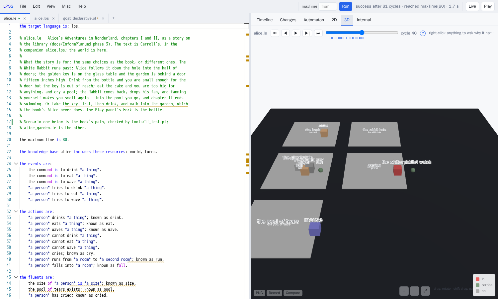
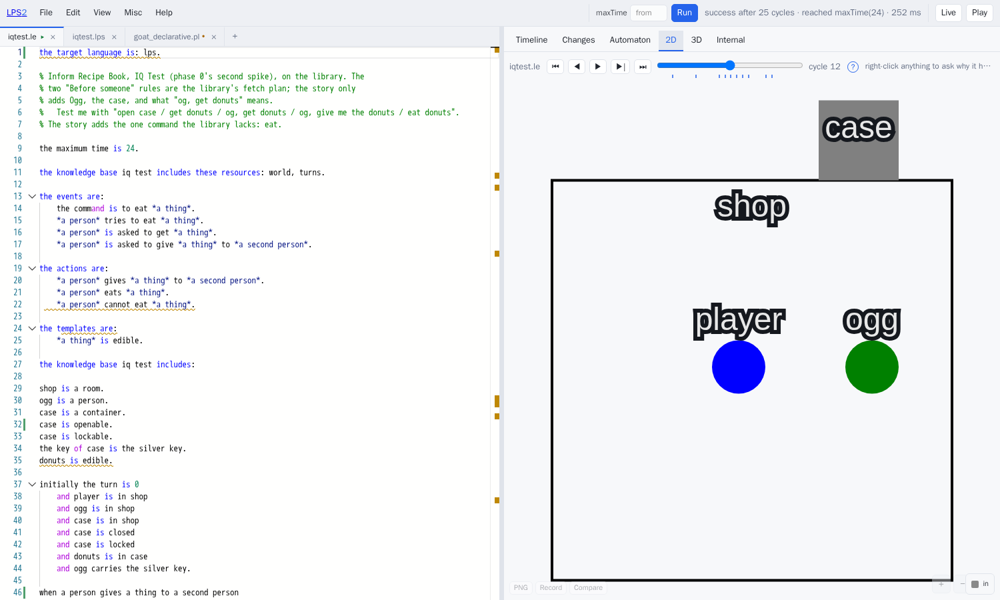
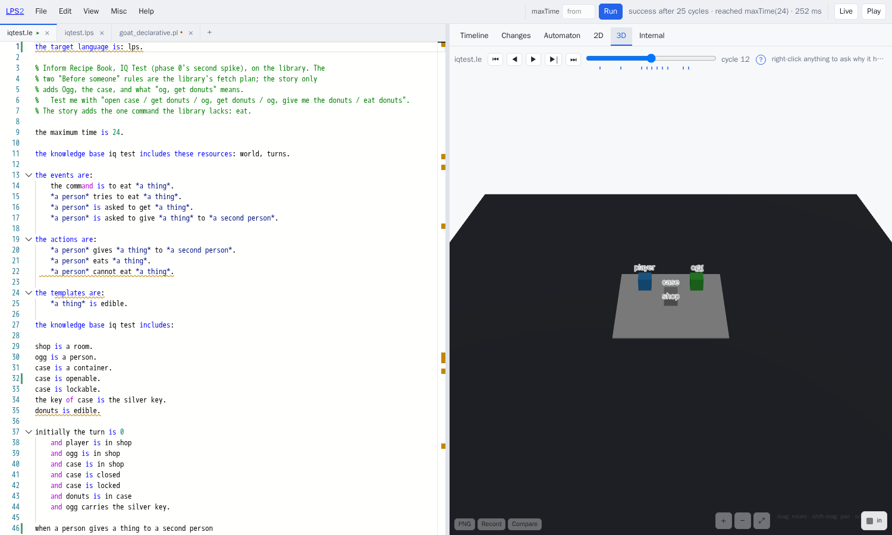

# LPS for Inform users

A guide for someone who writes interactive fiction in Inform 7 and wants to know what
LPS does with it: what maps onto what, where the examples are and how to run them,
where the two systems differ in capability, and what the current limitations are. Two
worked examples carry most of the detail: Inform's own *IQ Test* recipe, and *Alice's
Adventures in Wonderland* forked at the bottle. The pictures were taken from the
running system by `tools/doc_shots.cjs`.

Two caveats frame the comparison. Inform 7 is a mature system with a large standard
library, a parser refined over decades and a body of published work; what is compared
here is a small library on top of a general rule engine. The claims below are about
mechanism, not coverage; §8 lists what is missing. And the tests that check the
stories against Inform's transcripts compare event sequences, not printed text, so
"the story replays" means the same actions happen at the same turns, not that the
output reads the same.

The reasoning behind the design, and why LPS is used as an IF engine rather than as a
compiler to or from Inform, is in `docs/InformPlan.md`. This document is the how.

## 1. The two systems in one table

| | Inform 7 | LPS with Logical English |
|---|---|---|
| A story is | assertions building a world, plus rules in ~340 rulebooks | a Logical English document that includes a library and adds its world and its rules |
| The world | kinds, objects, properties, relations, compiled to predicate calculus | facts (timeless) and fluents (change over time), stated in English templates |
| State change | `now the door is open`, destructive | causal laws: `when X opens Y then it is not the case that Y is closed`; the frame problem is handled by the engine |
| Time | turns, a clock, `in four turns from now`, counters for the past | explicit cycles with the full history kept; the turn is an optional layer (`turns.le`): a burst of cycles, which every-turn rules and scheduled events key on |
| Preconditions | `Check` rules with a message each | `it must not be true that …` constraints; a refusal message is derived from the constraint |
| Exceptions | `Instead`, `Before`, `After`, ranked by four sorting laws | every rule fires; a conflict is settled by a constraint rather than by precedence |
| Characters | `every turn` rules and `try the person asked …` | reactive rules as standing goals; a plan is a composite event the engine expands |
| The parser | `Understand` lines and a kit | the story's command templates serve as the grammar; short forms (`x`, `i`, `n`) are built in |
| Output | `say` with substitutions, `report` rules | actions rendered through their templates, or a `narrate/2` clause in a companion file |
| Debugging | `actions`, `rules`, `scenes` commands | `why` and `why not` on any line of the transcript; a timeline; a state-transition diagram |
| What-if | UNDO | fork a game and diff the two |

The difference with the largest effect on how a story is written is that **a command is
a `try`, not an obligation.** In LPS a reactive rule's consequent is a goal the engine
must satisfy, and a goal that cannot be satisfied ends the run. So `the command is to
open X` becomes `player tries to open X`, a composite event whose first clause is the
action and whose second is a refusal. When a precondition refuses the action, the
engine backtracks into the refusal, and the refusal carries the constraint that failed,
which is what the narrator reports. The library does this for every standard command;
a story has to do it for the commands it adds (§4).

## 2. What each Inform construct becomes

| You write in Inform | You write in Logical English |
|---|---|
| `The Kitchen is a room.` | `kitchen is a room.` |
| `The oak door is a locked door. It is east of the Hall and west of the Study.` | `the oak door is a door.` `the oak door leads east from hall to study.` and, in `initially`, `the oak door is closed and the oak door is locked` |
| `Ogg is a man in the Donut Shop.` | `ogg is a person.` and `initially ogg is in donut_shop` |
| `The case contains some cake donuts.` | `initially donuts is in case` |
| `The matching key of the case is a silver key.` | `the key of case is the silver key.` |
| `Carry out eating: now the player is replete.` | `when a person eats a thing then it is not the case that the person is hungry.` |
| `Check eating something when the player is not hungry: say "…"` | `it must not be true that a person eats a thing from a first time to a second time and it is not the case that the person is hungry at the first time.` No message is written; the narrator derives one from the constraint (§4) |
| `Every turn when the player is hungry: say "…"` | `if the turn ends from a first time to a second time and player is hungry at the second time then player complains from the second time to a third time.` |
| `Hunger resumes in the satisfaction period of the noun from now.` | a fluent naming the turn it is due, and a rule on `the turn ends` that fires when `the turn is` that number |
| `Starting ends roundly when the player carries the ball.` | `if starting is playing at a time and player carries ball at the time then terminate starting is playing … and initiate starting has ended roundly …` |
| `Before someone taking something in a closed container: try the person asked opening the container.` | a composite event: `a person fetches a thing … if the thing is in a container … and the person opens up the container … and the person takes the thing …`, provided by the library |
| `Understand "photograph [someone]" as photographing.` | declare the event `the command is to photograph *a person*`; the template is the grammar |
| `say "Taken."` | nothing, or `narrate(take(player, X), "Taken.")` in the companion |
| `Test me with "n / s / e / w".` | a `scenario` of `the command is to go north from 1 to 2.` lines, or play it |

Two conventions of Logical English that Inform does not have:

- **One condition per line, `and` first.** A conjunction on one line is read as a
  single sentence. This is a common source of error for people coming from Inform.
- **A name is a word or a phrase beginning with `the`.** `hall`, `bottle`, `the oak
  door`, `the silver key`: Logical English reads `the oak door` as a constant where
  no `an oak door` introduced it earlier in the sentence. The player types `door`
  or `key`; the narrator prints the name as written.

## 3. Where the examples are, and how to run them

Everything is under `examples/if/`:

| file | what |
|---|---|
| `world.le` | the library: a subset of Inform's physical world model, a dozen actions with preconditions and effects, scenes, a fetch plan |
| `turns.le` | the clock: `the turn begins`, `the turn ends`, `the turn is N`. A layer a story includes or not |
| `implicit_connections.le`, `nothing_as_term.le`, `negated_rp.le`, `npc_going.le`, `regarding.le`, `scene.le` | six of Inform's own test cases, each with its `Test me with` script |
| `iqtest.le`, `boston_cream.le`, `mre.le` | three Recipe Book examples: goal-seeking characters and future events |
| `doors.le` | a door, hand-written from *Writing with Inform* §3.12 |
| `alice.le`, `alice.lps`, `alice_garden.le` | Alice, chapters I and II, and the path the book's Alice does not take |
| `alice_pure_lps.le` | Alice without the clock: the same states from causal rules alone (§6b) |
| `inform/*.ni` | eleven Inform sources, verbatim, for the front end of §5 |
| `expected/` | the event sequences the stories are checked against, read from Inform's ideal transcripts |

You need LE2 (the Logical English compiler) beside this repository; every command
below assumes `LPS_LE2_LIB=/LogicalEnglish2`.

```sh
./lps play examples/if/iqtest.le           # play it on the terminal: type; `why`; `fork`; `diff`; `quit`
./lps run  examples/if/iqtest.le           # replay its Test-me script and print the trace
./lps ide                                  # then open the story in the browser and press Play
```

The tests:

```sh
./myswipl.sh -q -g "consult('tools/if_test.pl')"   -g "if_test:main"   -t halt   # 13 stories: each replay's event sequence against the one read from Inform's transcript
./myswipl.sh -q -g "consult('tools/play_test.pl')" -g "play_test:main" -t halt   # 18 things a player does
tools/inform_test.sh                                                              # 11 Inform sources translate and run
```

In the IDE, **File ▸ Open example** lists them under *interactive fiction* and
*Inform 7*. Open one, press **Play** in the top bar, and type.

**What to type.** The verbs are the story's command templates: the library's
(`look`, `examine X`, `inventory`, `wait`, `take X`, `drop X`, `put X in Y`, `put X
on Y`, `open X`, `close X`, `lock X with Y`, `unlock X with Y`, `go north` or `n`,
`enter X`, `exit`), an order to a character (`og, get donuts`), and whatever the
story declares (`drink`, `eat`, `wave` in Alice). **Commands** in the panel, or
`commands` on the terminal, lists the commands that would succeed from the current
state, in the words the player would type; clicking one runs it. The list is
computed from the story's own constraints, so it is as contextual as they are: in
the hall, `take the golden key` is offered while Alice is her own size, and `unlock
the small door with the golden key` only once she carries the key and is small.
Inform's Standard Rules have no equivalent; an action's check rules run only as
part of performing the action, so a listing of this kind would have to be written
per story. The cost is small in practice: a player's command is judged by evaluating
the story's preconditions against the state, and only an order to a character, whose
plan is more than one step, is tried on a copy of the game. Tick **each turn**,
beside Commands, and the list is refreshed after every turn.

A line the parser does not understand can be handed to a language model. With an API
key set (Misc ▸ API keys), the panel sends the line and the list of commands the story
could take to the model, which either selects one (*I take that as: go west*) or none
(*I really don't understand that*). The parser itself stays deterministic; the model
only chooses among the parser's own sentences, and its choice can be wrong in the way
any such guess can.

**The panes follow the game.** After each turn the Timeline, Changes, Automaton and
the 2D and 3D panes show the game so far, and the slider scrubs it. The transcript
keeps track of turns: each typed line carries its turn number and the cycles the turn
took. A click in the Timeline marks, in the transcript, the turn that cycle fell in;
a click on a turn's line takes the panes to the end of that turn; and a click on a
thing in the 2D or 3D picture marks the turn in which that thing last changed, as of
the slider's cycle, and says which fluents changed.

**A note on `; known as`,** which appears after some templates in the stories below
(`*a person* eats *a thing*; known as eat`). It is not a synonym (Logical English has
`; synonym` for that). It fixes the Prolog name the template compiles to, `eat/2`
here, instead of the one LE2 would derive from the words (`eats/2`, or
`the_command_is_to_eat/1` for a command). It is optional: a story plays, its Commands
list works and its refusals are explained without it. It matters where something
outside the English names the predicate: a companion `.lps` file of narration and
pictures (`alice.lps` is keyed on terms like `take(player, 'the golden key')`), and the
labels on the Timeline and the Automaton, which print the Prolog name. A story's
commands, its `tries to` composites and its refusals do not need one, because the
player pairs a refusal with the action it refused through the composite, not through
the name. The library declares it for everything it defines, so a story inherits those
names and writes it only for its own verbs.

## 4. Worked example: Inform's *IQ Test*

The Recipe Book's *IQ Test* introduces Ogg, "a person who will unlock and open a
container when the player tells him to get something inside". Inform's source:

```
The Donut Shop is a room. Ogg is a man in the Donut Shop.
The Donut Shop contains a transparent closed openable locked lockable container
called a case. The case contains some cake donuts. The donuts are edible.
The matching key of the case is a silver key. The silver key is carried by Ogg.

A persuasion rule for asking someone to try doing something: persuasion succeeds.

Before someone opening a locked thing (called the sealed chest):
    if the person asked is carrying the matching key of the sealed chest,
        try the person asked unlocking the sealed chest with the matching key;
    if the sealed chest is locked, stop the action.

Before someone taking something which is in a closed container (called the shut chest):
    try the person asked opening the shut chest;
    if the shut chest is closed, stop the action.

Test me with "open case / get donuts / og, get donuts / og, give me the donuts / eat donuts".
```

The same story as `examples/if/iqtest.le`. The world is nine lines. The two `Before
someone` rules have no counterpart in the story, because the library's fetch plan
covers the same case. The story includes the library and the clock; the clock is
a layer a story may leave out (§6b):

```
the knowledge base iq test includes these resources: world, turns.

the events are:
    the command is to eat *a thing*.
    *a person* tries to eat *a thing*.
    *a person* is asked to get *a thing*.
    *a person* is asked to give *a thing* to *a second person*.

the actions are:
    *a person* gives *a thing* to *a second person*.
    *a person* eats *a thing*.
    *a person* cannot eat *a thing*.

the templates are:
    *a thing* is edible.

the knowledge base iq test includes:

shop is a room.
ogg is a person.
case is a container.
case is openable.
case is lockable.
the key of case is the silver key.
donuts is edible.

initially the turn is 0
    and player is in shop
    and ogg is in shop
    and case is in shop
    and case is closed
    and case is locked
    and donuts is in case
    and ogg carries the silver key.

when a person gives a thing to a second person
then it is not the case that the person carries the thing.

when a person gives a thing to a second person
then the second person carries the thing.

when a person eats a thing
then it is not the case that the person carries the thing.

it must not be true that
    a person eats a thing from a first time to a second time
    and it is not the case that the person carries the thing at the first time.

if a person is asked to get a thing from a first time to a second time
then the person fetches the thing from the second time to a third time.

if a person is asked to give a thing to a second person from a first time to a second time
    and the person carries the thing at the second time
then the person gives the thing to the second person from the second time to a third time.

if the command is to eat a thing from a first time to a second time
then player tries to eat the thing from the second time to a third time.

a person tries to eat a thing from a first time to a second time if
    the person eats the thing from the first time to the second time.

a person tries to eat a thing from a first time to a second time if
    the person cannot eat the thing from the first time to the second time.
```

The last three rules are the `try` pattern of §1, written out for the one command the
library lacks. The rest (opening, taking, giving orders, the plan Ogg follows) comes
from the library.

Playing it with Inform's own test script:

```
> open case
You can't open the case: the case is locked.
> get donuts
You can't take the donuts: you cannot reach the donuts.
> og, get donuts
Ogg unlocks the case with the silver key.
Ogg opens the case.
Ogg takes the donuts.
> og, give donuts to me
Ogg gives the donuts to you.
> eat donuts
You eat the donuts.
```

The two refusal messages are not written in the story or in the library. When the
constraint refuses `open`, the engine backtracks into the refusal, and the narrator
asks the engine *why not*: the denial names `the case is locked`, and that becomes
the message. The wording is generic; a story that wants a specific sentence supplies
it in the companion (§6 has an example). Ogg's three actions are the library's fetch
plan being expanded: the case is closed, so open it first; it is locked, so unlock it
first; he carries the key, so he can. **Why?** asks the engine about the last turn:



The answer names the rule, the composite event it was resolving, and the sentence of
the story it came from. Right-clicking anything in the Timeline or the Changes pane
asks the same question of a scripted run.

**Asking on the terminal.** The same questions can be put to the story's scripted
run, without playing it, with `./lps explain`. The refused `open` at the first turn:

```sh
./lps explain examples/if/iqtest.le --ask "why_not(happened(open(player, case)), 3)"
```
```
[blocked_by_denial]
open(player,case) did not occur at cycle 3
  a denial blocked open(player,case) — false [happens(open(player,case),2,3),holds(locked(case),2)]
```

That is the constraint from the library, with the fluent that made it hold: the case
was locked at cycle 2. It is the provenance of the refusal message. The refused `get
donuts` at the second turn:

```sh
./lps explain examples/if/iqtest.le --ask "why_not(happened(take(player, donuts)), 7)"
```
```
[blocked_by_denial]
take(player,donuts) did not occur at cycle 7
  a denial blocked take(player,donuts) — false [happens(take(player,donuts),6,7),holds(not(reachable(player,donuts)),6)]
```

`reachable` is the library's intensional fluent: the donuts are in a closed case, so
nothing in the room can reach them. And why Ogg unlocked the case at the third turn,
which nobody told him to do:

```sh
./lps explain examples/if/iqtest.le --ask "why(happened(unlock(ogg, case, 'the silver key')), 11)"
```
```
[happened]
unlock(ogg,case,'the silver key') occurred from cycle 10 to 11 — committed while resolving goals in the previous cycle
  while resolving the composite event open_up(ogg,case) — from 10 to 12
  while resolving the composite event fetch(ogg,donuts) — from 10 to 13
  from the goal created by a reactive rule (goal 7) — consequent [happens(fetch(ogg,donuts),10,A)]
    rule at src(examples/if/iqtest.le,59,0,le) — if [happens(is_asked_to_get(_1498398,_1498400),_1498392,_1498394)] then ...
```

Read from the bottom up: the order to get the donuts created a goal, `fetch` is the
library's plan for getting something, opening a locked case is `open_up`, and
unlocking is the first step of that. The line number is the story's sentence `if a
person is asked to get a thing … then the person fetches the thing …`. In Inform the
corresponding information comes from reading the `Before someone` rules and running
`rules on`, which lists the rules that fired but does not connect them to the goal
that caused them.

## 5. Bringing an Inform source across

`./lps inform` reads an Inform 7 source and writes the Logical English story its
*assertions* make. Its *rules* are reported, sentence by sentence, as diagnostics;
they are not translated or approximated.

```sh
./lps inform examples/if/inform/IQTest.ni                    # print the story
./lps inform examples/if/inform/IQTest.ni --out build/story  # write it beside a copy of the library
./lps play   examples/if/inform/NegatedRP.ni                 # or play the source directly
```

In the IDE the same happens when you open a `.ni` file:



What crossed: the room, Ogg, the case with its properties and its key, the donuts,
the initial placement, and the first two commands of the test script. What did not,
and is listed in the comments at the bottom and in the diagnostics: `og, get donuts`
(no such command in the library), `eat donuts` (a verb the story must add), and the
two `Before someone` rules, the persuasion rule and the unlisted block-giving rule.
The imported story is a world without a rule register; the eleven lines of §4 that say
what `og, get donuts` means have to be added by hand before it plays.

The front end takes rooms, kinds (built in or declared with `is a kind of`),
properties, `contains`, `in`/`on`, `here`, `carried by`, the map in its various
phrasings, doors with two sides, matching keys, descriptions, and `Test me with`. It
applies Inform's defaults: a door is closed unless said, the player starts in the
first room, a connection runs both ways, `It` is the last thing declared. Eleven of
Inform's programs go through it in `tools/inform_test.sh`, checked against the initial
state read by hand from each and, for the ones with no rules of their own, against the
transcripts. Eleven programs is a small sample of Inform's assertion syntax, and
sources outside that sample will meet phrasings the front end does not know.

## 6. Worked example: Alice, forked at the bottle

`examples/if/alice.le` is chapters I and II: the riverbank, the rabbit hole, the hall
of doors with the golden key on the glass table and the garden behind a door fifteen
inches high; a size with three values; a pool of tears that comes into being; the
White Rabbit on a route, with a return for the fan; and two chapters as scenes.
Carroll's words are in `alice.lps`, the companion.

Three constructions in it are worth noting.

**A character with a route.** The Rabbit's timetable is four facts and one rule:

```
the rabbit runs from offstage to riverbank.
the rabbit runs from riverbank to the rabbit hole.
the rabbit runs from the rabbit hole to hall.
the rabbit runs from hall to garden.

if the turn ends from a first time to a second time
    and the white rabbit is in a room at the second time
    and the rabbit runs from the room to a second room
then the white rabbit runs from the room to the second room from the second time to a third time.
```

The Rabbit appears by running from `offstage` to the riverbank. Inform does the same
with `now the White Rabbit is in the Hall`; no new construct was needed for a
character who is not there yet.

**A room that comes into being.** A room is reachable only once a fluent holds:

```
down from hall leads to the pool of tears at a time if
    the pool of tears exists at the time.
```

That is a clause added to the library's own `leads` fluent. The map is a fluent like
any other, and a story may add clauses to it.

**A constraint instead of an `Instead`.** The door is fifteen inches high:

```
it must not be true that
    a person goes south from a first time to a second time
    and the person is in hall at the first time
    and it is not the case that the size of the person is small at the first time.
```

Inform would write `Instead of going south in the Hall when the player is not small:
say "…"`. Here there is no message and no precedence: the constraint refuses, the
narrator says why, and the same constraint applies to the Rabbit. The price is that
the refusal is worded by the narrator unless the companion supplies a sentence.

Forking is the feature without a direct Inform counterpart. UNDO reverts one turn;
here two games diverge from a common turn and can be compared. Play to the hall, then
choose **Fork this game…**, the last item of the games picker. In the fork, take the
key first, then drink, unlock, open, and go south, which is the path the book's Alice
does not take. **Diff** lists what happened in this game and not in the other, in the
words of the story:



A session is an immutable term, so a fork is a copy of a reference rather than of the
state, and the two games diverge with what is typed into each. In the original, type
`drink bottle` and then `take key`: *You cannot possibly reach it: the key is on the
table, far above your head*. That sentence is Carroll's, from the companion, and it
overrides the narrator's derived line.

Run the story's own scenario with **Run** and the panes show the run rather than the
prose. The Timeline is the scenario's path, fluent by fluent and turn by turn:



And the state-transition diagram corresponds to what Inform's Scenes index calls "the
map of time", except that it is drawn from the run rather than from the declarations:



## 6a. Seeing the world, in two dimensions and three

An LPS program can say how its state should be drawn (`display/2` for a 2D canvas,
`display3d/2` for a three.js scene) and the IDE's 2D and 3D panes play the run back
as a picture, with the cycle slider to scrub it and a right-click on anything drawn
to ask why it is there. Inform has no counterpart; its world is prose.

The clauses can be written by hand or generated. The assistant's **Animate in 2D**
and **Animate in 3D** buttons ask a language model for them, from the program's
declarations and initial state, and offer to put the result in the companion file.
That is how the drawings below were produced: the request was made through LPS2's LLM
client to `openai/gpt-oss-120b` on Groq, the result was validated by running the
story and counting what was drawn, and it was written into `alice.lps` and
`iqtest.lps` with a header saying so.

**A caveat.** A model's drawing is not deterministic and not authoritative. Asking
again gives a different layout, different colours, other choices of what is worth
drawing; the IQ Test drawing below puts the case outside the shop, which is the
model's geometry and nothing in the story says so. What is shown is one answer among
many, kept because it was adequate to illustrate the story. The logic is unaffected:
`display/2` reads the state and never changes it, and the tests that check the stories
against Inform's transcripts do not look at the pictures. The clauses can be edited by
hand or regenerated.

Alice at cycle 40 of the book's path, small in the hall, the key on the table out of
reach, the Rabbit in the garden:



The same cycle in three dimensions: the rooms as slabs, everything standing on the
slab of the room that holds it, `carries` as a line:



The IQ Test at cycle 12, just after Ogg has unlocked and opened the case on the
player's order:





The pictures regenerate from the clauses in the companions; the clauses themselves
regenerate from the model, differently each time. `docs/UsingTheIDE.md` says what the
panes can do, and `docs/lps_summary.md` §18 and §18a say what the clauses may say.

## 6b. The same story without turns

`examples/if/alice_pure_lps.le` is Alice with the clock left out: it includes
`world` but not `turns`, so nothing in it can mention a turn, and the driver
injects no turn markers. The three rules that alice.le keys on `the turn ends`
are written as what caused them. The Rabbit runs on when Alice reaches the room
it is in:

```
if the white rabbit is in a room at a time
    and player is in the room at the time
    and the rabbit runs from the room to a second room
then the white rabbit runs from the room to the second room from the time to a second time.
```

A huge Alice in the hall cries because she is huge and in the hall; a small one
with a pool in the room falls in. The trace test records the same fluent
transitions in the same order as alice.le, and the story plays to the same end;
the pacing differs, since the Rabbit's first two runs happen before the first
prompt and everything the cake causes happens in one burst. Its companion is
alice.lps itself, whose words are keyed on actions and never on a turn.

What the comparison shows is where the turn is needed. Not in a story's logic:
a causal formulation exists for everything Alice schedules by the turn. It is
needed by a scripted replay, which must know where one command's consequences
end (the pure story's scenario leaves gaps between its commands), and by rules
that count commands: Inform's `every turn` and `in three turns from now`, which
are turn-based by definition. A story with neither includes the library alone.

## 7. Where the two systems differ in capability

What LPS has and Inform does not:

- **Explanations.** `why` on the terminal, **Why?** in the panel, `./lps explain` on
  a scripted run, or a right-click in a pane: which rule, which composite event, which
  sentence. `why not` for what did not happen, including which constraint refused it
  and what fluent made it hold (§4). Inform's `rules on` lists rules as they fire; it
  does not connect them to goals.
- **Pictures.** A 2D canvas and a 3D scene of the state, scrubbed by cycle, drawn
  from clauses that can be written by hand or generated (§6a).
- **A list of what would succeed now.** Computed from the story's constraints, and
  for orders to characters by trying the order on a copy of the game (§3).
- **Refusal messages derived from constraints.** A `Check` message in an Inform story
  is a sentence somebody wrote. Here the default message is the constraint, rendered;
  a story that wants particular wording writes it in the companion.
- **Forking.** What-if at any turn, with a diff (§6).
- **Time as data.** The full history is kept: `at the first time` in a rule is a
  query over the history, not a counter. A scheduled event is a fact about a future
  turn, and the turn itself is a layer a story can do without (§6b).
- **Plans.** A character's goal is a composite event and the engine finds the steps.
  Ogg's fetch is the library's; a story's characters are given sentences saying what
  they want.
- **The same file, scripted and played.** A `scenario` is a `Test me with`; the test
  replays every story against Inform's transcripts, and the same file is played.
- **A live session.** A story is a program that waits for events, the same
  abstraction that a thermostat and a Minecraft bot use here; the Play panel is one
  client of it.

What Inform has and LPS does not, at present:

- **The Standard Rules.** Some 340 rulebooks against a library of a dozen actions.
  Light and darkness, containers' contents in `look`, plurals, pronouns, supporters
  and containers with all their properties, and much else are absent (§8).
- **The parser.** `Understand` lines, synonyms, disambiguation and the kit. The LPS
  parser matches on the words of a name and on command templates; it has no
  synonym mechanism for nouns (§8).
- **Extensions and a body of work.** Inform's extension library and its published
  stories have no counterpart here; the examples are the eleven test programs and
  Alice.
- **Distribution.** An Inform story compiles to a file that runs in any Z-machine or
  Glulx interpreter. Playing a story here requires the LPS runtime and, for Logical
  English sources, LE2.
- **Rules from Inform sources.** The front end translates assertions only (§5). Every
  `Before`, `Instead`, `Check` and `Every turn` rule has to be rewritten by hand.

## 8. Current limitations

- **One condition per line.** Said above; a frequent error.
- **Your own commands need the `try` pair.** A story that declares `the command is
  to eat *a thing*` must also give `player tries to eat the thing` its two clauses
  (§4), or the first refused `eat` ends the run.
- **Property changes are two laws.** `becomes` fits `the reward is *an amount*`; for
  `the size of *a person* is *a size*`, terminate the old value and initiate the new.
- **No `Understand` synonyms for nouns.** The parser finds `door` for `the oak door`
  and `og` for `ogg` by the words of the name; a name that shares no word is not
  found.
- **No listing of contents in `look`** beyond what is directly in the room, no light
  and darkness, no plurals, no pronouns. The library is a small subset of the
  Standard Rules, by design; `docs/InformPlan.md` §7b says what it has.
- **Exits list both ways.** A stated connection runs both ways, as in Inform; a story
  that forbids the return trip with a constraint (Alice cannot climb back up) still
  shows `up` as an exit.
- **An action must not be named like a Prolog built-in.** The library says `closes … ;
  known as shut` for that reason.
- **The rule register of an imported Inform story is yours to write.** What the front
  end reports as a diagnostic, it did not translate (§5).
- **The transcript tests compare events, not text.** A story that "replays to Inform's
  transcript" produces the same actions at the same turns; the printed output is not
  compared.

## 9. Where to go next

- `examples/if/README.md`: every story, how it is driven, the conventions.
- `docs/InformPlan.md`: the evaluation, the plan, and what each phase found, with
  the numbers.
- `docs/UsingTheIDE.md`: the Play panel among the rest of the editor.
- `docs/lps_tutorial.md` and `docs/le_lps_surface.md`: the language, and Logical
  English for it, construct by construct.
