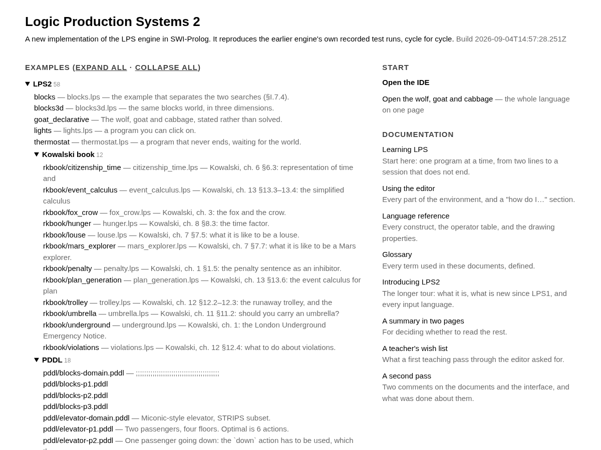
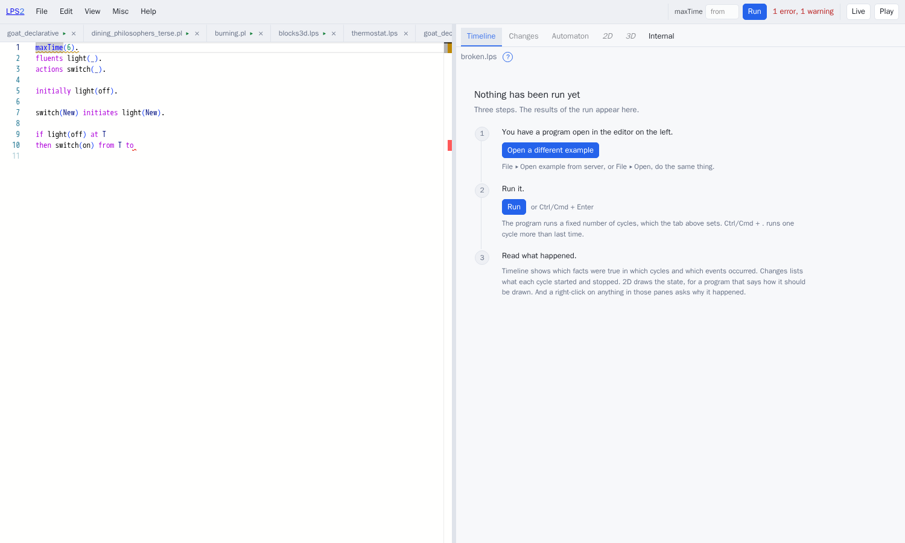
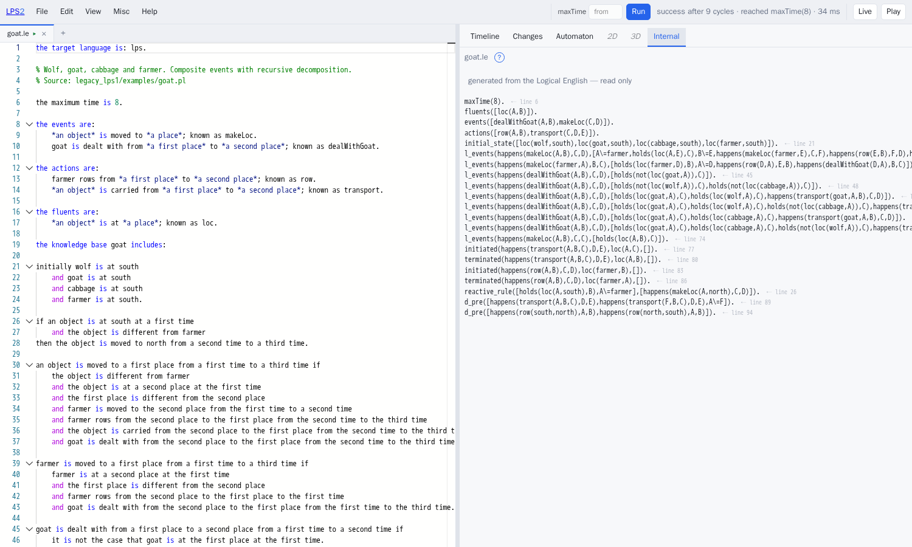

# Using the editor

`./lps ide` starts a server on <http://localhost:3060>. This document describes
each part of what it serves, and ends with a **[how do I …](#how-do-i-)**
section answering the questions people actually arrive with.

**<http://localhost:3060/> is a start page, not the editor.** It lists every
program on the server, arranged by directory, with the folders you left open
still open, and it lists the documents. The editor itself is at
<http://localhost:3060/ide>. Every link on the start page opens the editor with
that program already loaded.



Everything the editor does, it does by sending a request to a single web
address, `POST /lpsapi`. Nothing described below is available only from the
editor: all of it can be done with `curl` as well. That rule is what keeps the
editor from quietly becoming the only way to use the system.


---

## Contents

- [The start page](#the-start-page)
- [The layout](#the-layout)
- [Running a program](#running-a-program)
- [The editor itself](#the-editor-itself)
- [The six panes](#the-six-panes)
- [Asking why](#asking-why)
- [Logical English](#logical-english)
- [The assistant](#the-assistant)
- [Sessions that do not stop](#sessions-that-do-not-stop)
- [The menus](#the-menus)
- [How do I …](#how-do-i-)
- [Keyboard shortcuts](#keyboard-shortcuts)

---

## The start page

`/` lists the programs as a tree: LPS2's own examples first; then the ones
translated from PDDL and from Drools; then the agent and Minecraft examples;
then LPS1's own examples with their subdirectories. Each folder remembers
whether you left it open, in this browser. Adding `?expand=all` to the address
opens all of them. The column on the right says where to start and what to read.

## The layout

The screen has one row of controls and two columns.

**The row of controls at the top** is the only place anything is operated from.
From the left: the menus; then `maxTime` and **Run**; then how the last run
ended; then **Live**, which opens the live panel, and **Play**, which opens the
play panel.

The optional panels are also in **View**: **Assistant panel**, **Live execution
panel** and **Play panel**. A button that is lit means its panel is open. A closed
panel occupies no space and shows no controls at all.

**The play panel** is for a story: a Logical English document that includes the
interactive-fiction library (`examples/if/`, and `docs/InformPlan.md` for why). Start
plays the document in the editor. Type what a player types — `open the door`, `e`,
`og, get donuts` — and read what happened; **Why?** asks the engine why the last
turn went as it did, and a refusal (*You can't open the case: the case is locked*)
is already the engine's own reason, rendered. No key is needed: the story's command
templates are the grammar. **Fork** starts a second game from exactly here, the
picker switches between games, and **Diff** says what happened in this one and not
in the one it was forked from.

**The left column** is your program: one tab per open file, and the text.

**The right column** is the run belonging to whichever tab is lit: six ways of
looking at it. Before anything has been run, it says what to do instead, with
the buttons to do it.

| region | what it is |
|---|---|
| **file tabs** | one tab per open file. A tab owns its *run* as well as its text |
| **the editor** | one grammar covering both LPS and the Prolog written inside it |
| **the panes** | six ways of looking at the run belonging to the lit tab |
| **Assistant** | a language model with the same tools you have. Closed until you open it |
| **Live** | a program that keeps cycling and accepts events. Closed until you open it |

Everything is resizable, and the sizes are remembered between visits. Drag the
vertical bar between the editor and the panes; double-click it to put it back in
the middle. When a panel is open, drag the horizontal bar above it.

**Each tab owns its own run.** Open two programs, run both, and switching tabs
switches everything on the right: the timeline, the scene, the cycle, the
errors. A tab whose program has been run carries a green dot. That is how to
compare two versions of a program — open both, run both, and switch between
them.

## Running a program

**Run** compiles the program and runs it to the end. Ctrl/Cmd + . — or **Run one
more cycle** in the editor's right-click menu — runs one more cycle of the run
already in progress, so a run can be extended without starting it again.

The status line says how far the run got *and why it stopped there*, as in
`success after 21 cycles · reached maxTime(20) · 34 ms`. Those are two separate
facts. A run that reached `maxTime` and a run that had nothing left to do both
report success, and only one of them has finished.

The **maxTime** box overrides the program's own value, for the next run only.
Your file is not edited. Leave it empty to use whatever the program says.

When a run finishes, the panes show the last cycle for which a state was
recorded. Not cycle 0, which is the initial state, and not the engine's final
clock reading, which is one past the last cycle anything happened in.

Beside the cycle slider are ⏮ ◀ ▶ ▶| ⏭ — first, back, play, forward, last. The
arrow keys, Home, End and the space bar do the same from anywhere outside a text
box.

## The editor itself

Fluents, events and actions are **coloured according to what the program
declared them to be**. A fluent is dark text on a pale blue background; an event
or an action is amber. These are LPS1's own colours, taken from its stylesheet,
so a program looks here as it did in SWISH.

No syntax highlighter could do this by itself. `loc(wolf,north)` and
`row(south,north)` have the same shape, and which of them is a fluent is stated
in the declarations. The colouring follows the analysis of the program, so
adding a name to a `fluents` declaration colours every use of it.

Clauses that fired during the last run carry a mark in the margin. A rule that
never fires is the commonest mistake in a first LPS program, and it is otherwise
invisible: the program runs, it simply does nothing.

Hovering over a name says what it is — *a fluent this program declares*, with
its arity — and hovering over an operator says what the operator table says
about it.

Mistakes are reported **in the text**, not in a strip underneath it: a wavy
underline on the line, the message when you hover, and a mark on the right-hand
edge of the scrollbar. The count in the top bar is a button; click it to go to
the first problem, and press **F8** for the next.



The program is analysed about a second after you stop typing. The analysis runs
on the server and reports exactly what the compiler reports. A file that does
not parse still gets everything the reader managed to work out before it gave
up.

**Right-click** in the text for a menu:

| item | |
|---|---|
| Run | compile and run, the same as Ctrl/Cmd + Enter |
| See internal form | what the engine actually runs |
| Why did this happen? | explain the term under the cursor, at the current cycle |
| Observe this | send the term under the cursor as an event to a running session |
| Show definition | go to the first clause with that name |
| Go back | return to where you came from |
| Show occurrences | every use of the name, as a list you can click |
| Fold / unfold all clauses for this predicate | |
| Copy URL | a link with the program inside it |

The same menu has cut, copy and paste, and everything the underlying editor
brings: **Ctrl/Cmd + F** to find, **Ctrl/Cmd + H** to replace, several cursors at
once, moving lines, and commenting out. Selecting a term highlights its other
occurrences, and so does resting the cursor on a name.

Completion offers the language's own vocabulary *and* this program's: the events
and actions it declares, taken from the last analysis.

## The six panes

Five of the six move together on one cycle slider. The slider appears when there
is a run to move through and stays away when there is not. Underneath it, a tick
marks every cycle in which something changed, so a quiet run does not have to be
searched by dragging. Click a tick to go there.

**What the row of tab names is telling you.** A dimmed tab is dimmed for one of
two reasons, and its tooltip says which:

- *"run the program first"* — it will fill as soon as you press Run;
- *"this program declares no display/2 clauses"* — it will not fill however many
  times you press Run, and the empty pane offers the button that would change
  that.

A tab that is not dimmed has something in it now.

Two more markers appear in the strip above the panes. **LIVE** means the panes
are following a running session rather than the last press of Run. *"was run
before your last edit"* means you have typed something since the run the panes
are showing.

### Timeline

One row for each fluent, drawn across the interval it holds; then the events of
each cycle; then a row for composite events, which appears only if the program
has any. Click the picture to move to that cycle.


### Changes

What was started, stopped and updated at this cycle, grouped under *the causal
law that did it*. Click the law to go to that clause.

Everything that did not change is listed separately as having *persisted*,
because the engine knows the difference between "still true" and "made true
again". If nothing changed at this cycle, the pane offers the nearest cycle in
each direction where something did.

If nothing changed in *any* cycle, the pane says so and says why. A program
whose fluents only move when an event arrives does nothing at all in an ordinary
run, and wants a session that does not stop rather than another press of Run.
`lights.lps` and `thermostat.lps` are both like this.


### Automaton

The run as a state machine: each distinct state once, so a program that returns
to a state it has been in shows that as a loop. A run whose states form a simple
chain is drawn as a column; anything that branches is drawn left to right.

Two switches: *abstract numbers* merges states that differ only in a number, and
*hide self-loops* removes the arrows a state draws to itself.


Clicking a state moves the cycle slider to it.

### 2D

The picture described by the program's `display/2` clauses. The origin is at the
bottom left and y increases upwards. Use the wheel to zoom, drag to move, and
double-click to fit everything in view.

Hovering over an object names the fluent it stands for and the cycle. A key in
the corner gives the colours. Along the bottom: **PNG** saves the current frame,
**Record** plays the run and records it as a video file, and **Compare** puts
this cycle beside the one before it.

### 3D

The picture described by `display3d/2`. Drag to turn the scene, use the wheel to
move towards or away from it, and press ⤢ to fit everything in view.

Your view survives moving the cycle slider: a camera declared in the program is
a *starting* camera, not an instruction repeated for every frame.

**While a session is running, the 2D and 3D panes follow the session** rather
than the last finished run. Clicks in them reach the program, exactly as they do
in a popped-out window.

### Internal

The form the engine actually runs: `reactive_rule/2`, `d_pre/1`, `updated/4`,
`initial_state/1`. It is worth looking at once. It makes clear that
`false X, Y, Z` is a constraint, and that `at`, `from` and `to` are a convenient
way of writing explicit time arguments.

**Copy this text** takes all of it, which is what a bug report wants. Clicking a
line looks for that predicate in your own source.

## Asking why

There is no pane for explanations. **Right-click anything a pane has drawn** — a
bar on the timeline, an event, a row of the changes table, a state, the label on
an arrow, a shape in two dimensions, a solid in three — and you get the
explanation for that term at that cycle.

The dialog that opens also has a **why not** field, because the interesting
question is often about something that is *absent*, and you cannot click on
something that was never drawn. The field is filled in with the right shape;
edit it and press the button. The forms of question it accepts are printed
underneath.

The dialog keeps what you asked before, so a follow-up question does not lose
the answer you were reading. **Copy** takes the question and its answer. The
cycle box asks the same question at a different cycle without closing. *Why not
earlier?* asks about the cycle before.

Every part of the answer that names a clause is a link into the editor, and it
selects the whole clause rather than putting the cursor on its first line.

`why_not` has four different answers, and they are not interchangeable:

- **scheduled_for_another_cycle** — the plan does intend to, later, as step *n*.
- **no_goal_created** — nothing ever asked for it.
- **rejected_by_prospective_constraint** — something did ask, and a named
  constraint refused it.
- **no_plan_found** — it was asked for, and no plan was found within the
  horizon.

Outside those four the answer is a plain "no applicable rule". Where the record
of the run says nothing, the answer is *not recorded*, rather than a plausible
story assembled after the fact. That restraint is the whole value of the feature
when something has gone wrong.

## Logical English

A `.le` file opens here like any other, and everything to the right of the
dividing bar works on it unchanged: run it, move through the cycles, ask why,
have it drawn.



What is different is the left-hand column.

- **The colouring is built from LE2's own word list.** The section headings, the
  connectives and the `*slots*` are coloured from LE2's `i18n/keywords.csv`,
  fetched when the editor starts rather than copied into this project. A copy
  would be wrong for every language but English as soon as either side changed.
- **Completion comes from the document's own templates**, each labelled with its
  role. Two templates that read alike may be a fluent and an action, and which
  is which is the first thing an author needs to know.
- **Errors are reported on the English line.** LE2's own complaints and LPS2's
  are shown one after the other and never merged: they are different claims
  about different texts. Both land on the `.le` line, because every generated
  term remembers which sentence it came from.
- **The generated program sits beside the source.** The Internal pane shows what
  your English compiled to. It cannot be edited, and every line links back to the
  sentence that produced it. Click a term to go there.
- **Prolog goes in the companion file.** `badlight.le` and `badlight.lps` are one
  program: the English says what is true and what happens, and the `.lps` half
  holds what is not English and gains nothing from being written as if it were —
  the drawing clauses above all. Opening one opens the other, and they compile,
  run and are drawn together. Each half keeps its own colouring and its own
  errors: a mistake in the companion is marked in the companion. Pressing Run in
  either tab runs the whole program.
- **Edit ▸ Say it in English…** turns a sentence into Logical English using only
  the templates this document declares, checks the result against the program,
  improves it, and shows it to you. Nothing is inserted until you say so.

LE2 does the parsing. It owns the grammar, the dictionary and the writer. LPS2
loads it as a library, so translating a document is a predicate call rather than
a request over the network. Start the server with a copy of LE2 to load:

```sh
LPS_LE2_LIB=/path/to/LogicalEnglish2 ./lps ide
```

There are two alternatives: `LPS_LE2_URL`, naming a running LE2 server, and
`LPS_LE2_SUBPROCESS=1`, which runs LE2 as a separate process.

**With none of the three set, Logical English is simply absent.** A `.le` file
opens, says which variable to set, and nothing else in the editor changes. It
never guesses which LE2 to use: a `.le` file compiled by the wrong one is a
program whose meaning nobody has stated.

## The assistant

A language model with the same tools you have. It compiles, runs, asks why, and
checks what its own drawing clauses produced. Its idea of "this compiles" is the
editor's, because it is the same call.

Open it with **View ▸ Assistant panel**. Choose a model in the
panel's own header to use it for one question, or set the default in **Misc ▸
API keys, models & Assistant settings**.

The list of models is what the providers themselves report. It is read when the
server starts, and again whenever you press *Re-read from providers*. A key set
in the server's environment is used in preference to one typed into the browser.
With no key at all, the panel says so and offers the button that sets one.

Two buttons ask a question that is already written.

**Animate in 2D** asks the model for a *plan* — which containers there are, what
moves between them, which fluent puts a thing in a container, what each thing
looks like — and then works out the geometry itself. The model never writes a
coordinate. That is why the result never overlaps:


The clauses it produces are ordinary Prolog over a table of positions,
`lps_slot/4`. Move a position in the table and everything that ever sits there
moves with it.

**Animate in 3D** asks for the same plan and draws it again in three dimensions.
The grid of containers becomes a floor plan, things stand up out of it, and a
stack becomes a tower.

Nothing is put into your file until you press **Apply to editor**, and one undo
takes it back out.

For a Logical English document the clauses go into its `.lps` companion, which is
opened for you if there is not one yet. They are Prolog, and Prolog in an English
document is not a bad edit but an impossible one — LE2 reads a clause as a
malformed section and the document stops compiling.

## Sessions that do not stop

Leave out `maxTime` and a program runs until it is stopped, doing nothing until
an event arrives. Open the **Live** panel from the top bar.


While no session is running, the panel offers a rate and a Start button, and
nothing else. The rest appears when there is a session for it to act on.

- **every N ms** — how long a cycle should take. The engine's own idea of time
  is still worked out from the cycle number; this only paces the loop.
- **Send** — sends an event term. The menu beside it lists *this* program's
  declared events; choosing one fills the box in and selects the arguments. Its
  tooltip says whether the program handles mouse events at all.
- **quiet cycles** — also record the cycles in which nothing happened. Off by
  default: at two cycles a second, "nothing happened" would be most of what you
  read.
- **Save log** — writes the whole record to a file. A session that runs in real
  time cannot otherwise be repeated.
- **Translate** — say it in English and let the assistant choose the term. You
  are shown the term before it is sent, because an event translated wrongly is
  an event you did not mean.
- **Pop out 2D / Pop out 3D** — a window that follows the running session. These
  appear only for a program that has something to draw.

The record shows one line for each cycle in which anything happened: the events
observed, the actions taken, and the fluents that started (`+`), stopped (`-`)
or changed value (`→`). The header counts cycles and elapsed time, and — when
the session cannot keep up with the rate you asked for — says what it is
actually managing.

An event that arrives part-way through a cycle is delivered at the next cycle
boundary. The record says *queued for cycle N*, so you know where to look for
it.

**A program that declares `lps_mousedown/3`, `lps_mouseup/3` or
`lps_mousedrag/3` as events can be clicked on.** The popped-out windows send
those events in the program's own coordinates. A program that does not declare
them gets no listener attached at all. `examples/lights.lps` is the
demonstration.

## The menus

**File** — New, Open (several files at once), Open example from server (every
program on the server, with a filter and a resizable name column), Save, Save
As, Close file, Copy share link.

`.pddl` and `.drl` files open like any other. The server translates them into
LPS, and the tab carries a note saying what it was translated from and when.

**Edit** — undo and redo, find, replace, go to line, commenting out, fold all
clauses, unfold all, next problem, and **Insert a construct…**, which offers the
forms of rule for when you know what you want to say but not which word says it.

**View** — the original that a translated file came from, a comparison of this
run with the previous one, a pane of documentation beside the editor, and the
two optional panels: the assistant and the live session.

**Misc** — theme (dark, light, high contrast), font size, API keys and models,
the server's access token, and *Deploy as WASM*.

**Help** — the start page, the keyboard shortcuts, this document, the tutorial,
the language reference, the glossary, the tour, the licences of the icons, and
About, which says which build you are running.

---

## How do I …

**…run a program?** Ctrl/Cmd + Enter, or the Run button. The panes fill in.

**…see why something happened?** Right-click it, in any pane.

**…see why something *did not* happen?** Right-click anything, and then edit the
*why not* field in the dialog that opens.

**…compare two programs?** Open both — File ▸ Open takes several at once, or use
the + on the tab strip — run both, and switch tabs. Each tab keeps its own run.

**…find where a predicate is defined?** Right-click it ▸ Show definition, or
Ctrl/Cmd + F12. *Go back* returns you.

**…give my program an animation?** Open View ▸ Assistant panel and press *Animate
in 2D*. Or write the `display/2` clauses yourself;
[`lps_summary.md`](lps_summary.md) §18 lists the properties.

**…use one of the built-in pictures?** `[type:raster, icon:NAME]`.
Help ▸ About the icons lists every name, with its picture.

**…send a program events while it runs?** Open the Live panel and press Start.
Then type an event term, or say it in English and press Translate.

**…make an animation respond to clicks?** Declare `lps_mousedown/3` — and, if
you want them, `lps_mouseup/3` and `lps_mousedrag/3` — as events, and write a
rule that reacts to them. Then pop out the 2D window and click. See
`examples/lights.lps`.

**…run a PDDL problem?** File ▸ Open, and select the domain *and* the problem
together. They arrive as one LPS program with `achieve` at the end.

**…run a set of Drools rules?** File ▸ Open the `.drl` file. Add an `initially`
line to put some facts into the working memory — the note at the top of the
generated program says so — and run it.

**…see what a translated file said originally?** View ▸ The original this was
converted from.

**…see what changed between two runs?** Run, edit, run again, then View ▸
Compare with the previous run. The cycles that differ are highlighted.

**…get my unsaved work back after reloading the page?** It is already there.
Files with unsaved changes are kept in this browser and restored on your next
visit.

**…write my program in English?** That is Logical English. Start the server with
`LPS_LE2_LIB=/path/to/LogicalEnglish2`, put `the target language is: lps.` at
the top of a `.le` file, and edit it here. There is no second server to run. See
[Logical English](#logical-english).

**…share a program?** File ▸ Copy share link. The program travels inside the
address, so nothing is uploaded anywhere.

**…run a program with no server at all?** Misc ▸ Deploy as WASM. You get a
single HTML page with the engine and your program inside it. The dialog explains
what it still fetches and how to serve it.

**…use an editor served by a server that requires a token?** Open it once as
`…/ide?token=<the token>`. The token is stored in this browser and removed from
the address bar. Or set it in **Misc ▸ Server token…**. If you do neither, the
first thing that needs the server opens that dialog and says which operation was
refused. On such a server *nothing* works without the token, because every
feature here is a request to the server.

**…point the editor at a different LPS2 server?** Set `window.LPS_API_BASE`
before the page's script loads, or serve the page from that server. LE2's own
editor takes `?lpsapi=…` in the address instead.

**…get rid of the assistant's "this needs a key" message?** Misc ▸ API keys. Or
start the server with `ANTHROPIC_API_KEY`, `OPENAI_API_KEY`, `GROQ_API_KEY`,
`GEMINI_API_KEY` or `TOGETHER_API_KEY` in its environment, which takes
precedence over anything typed into the browser.

**…stop the 3D scene resetting when I move the slider?** It does not any more.
If you want the program's own camera back, press ⤢.

**…read the error messages, now that there is no strip for them?** They are on
the line itself: hover for the message, F8 to step through them, and click the
count in the top bar for the first.

---

## Keyboard shortcuts

| | |
|---|---|
| Ctrl/Cmd + Enter | run |
| Ctrl/Cmd + . | run one more cycle |
| ← → | previous / next cycle |
| Home / End | first / last cycle |
| space | play or pause |
| Ctrl/Cmd + F | find |
| Ctrl/Cmd + H | replace |
| F8 | next problem |
| Ctrl/Cmd + F12 | show definition |
| Ctrl/Cmd + / | comment or uncomment the line |
| Alt + ↑/↓ | move the line up or down |
| Shift + Alt + ↑/↓ | duplicate the line |
| Ctrl/Cmd + D | select the next occurrence |
| Escape | close a dialog |
| Middle-click a tab | close that file |
