# Learning LPS

This is a way into LPS2 for someone who can program but has never written a
reactive rule. It starts with a two-line program and works up to planning,
explanation, and sessions that do not stop.

Two documents go beside it. [`lps_summary.md`](lps_summary.md) is the reference:
every construct, every declaration, the operator table. It is the right thing to
keep open next to this one. [`glossary.md`](glossary.md) defines the terms.

Every picture below was made by driving the real editor in a browser. Every
program was run before it was copied in.

---

## Contents

1. [Getting it running](#1-getting-it-running)
2. [The first program](#2-the-first-program)
3. [The five kinds of sentence](#3-the-five-kinds-of-sentence)
4. [Reading a run](#4-reading-a-run)
5. [Events from outside](#5-events-from-outside)
6. [Composite events](#6-composite-events)
7. [Intensional fluents](#7-intensional-fluents)
8. [Constraints](#8-constraints)
9. [Constraints about what an action would bring about](#9-constraints-about-what-an-action-would-bring-about)
10. [Planning: `achieve`](#10-planning-achieve)
11. [Prolog inside LPS](#11-prolog-inside-lps)
12. [Drawing a program: `display/2` and `display3d/2`](#12-drawing-a-program-display2-and-display3d2)
13. [Asking why](#13-asking-why)
14. [Programs that do not stop](#14-programs-that-do-not-stop)
15. [Where to go next](#15-where-to-go-next)
16. [Eight mistakes that are easy to make](#16-eight-mistakes-that-are-easy-to-make)

---

## 1. Getting it running

```sh
git clone …  &&  cd lps2
./lps run examples/goat_declarative.pl        # from the command line
./lps ide                                     # the editor, in a browser
```

The editor has to be built once. Node is needed to build it but not to run it:
the packaged copy of the system that runs on a server has no Node in it.

```sh
cd ui && npm install && npm run build
```

Then open <http://localhost:3060>. That is the **start page**: every example
program on the server, arranged by directory, and the documents. Click one and
the editor opens with that program loaded. Or go straight to
<http://localhost:3060/ide>.

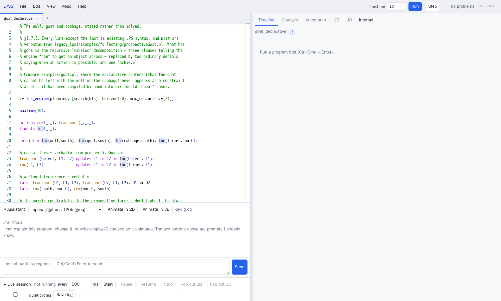

The screen has three parts.

**Along the top** is the only row of controls. On the left are the menus. On the
right are `maxTime` and **Run**, then the result of the last run, and then
**Live**. That button, and the last two items of the **View** menu, open the two
panels that sit below the editor — the assistant and the live session. Those
panels start closed and show nothing at all while they are closed.

**On the left** is the text of your program, in an editor that understands both
LPS and the Prolog you can write inside it. Several files can be open at once,
each with its own tab. Each tab owns its own run, so you can keep two programs
open and switch between them without losing either result.

**On the right** are six ways of looking at a run — of *this* file's run. Before
you have run anything, that side of the screen tells you what to do instead.

**Ctrl/Cmd + Enter** runs the program.

Mistakes are reported on the line that contains them: a wavy underline, the
message when you hover over it, and a count in the top bar that takes you to the
first one when you click it.

[`UsingTheIDE.md`](UsingTheIDE.md) describes all of it, and has a "how do I …"
section.

You do not have to start from an empty file. **File ▸ Open example from server**
lists all 178 programs — 158 of LPS1's own, and this project's — each with the
first line of its own comment as a description.

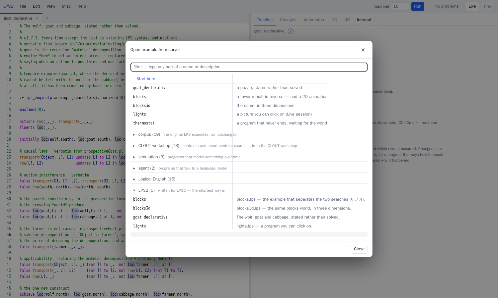

---

## 2. The first program

```prolog
maxTime(6).

fluents  light(_).
actions  switch(_).

initially light(off).

switch(New) updates Old to New in light(Old).

if   light(off) at T1
then switch(on) from T1 to T2.
```

Running it prints:

```
fluents/0        [light(off)]
fluents/1        [light(off)]
events/2         [switch(on)]
fluents/2        [light(on)]
fluents/3        [light(on)]
…
success (success)
```

Five things are already on show.

**A fluent is something true over an interval**, not a variable holding a value.
`light(off)` holds from cycle 0 until something stops it.

**An action is something the program does.** It is declared as an action, and it
happens only because some rule asked for it.

**A reactive rule is not an `if` statement.** Read
`if light(off) at T1 then switch(on) from T1 to T2` as a goal: whenever the
condition becomes true, the engine takes on the obligation of making the
conclusion true. Nothing in it says *when* that must happen. `T2` is not bound
to anything, and the engine chose the next cycle.

**The causal law is separate from the rule that causes the action.**
`switch(New) updates Old to New in light(Old)` says what `switch` *means*. The
reactive rule says when to do it. Keeping the two apart is most of what gives
LPS programs their shape: how the world works is written down once, and every
rule that acts gets it for nothing.

**Time is measured in cycles.** `maxTime(6)` says when to stop. Cycle 0 is the
initial state. The switch happens between cycles 1 and 2 and is recorded at
cycle 2, because actions occur *between* states.

---

## 3. The five kinds of sentence

Nearly every LPS program is made of five kinds of sentence. Here they are with
their proper names, and the section of [`lps_summary.md`](lps_summary.md) that
gives the full form of each.

| kind | example | meaning |
|---|---|---|
| **declarations** | `fluents light(_).`  `actions switch(_).`  `events badge(_).` | what sort of thing each predicate is |
| **the initial state** | `initially light(off), door(shut).` | what holds at cycle 0 |
| **reactive rules** | `if C at T1 then A from T1 to T2.` | when C holds, bring A about |
| **causal laws** | `switch(N) initiates light(N).`, and likewise `terminates` and `updates … to … in …` | what an action or event does to the state |
| **constraints** | `false transfer(F,_,N) from T1 to _, balance(F,B) at T1, B < N.` | this must never be the case |

`updates Old to New in f(Old)` says `terminates f(Old)` and `initiates f(New)`
in one sentence, and is nearly always what you want for a fluent that has a
*value*.

Three further kinds of sentence have sections of their own below: composite
events (§6), intensional fluents (§7), and `achieve` (§10).

---

## 4. Reading a run

Run the wolf, goat and cabbage program and look at the **Timeline**.

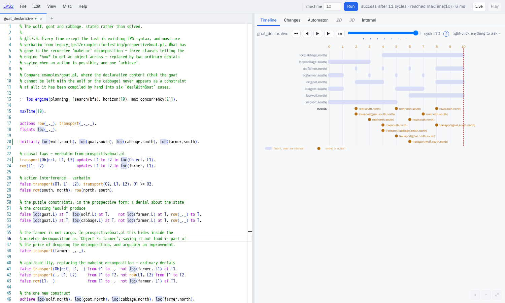

There is one row for each fluent, drawn as a bar across the interval it holds.
Below the fluents are the events of each cycle, and below those the composite
events. The red dashed line marks the cycle you are looking at. The slider moves
it, and so does clicking on the picture.

The timeline is not an extra piece of machinery bolted on for the sake of
looking at things. It is drawn from the same records the engine writes to
compare itself against LPS1 — so nothing in the engine has to be switched on to
produce it.

**Changes** answers a narrower question about one cycle: what changed, and why.

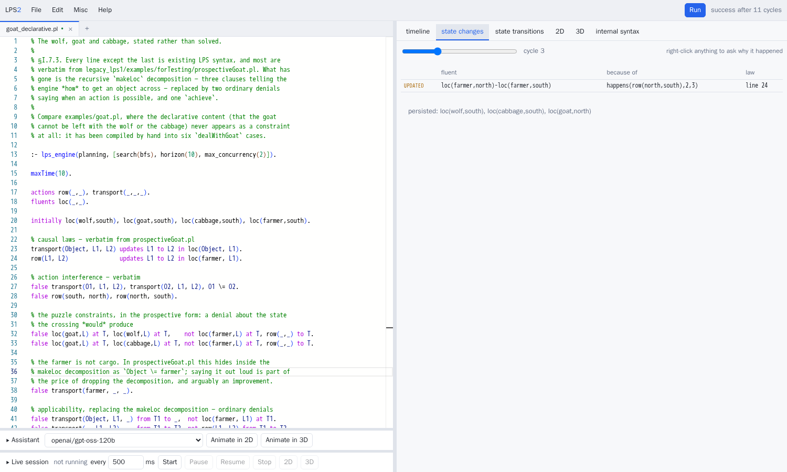

The last column is the part LPS1 did not have. `line 24` is the causal law that
fired, in the file in front of you. Everything else at that cycle is listed as
having *persisted*: it did not change, and the engine knows the difference
between "still true" and "made true again".

**Automaton** shows the whole run as a state machine: each distinct state
appears once, so a program that returns to a state it has been in before shows
that as a loop.

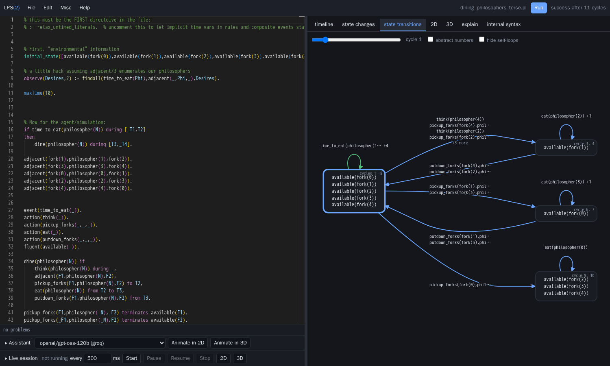

That is `dining_philosophers_terse.pl`. The large box on the left is the state
in which all five forks are free. It is reached at cycles 1 to 8, which is why
so much meets there. Each box on the right is somebody eating, with a loop back
to itself for as long as they carry on. The wolf-and-goat program's diagram, by
contrast, is a straight chain: it never returns to a state it has left, and the
diagram says so.

**Internal** shows the form the engine actually runs.

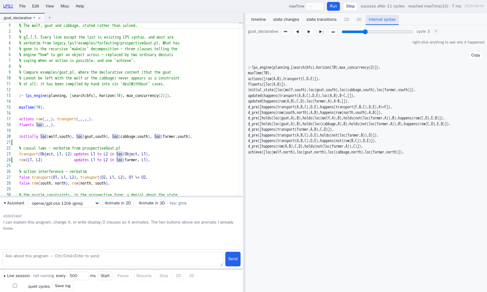

`reactive_rule/2`, `d_pre/1`, `updated/4`, `initial_state/1`. This is the same
form LPS1 used, deliberately. It is worth looking at once, because it makes
three things obvious: that `false X, Y, Z` is a constraint; that `at`, `from` and
`to` are a convenient way of writing explicit time arguments; and that `achieve`
is one more fact like any other.

---

## 5. Events from outside

Not everything is the program's own doing. `observe` supplies an event that the
world caused:

```prolog
events   reading(_).

observe reading(31) from 2 to 3.
```

Events and actions have the same shape and differ only in where they come from.
An *action* is something a rule decided to do. An *event* is something that
happened to you. Both are causes: either can appear in `initiates`,
`terminates` and `updates`.

In a session that does not stop (§14), `observe` is replaced by events arriving
over the network while the program runs.

---

## 6. Composite events

A composite event is a name for a *pattern* of other events over an interval.

```prolog
maxTime(8).

fluents  door(_), inside(_).
events   badge(_), pull(_).
actions  admit(_).

initially door(shut), inside(nobody).

observe badge(ann) from 1 to 2.
observe pull(ann)  from 2 to 3.

%  Two events, in that order, are one thing.
entry(P) from T1 to T3 if badge(P) from T1 to T2, pull(P) from T2 to T3.

if   entry(P) from T1 to T2
then admit(P) from T2 to T3.

admit(P) updates Old to P in inside(Old).
```

```
events/2         [badge(ann)]
events/3         [pull(ann)]
composites/3     [happens(entry(ann),1,3)]
events/4         [admit(ann)]
fluents/4        [door(shut),inside(ann)]
```

`entry(ann)` is recorded as happening *from 1 to 3*. Composite events have
duration, and that duration is what makes them useful: a rule can talk about the
whole pattern without knowing what it is made of.

Composite events work in the other direction too, as decompositions. In the
dining philosophers,
`dine(P) if think(P), pickup_forks(…), eat(P), putdown_forks(…)` says "to dine,
do these four things". It is the same clause, read as a plan rather than as a
pattern.

---

## 7. Intensional fluents

Some things are true because other things are true. Storing them separately
would mean keeping two copies of the same fact in step.

```prolog
too_hot at T if temperature(N) at T, N > 30.

if   too_hot at T1
then alarm(heat) from T1 to T2.
```

`too_hot` is never initiated and never terminated. It is worked out afresh every
time it is asked about, from whatever the state is at that moment. Declare it
with `fluents` like any other fluent, give it a rule with `at T if`, and never
give it a causal law.

Run that, and the alarm fires in *every* cycle after the temperature rises:

```
events/3         [reading(31)]
fluents/3        [temperature(31)]
events/4         [alarm(heat)]
events/5         [alarm(heat)]
events/6         [alarm(heat)]
```

This catches everybody once. A reactive rule sets a goal that the engine keeps
trying to satisfy for as long as the condition holds. It does not fire only at
the moment the condition becomes true.

If you want the alarm to sound once, arrange for it to make its own condition
false. That is what a pair like `alarm(heat) initiates alarmed` and
`if too_hot at T, not alarmed at T then …` is for.

---

## 8. Constraints

```prolog
false transfer(From, _, N) from T1 to _, balance(From, B) at T1, B < N.
```

Read `false` as "it must never be the case that". This one says: never transfer
more than the payer has. Not "log a warning", and not "prefer not to". The
engine will not commit a set of actions that makes the sentence true.

```prolog
maxTime(6).

fluents  balance(_, _).
actions  transfer(_, _, _).

initially balance(alice, 100), balance(bob, 0).

transfer(From, To, N) updates Old to New in balance(From, Old) if New is Old - N.
transfer(From, To, N) updates Old to New in balance(To,   Old) if New is Old + N.

if   balance(alice, A) at T1, A >= 30
then transfer(alice, bob, 30) from T1 to T2.

false transfer(From, _, N) from T1 to _, balance(From, B) at T1, B < N.
```

```
fluents/1        [balance(alice,100),balance(bob,0)]
events/2         [transfer(alice,bob,30)]
fluents/2        [balance(alice,70),balance(bob,30)]
events/3         [transfer(alice,bob,30)]
fluents/3        [balance(alice,40),balance(bob,60)]
events/4         [transfer(alice,bob,30)]
fluents/4        [balance(alice,10),balance(bob,90)]
fluents/5        [balance(alice,10),balance(bob,90)]
```

Three transfers, and then it stops. Nothing in the program says "stop after
three". The rule's own condition, `A >= 30`, stops holding; and had it not, the
constraint would have refused the action in any case.

Both are worth having. The condition expresses what the program is trying to do.
The constraint is the guarantee that it will not do something else.

This is the largest difference between LPS and a rule engine: **a constraint is
checked by the engine, not by the thing being constrained.** It is also why the
examples from Kowalski's *Computational Logic and Human Thinking* fit here so
directly.

---

## 9. Constraints about what an action would bring about

An ordinary constraint talks about the state as it is. A constraint can instead
talk about the state an action *would* produce.

```prolog
false loc(goat,L) at T, loc(wolf,L) at T, not loc(farmer,L) at T, row(_,_) to T.
```

The last literal, `row(_,_) to T`, is what makes the difference. It says that T
is the time at which a rowing action *ends*, so the fluents are read in the state
that crossing would bring about. The whole sentence therefore reads: after any
crossing, the goat must not be left alone with the wolf.

That is the actual rule of the puzzle, said once. The alternative is to work out
by hand what the farmer should carry in each of six cases and write those down
instead.

`examples/goat_declarative.pl` is exactly the program above.
`legacy_lps1/examples/goat.pl` is the same puzzle with the same knowledge spread through six
`dealWithGoat` clauses. Reading the two side by side is the shortest argument
for the language.

---

## 10. Planning: `achieve`

```prolog
:- lps_engine(planning, [search(auto), horizon(10), max_concurrency(2)]).

achieve loc(wolf,north), loc(goat,north), loc(cabbage,north), loc(farmer,north).
```

`achieve` states a goal and lets the engine find the actions that reach it. It
uses the same causal laws and the same constraints as the rest of the program,
so nothing is written twice. What it produces is a plan: a list of *sets* of
actions, one set per cycle, so that two things which can happen at the same time
do.

`search(auto)` chooses a strategy from the shape of the problem. It begins with
breadth-first search, which finds the shortest plan, and gives it a fixed budget
of states to visit. If the budget runs out it switches to greedy best-first
search, which is much faster and does not guarantee the shortest plan.
`search(bfs)`, `search(greedy)` and `horizon(N)` override the choice.

If the world moves and the plan stops being valid, execution fails and the
engine plans again from the state the program is actually in.

The picture below is `examples/blocks3d.lps`, which is
`achieve on(c,b), on(b,a)` over three blocks:

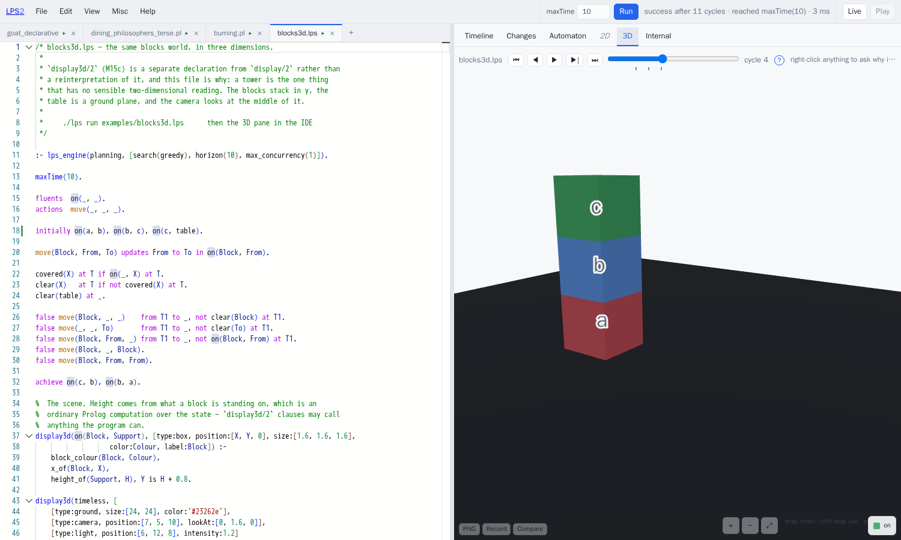

---

## 11. Prolog inside LPS

An LPS program is a Prolog file. Anything you write that is not one of the
sentence forms above is an ordinary Prolog predicate, and can be called from any
condition:

```prolog
adjacent(fork(1), philosopher(1), fork(2)).
adjacent(fork(3), philosopher(3), fork(4)).
```

Directives work too — `:- dynamic`, `:- discontiguous`, `:- op` — and so does
importing from the standard library:

```prolog
:- use_module(library(lists)).
```

Two of the engine's own predicates are worth knowing about.

- **`state(F)`** gives the fluents holding at the cycle being evaluated, *one at
  a time*. It does not return a list. Writing `state(S), memberchk(f(X), S)`
  will not work; `state(f(X))` is what you want.
- **`holds/2`** belongs to the engine's internal vocabulary. It is declared with
  no clauses, so calling it from your own Prolog does not raise an error — it
  quietly fails, which is worse. Use `at T` in a condition, or `state/1` inside
  a `display` clause.

---

## 12. Drawing a program: `display/2` and `display3d/2`

A `display/2` clause says how a fluent or an event should be drawn:

```prolog
display(burning(X,Y), [type:circle, center:[CX,CY], radius:10, fillColor:yellow]) :-
	pixels(X, Y, CX, CY).

display(ignite(X,Y),  [type:star, fillColor:red, center:[CX,CY],
		       points:6, radius1:10, radius2:6, opacity:0.5]) :-
	pixels(X, Y, CX, CY).

display(timeless, [[type:rectangle, from:[0,0], to:[200,200], strokeColor:green]]).
```

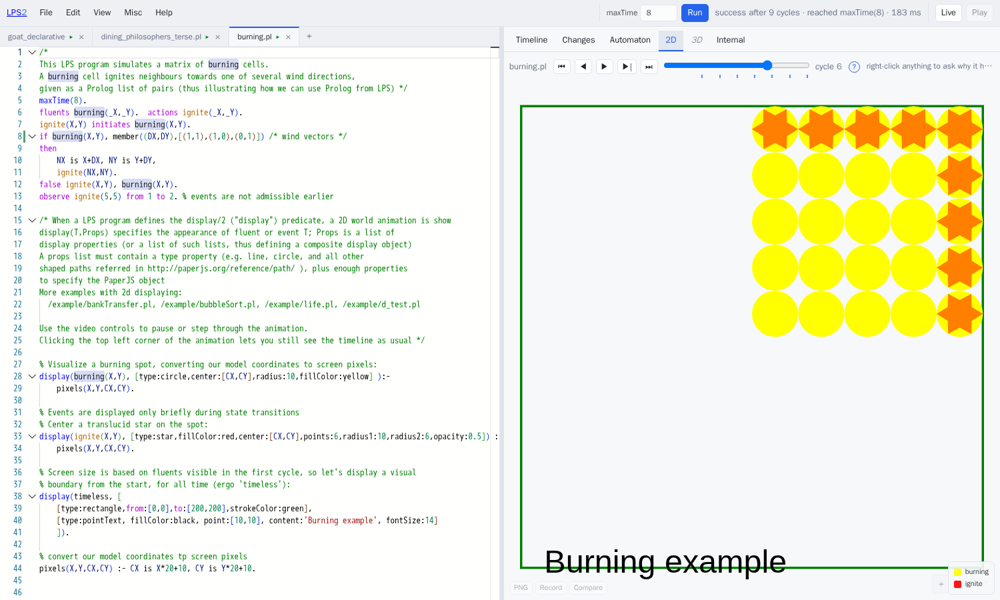

The origin is at the bottom left and y increases upwards, as it did in LPS1's
renderer. `timeless` is the background, and takes a list of property lists rather
than one. The body of the clause can be any Prolog at all, so the arithmetic
that turns the program's own coordinates into screen coordinates lives in the
program.

`display3d/2` is a separate declaration rather than a re-reading of the same
one: `type:box`, `type:ground`, `type:camera`, `type:light`, `type:text`, with
`position` and `size` in three dimensions. A program may have both, and show
different things in each.

There is a library of 134 pictures held on the server, reached as
`[type:raster, icon:fire]`. Prefer it to a URL. Several of LPS1's examples point
at clipart on sites that no longer serve it, and those pictures now come out as
holes.

**If you would rather not write any of this**, the assistant will. Open the
*Assistant* panel from the **View** menu and press **Animate in 2D**:

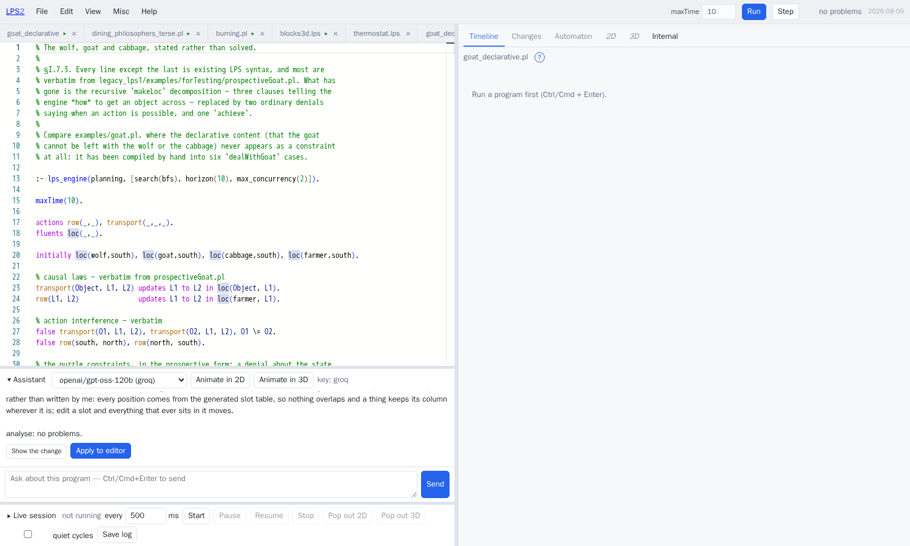

then press *Apply to editor*, and run:

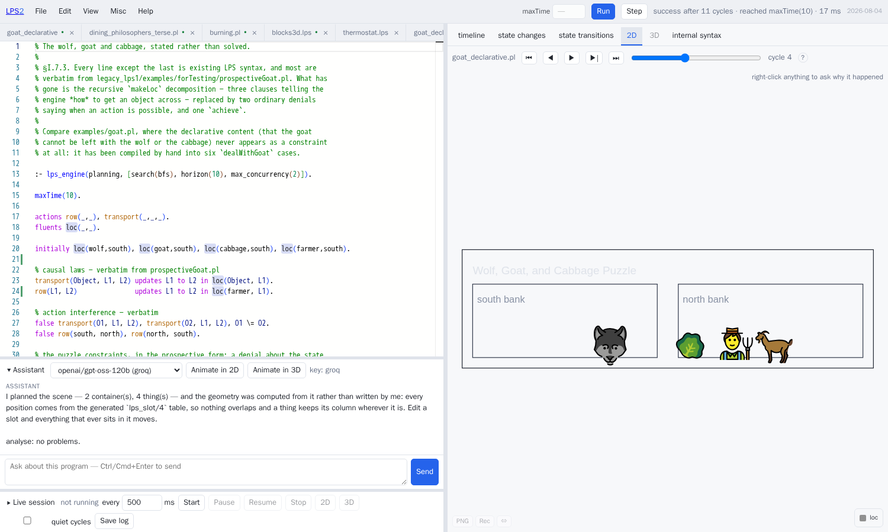

That is the wolf-and-goat program, animated in one step from a program that said
nothing about how it should be drawn.

What the model is asked for is the interesting part. It does *not* write
coordinates. Models are good at knowing that a goat belongs on a river bank and
bad at arithmetic over a canvas, and asking for both at once produced three
animals in the same place. So it is asked instead for a **plan**: which
containers there are, which things move between them, which fluent puts a thing
in a container, and what each thing looks like. The server works out the
geometry from that.

What ends up in your file is ordinary Prolog: a table of positions
(`lps_slot/4`), a background, and one `display/2` rule. Move a position in the
table and everything that ever sits there moves with it.

---

## 13. Asking why

Every run records how the engine reached each of its conclusions, whether or not
anyone is going to ask. **Right-click anything the panes have drawn** — a bar on
the timeline, an event, a row of the changes table, a state, the label on an
arrow, a shape in two dimensions, a solid in three — and you are asking about
that term at that cycle.

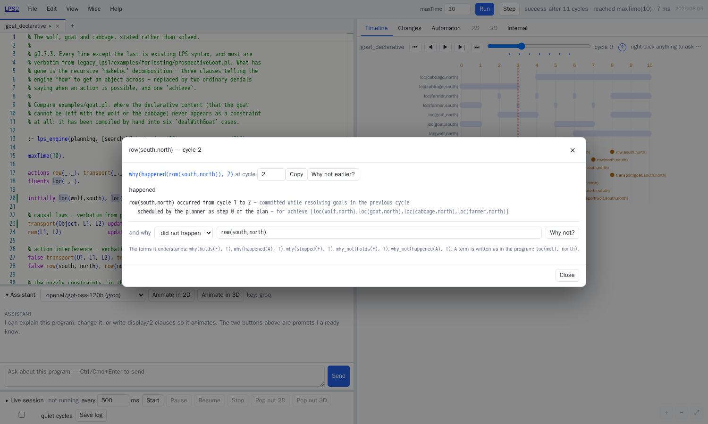

There are five forms of question, and the dialog builds them for you:

```
why(happened(A), T)        why did this action occur?
why_not(happened(A), T)    why did it not?
why(holds(F), T)           why is this fluent true?
why(stopped(F), T)         what stopped it, and what caused that?
what_if(Events, T)         what would a different observation have changed?
```

`what_if` is the one that is not simply a lookup. It copies the session, replays
it with the different observation, and compares the two runs. It is cheap
because a session is a Prolog term that is never modified, so copying one is a
single unification — about 5 microseconds, whatever the size of the session.

`why_not` needs a field of its own in the dialog, because you cannot click on
something that was never drawn:

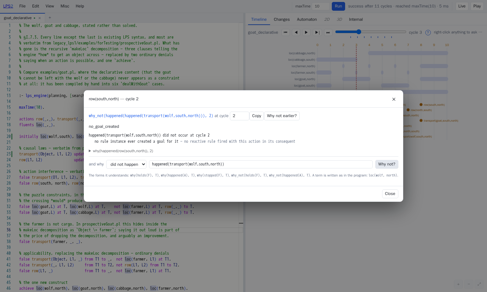

There are four different answers, and they are not interchangeable:

- `scheduled_for_another_cycle` — the plan does intend to, at cycle 6, as step 4.
- `no_goal_created` — nothing ever asked for it.
- `rejected_by_prospective_constraint` — something did ask, and a named
  constraint refused it.
- `no_plan_found` — it was asked for, and no plan was found within the horizon.

When the record cannot settle the question, the answer is "not recorded". The
pane never assembles a plausible story instead.

The same questions can be asked from the command line:

```sh
./lps explain examples/goat_declarative.pl --ask "why_not(happened(transport(wolf,south,north)), 1)"
./lps timeline examples/goat_declarative.pl
./lps changes  examples/goat_declarative.pl --at 2
./lps automaton examples/goat_declarative.pl
```

---

## 14. Programs that do not stop

Leave out `maxTime` and the program runs until something stops it, doing nothing
at all until an event arrives from outside. `examples/thermostat.lps` is the
first program written that way:

```prolog
fluents   temperature(_), target(_), heating(_), window_state(_).
events    temperature(_), set_target(_), window(_).
actions   heat(_), warn(_).

initially target(21), heating(off), window_state(shut), temperature(20).

temperature(T)  updates Old to T in temperature(Old).

if   temperature(T) at T1, target(Target) at T1, T < Target - 1, heating(off) at T1
then heat(on) from T1 to T2.

%  Never heat with the window open. This is a constraint, not advice.
false heat(on) from T1 to _, window_state(open) at T1.
```

In the editor, press **Live** in the top bar and then **Start**. Then type an
event, or say it in English and let the assistant work out the term.

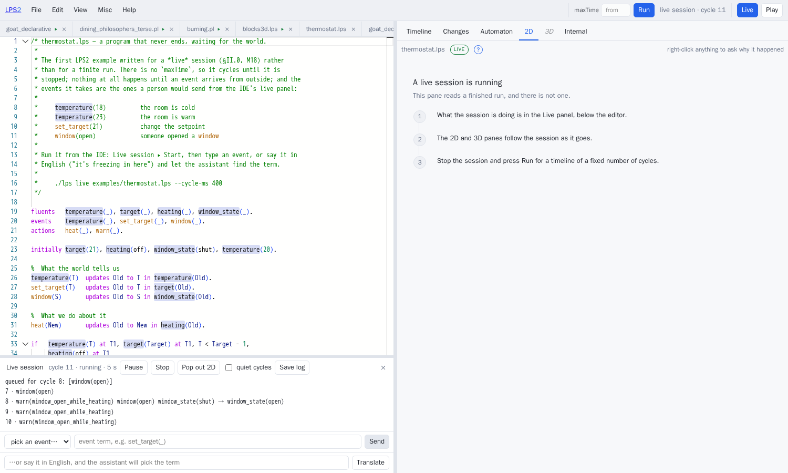

Two events went in — `temperature(14)`, then `window(open)` — and the program
answered with `warn(window_open_while_heating)`.

Notice the lines reading *queued for cycle N*. An event that arrives part-way
through a cycle is delivered at the next cycle boundary, so the record of a
session stays an orderly sequence rather than depending on exactly when things
arrived.

Notice also that the warning repeats in every cycle. A reactive rule sets a
standing goal (§7), and the window is still open.

The **Pop out 2D** and **Pop out 3D** buttons open a window that follows the
running session, rather than one you scrub back and forth through:


From the command line:

```sh
./lps live examples/thermostat.lps --cycle-ms 400
```

A session of this kind can be given a list saying which event terms each source
is allowed to send. That is not merely a convenience. It is how
`examples/agent/` makes a language model unable to approve its own dangerous
action: the event that would authorise it is not on the model's list, so no
amount of persuading the model can produce it.

### An animation you can click on

A program that **declares `lps_mousedown/3`, `lps_mouseup/3` or
`lps_mousedrag/3` as events** receives them from the popped-out window, in its
own coordinates:

```prolog
events lps_mousedown(_, _, _).

%  The reverse of the drawing — a scene and the test for what was clicked have
%  to agree, and the only way to be sure of that is to write them side by side.
lamp_at(X, N) :- N0 is X // 70, N is N0 + 1, N >= 1, N =< 4.

if   lps_mousedown(X, _, _) from _ to T1, lamp_at(X, N), not only_one_on(N) at T1
then toggle(N) from T1 to T2.

false toggle(N) from T1 to _, only_one_on(N) at T1.
```

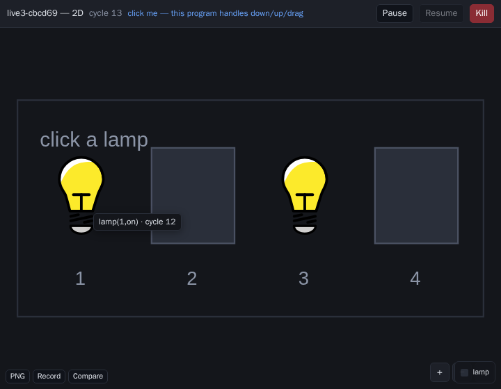

That is `examples/lights.lps`: four lamps, click to toggle one, and you cannot
turn off the last one that is on. Notice that it says so twice — once as a
condition on the rule, once as a constraint below it. The condition expresses
the intention and could be wrong. The constraint is the guarantee, and the
engine checks it however the action was proposed.

A program that does not declare those events gets no listener attached at all,
so a click on its picture stays a click on a picture.

---

## 15. Where to go next

- **[`lps_summary.md`](lps_summary.md)** — the reference. Every construct, the
  operator table, the full list of drawing properties.
- **[`glossary.md`](glossary.md)** — the terms used here and elsewhere.
- **`examples/`** — `goat_declarative.pl` (constraints about what an action
  would bring about, and `achieve`), `blocks.lps` and `blocks3d.lps` (planning,
  in two dimensions and three), `thermostat.lps` (a session that does not stop),
  `rkbook/` (twelve programs from *Computational Logic and Human Thinking*),
  and `pddl/`, `drools/`, `agent/`, `minecraft/`.
- **`legacy_lps1/examples/`** — LPS1's own examples, all of which run here, and
  all of which are two clicks away in the list of examples.
- **Logical English.** If you would rather write the program in English, LE2
  compiles to this engine. Put `the target language is: lps.` at the top of a
  `.le` file and run `./lps run foo.le`.
- **[`IntroducingLPS2.md`](IntroducingLPS2.md)** — what is new since LPS1, and
  why.

---

## 16. Eight mistakes that are easy to make

**`updates _ to X in f(_)` uses two different anonymous variables.** Each `_` is
a fresh variable, so the "old" value in the pattern is not the "old" value being
replaced, and the update quietly does nothing useful. Give it a name:
`updates Old to X in f(Old)`.

**A reactive rule keeps firing for as long as its condition holds.** It sets a
standing goal; it does not fire only at the moment the condition becomes true
(§7). If you want something to happen once, arrange for it to make its own
condition false.

**An event in the condition of a rule needs `from … to …`, not `at`.** An event
is something that happened over an interval. `at T` asks the *state* about it,
and the state has never heard of it, so the rule quietly never fires. Write
`if task_request(delete, F) from _ to T1 then …`, not
`if task_request(delete, F) at T1 then …`.

**An unquoted atom with a full stop in it is not an atom.** In SWI-Prolog 7,
`app.log` is read as the compound term `'.'(app, log)`. It prints back as
`app.log` and unifies with nothing. Write `'app.log'`. Event text arriving over
the network is parsed with a setting that allows the full stop, so somebody
typing into the Live panel does not run into this — but a term inside your own
program does.

**`state/1` gives you fluents one at a time; it does not return a list** (§11).

**`holds/2` quietly fails when called from your own Prolog** (§11).

**Actions happen between states.** An action recorded at `events/3` was decided
on the basis of the state at cycle 2, and its effects show up in `fluents/3`.
Confusion about which cycle something belongs to is usually this.

**A `display/2` clause must work with an unbound first argument.** Put the
conditions in the body. No cuts in the head, and no if-then-else deciding which
clause matches. Only the *first* solution for each subject is drawn, which is
LPS1's behaviour and is deliberate.
