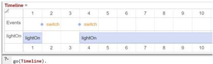
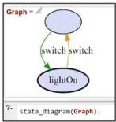
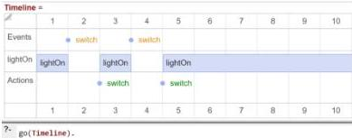
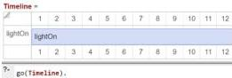
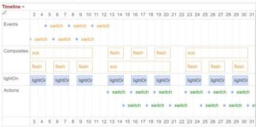
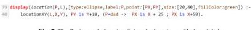

# Combining Logic Programming and Imperative Programming in LPS

Robert Kowalski$^{1}$, Fariba Sadri$^{1}$, Miguel Calejo$^{2}$ and Jacinto Dávila$^{3}$

$^{1}$Imperial College London, $^{2}$logicalcontracts.com, Lisbon,
$^{3}$Universidad de Los Andes, Venezuela.

Abstract. Logic programs and imperative programs employ different notions of computing. Logic programs compute by proving that a goal is a logical consequence of the program, or by showing that the goal is true in a model defined by the program. Imperative programs compute by starting from an initial state, executing actions to transition from one state to the next, and terminating (if at all) in a final state when the goal is solved.

In this paper, we present the language LPS (Logic Production Systems), which combines the logic programming and imperative programming notions of computing. Programs in LPS compute by using beliefs, represented by logic programs, to model the changing world, and by executing actions, to change the world, to satisfy goals, represented by reactive rules and constraints.

Keywords: logic programming, imperative programming, LPS, reactive rules

# 1 Introduction

On the one hand, it can be argued that logic programming (LP) is a Turing-complete model of computation, which is well-suited for all computing tasks. It can also be argued that the procedural interpretation of LP gives LP the computational capabilities of an imperative computer language. On the other hand, despite such arguments, conventional imperative languages dominate computing today.

In this paper, we take the position that, to have wider applicability, LP needs to be extended with the ability of imperative languages, to generate actions to satisfy an agent's goals. Without this ability, LP can represent only an agent's beliefs. The beliefs can be queried, to determine whether they hold at a given point in time. But without extension, LP cannot represent persistent goals that need to be satisfied over the course of time. For truly general-purpose computing, LP needs to be extended to include persistence goals and a treatment of time that is compatible with destructive change of state.

To support this position, we present the language LPS (Logic Production Systems) [15-22], which combines the use of LP, to represent an agent's beliefs, with the use of reactive rules and constraints, formalised in first-order logic, to represent the agent's goals. Computation in LPS generates actions, to satisfy goals in a model determined by the agent's beliefs.

Production Systems. LPS was inspired in large part by trying to understand the difference and relationship between rules in LP and condition-action rules (CA rules) in production systems *[27]*. We were motivated by the fact that both kinds of rules were used in the 1980s for implementing expert systems, and that production systems were also being used as a cognitive model of human thinking.

Moreover, we were provoked by Thagard’s claim in his popular Introduction to Cognitive Science *[34]* that “Unlike logic, rule-based systems can also easily represent strategic information about what to do”. He gives as an example the rule IF you want to go home for the weekend, and you have bus fare, THEN you can catch a bus. He does not observe that the rule incorporates the use of backward reasoning to give a procedural interpretation to the LP rule you go home for the weekend if you have the bus fare and you catch a bus. Viewed in this way, his example is not an argument against logic, but an argument for the procedural interpretation of logic programs.

In contrast, Russell and Norvig in their textbook, Artificial Intelligence: A Modern Approach, *[31]* characterise production systems as systems of logic that perform forward reasoning with rules of the form if conditions then actions, which “are especially useful for systems that make inferences in response to newly arrived information”. But they do not take into account that production systems have several features that do not accord well with such a logical interpretation. In particular, production systems destructively update a “working memory” of facts, and they use “conflict resolution” to choose between mutually incompatible actions.

For example, given a state in which you are both hungry and sleepy, and given the CA rules:

> If you are hungry then eat. If you are sleepy then sleep.

instead of deriving the logical consequence that you eat and sleep at the same time (assuming that to be impossible), production systems use conflict resolution to choose between eating or sleeping. One of the aims of LPS is to give such behaviour a logical interpretation by associating times with actions, and by allowing, in this case, eating and sleeping to occur at different times.

Integrity constraints. In addition to giving CA rules a logical interpretation, LPS also gives them a logical status as goals, distinct from the logical status of LP rules as beliefs. Our understanding of this distinction between the logic of LP rules and the logic of CA rules was influenced by Gallaire and Nicolas’ *[28]* work on deductive databases in the late 1970s. They distinguished between two kinds of general laws in deductive databases: general laws that are used (like logic programs) to derive implicit (or intensional) data from explicit (or extensional) data, and general laws that are used as integrity constraints to restrict and maintain database updates.

For example, the assumption that it is not possible to eat and sleep at the same time could be represented by the integrity constraint:

> not(you are eating and you are sleeping).

where you are eating and you are sleeping are “facts”, which are added to the database when the actions of eating and sleeping are initiated respectively.

This distinction between two kinds of general laws in databases inspired our work *[32]* on integrity checking for deductive databases, combining backward reasoning using LP rules with forward reasoning using integrity constraints, triggered by database updates. This combination of forward and backward reasoning is reflected in the operational semantics of LPS today.

External events and actions. However, integrity checking in traditional database systems only prevent database updates from violating integrity. It does not actively change the database, to ensure that integrity is maintained. Active databases *[37]* remedy this omission by using event-condition-action rules (ECA rules), to perform database-changing actions triggered by events, when the corresponding conditions hold. But, although it is natural to write such rules in the seemingly logical form if event and condition then action, ECA rules, like CA rules, do not have a logical interpretation as logical implications.

LPS gives CA and ECA rules a logical interpretation, not only by associating times with events, conditions and actions, but also by generating actions to make goals true. In this respect, LPS can be viewed as a special case of abductive logic programming (ALP) *[12]*, which combines logic programs and integrity constraints with candidate assumptions, which can be used to satisfy the integrity constraints. Whereas in the philosophy of science abduction is used to generate assumptions to explain external observations, abduction in LPS generates actions to make goals true.

Change of state. The final step in the logical development of LPS was to decide how to represent and reason about change of state. It is common in AI to represent such knowledge by means of frame axioms, such as those in the situation calculus *[25]* and event calculus *[23]*, reasoning, for example, that:

> if a fact is true in a given state, then it continues to be true in a later state, unless it is terminated by an event (either an external event or action) that occurs between the two states.

But reasoning with frame axioms is not practical for large scale computer applications. To develop LPS as a practical system, we needed to replace the use of frame axioms by destructive change of state. But we were committed to do so within a logical framework.

Models instead of theories. This last problem, of justifying destructive change of state within a logical framework, was solved by abandoning the theoremhood view of LP and replacing it with a model-theoretic view. The theoremhood view regards logic programs as axioms, and regards computation as proving that an answer to a query is a theorem. The model theoretic view regards logic programs as defining a unique, intended model, and regards computation as showing that the model satisfies the query, viewed as a goal.

To employ destructive change of state within a theorem-proving approach, it would be necessary to destructively change the axioms in the middle of a proof. But this would also destroy the justification for arguing that the theorem is a logical con

sequence of the axioms, because the axioms would not be well-defined. This problem does not arise with the model-theoretic view, because there is no such restriction on the way in which a model is defined.

We were influenced and encouraged in this model-generation view of computation by its use in such LP languages as XSB Prolog *[30]*, Transaction Logic *[4]* and Answer Set Programming *[24]*, as well as by the treatment of computation as model-generation in the modal temporal language MetaTem *[2]*.

## 2 Logic Programs for representing change of state

Computation in LPS follows the imperative paradigm of generating a sequence of states and events, to make goals true. However, unlike states in imperative programming languages, which are collections of computer memory locations named by “variables”, states in LPS are sets of facts (called *fluents*) that change with time. In this respect, states in LPS are like relations in a relational database.

LPS, like relational databases and Datalog, distinguishes between extensional fluents, which are stored explicitly, and intensional fluents, which are defined in terms of extensional fluents and other intensional fluents. These definitions are like view definitions in relational databases.

Change of state in LPS also follows the imperative paradigm of destructive updates, maintaining only a single current state. However, whereas imperative programs update variables by means of assignment statements, LPS updates fluents by means of events, whose effects are defined by logic programs. Events directly affect only the status of extensional fluents. They affect the status of intensional fluents indirectly, as ramifications of changes to the extensional fluents.

LP clauses in LPS are written in the form *conclusion if conditions*, where the *conclusion* is a simple atomic formula, and the *conditions* can be an arbitrary formula of first-order logic *[21]*. However, in the current implementation of LPS in SWISH *[38]*, *conditions* are restricted to conjunctions of atomic formulas and their negations.

As a simple example, consider the following LP clauses in LPS syntax, where *lightOn* is an extensional fluent, *lightOff* is an intensional fluent, and *switch* is an event, which can be an external event or an internally generated action.

> > *initially lightOn.*
> >
> > *observe switch from 1 to 2.*
> >
> > *observe switch from 3 to 4.*
> >
> > *lightOff if not lightOn.*
> >
> > *switch initiates lightOn if lightOff.*
> >
> > *switch terminates lightOn if lightOn.*

The first clause defines the initial state at time $1$, in which the fluent *lightOn* is *true*. The clause is shorthand for the sentence *holds(lightOn, 1)*, written in the syntax of the event calculus *[23]*.

The second and third clauses define observations of the external event *switch*, which occurs instantaneously both in the transition between the state at time $1$ and the next state at time $2$, and between the state at time $3$ and the next state at time $4$. The

clauses are shorthand for happens(switch, 1, 2) and happens(switch, 3, 4) in a syntax similar to that of the event calculus.

The fourth clause defines the intensional fluent lightOff in terms of the extensional fluent lightOn. The clause is shorthand for holds(lightOff, T) if not holds(lightOn, T).

The fifth and sixth clauses are causal laws, which specify, in effect, that a switch event turns the light on if the light is off and turns the light off if the light is on. The two clauses are shorthand for:

initiates(switch, lightOn,  $T + 1$ ) if holds(lightOff, T).

terminates(switch, lightOn,  $T + 1$ ) if holds(lightOn, T).

Given these clauses, the general command go(Timeline) in the SWISH implementation displays the history of states and events generated by computation in LPS. Notice that "times" are actually periods of time during which no change of state takes place. Events, on the other hand, are instantaneous and take place between time periods.


Fig. 1. An initial history of states and events, displayed as a Gantt chart. https://demo.logicalcontracts.com/p/basic-switch.pl

The SWISH implementation of LPS includes other general predicates that display other views of the computation. For example, the command state_diagram(Graph) generates the more abstract display in figure 2.

Logically, the history computed by LPS determines a model that satisfies the program, by making all the sentences in the program true. It makes extensional fluents true or false, by using causal laws, to initiate and terminate extensional fluents. It makes intensional fluents true or false (as ramifications of changes to extensional fluents), by using intensional fluent definitions.


Fig. 2.

In figure 1, the occurrence of the switch event between times 1 and 2 terminates the truth of the extensional fluent lightOn, so that it is no longer true at time 2. As a consequence, according to both negation as failure (NAF) and the classical meaning of

negation, not lightOn becomes true at time 2, and consequently lightOff also becomes true at time 2.

The sentences not lightOn and lightOff remain true at time 3, simply because they are not made false by the occurrence of any terminating events. Similarly, the fluent lightOn that becomes true at time 4 remains true indefinitely, unless and until some terminating switch event occurs.

In general, computation in LPS satisfies an event-calculus-like causal theory:

holds(Fluent, T+1) if happens(Event, T, T+1) and initiates(Event, Fluent, T+1).

holds(Fluent, T+1) if holds(Fluent, T) and there does not exist Event such that

{happens(Event, T, T+1) and terminates(Event, Fluent, T+1)}.

Here the second sentence is a frame axiom, which asserts that a fluent that holds at a time $T$ continues to hold at the next time $T+1$, unless an event that terminates the fluent occurs between $T$ and $T+1$.

It is important to note that LPS does not reason explicitly with such frame axioms. Forward reasoning with the frame axiom would entail the computational cost of reasoning that, for every fluent that holds at a time T and that is not terminated by an event that occurs between T and T+1, the fluent continues to hold at time T+1. Backward reasoning is only marginally better. Backward reasoning, to determine whether a fluent holds at a given time, entails the cost of chaining backwards in time until the time the fluent was initiated, checking along the way that the fluent was not terminated in between times. Both kinds of reasoning are intolerably inefficient compared with destructive change of state.

Instead, in LPS, when an event occurs, then any fluent initiated by the event is added to the current state, and any fluent terminated by the event is (destructively) deleted from the current state. However, although the causal theory is not used to reason explicitly whether any fluents hold, the causal theory and its frame axiom are emergent properties that are true in the model generated by the computation. This is like the way in which the associativity of the append relation is used neither to generate a model of append, nor to compute instances of append, but it is an emergent property, which is true in the model generated by the recursive definition of append.

Notice that the logical interpretation of destructive change of state, as generating extensional fluents in a timestamped model-theoretic structure, provides a logically pure alternative to the logically impure use of assert and retract in Prolog, which is one of the ways many Prolog programmers avoid the inefficiencies of the frame axiom in practice.

Unlike models in modal logic, which are collections of possible worlds connected by accessibility relations, models in LPS are single models in which fluents are stamped with the times at which they hold, and events are stamped with the times between which they happen. In this example, the Herbrand model, which consists of all the facts that are true in the model, is:

{happens(switch, 1, 2), happens(switch, 3, 4), initiates(switch, lightOn, 3), initiates(switch, lightOn, 4), terminates(switch, lightOn, 2),

terminates(switch, lightOn, 5), terminates(switch, lightOn, 6),...holds(lightOn, 1), holds(lightOff, 2), holds(lightOff, 3), holds(lightOn, 4), holds(lightOn, 5),...}

# 3 Reactive rules as goals

In addition to logic programs, which can be regarded as an agent's beliefs, LPS also includes reactive rules of the form if antecedent then consequent and constraints of the form false conditions, which can be understood as an agent's goals. LPS can also generate actions to help an agent satisfy its goals.

For example, the reactive rule if lightOff then switch, which is shorthand for:

For all  $T1$  [if holds(lightOff, T1) then there exists  $T2$  such that [happens(switch, T2,  $T2 + 1$ ) and  $T1 \leq T2$ ]].

represents the goal of switching the light whenever the light is off.

An LPS agent uses its beliefs to determine when the antecedent of a rule becomes true, and then it performs actions to make the consequent of the rule true. If time is unbounded, then the model determined by the resulting history of states and events can be infinite, and the computational process might never end.

The timeline in figure 3 displays an initial portion of the infinite model generated when the reactive rule above is added to the previous example:


Fig. 3. https://demo.logicalcontracts.com/p/simple%20switch.pl

Here, instead of the intentional fluent lightOff persisting, as before, from state 2 to state 3, the reactive rule recognises that lightOff is true at time 2 and generates the goal of performing a switch action in the future. The switch action can be performed at any time after time 2. However, in practice, LPS generates models in which goals are satisfied as soon as possible. So, in this case, it performs the action immediately, between times 2 to 3.

Whereas, without the reactive rule, the second switch external event turned the light on, now the same external event turns the light off. So, again, the reactive rule is triggered and turns the light back on, as soon as possible.

Of course, leaving it to the LPS implementation to make reactive rules true as soon as possible is a risky business. However, it is possible to specify the time at which the consequent of the rule is made true explicitly, in this example by using any one of the following equivalent notations:

if lightOff at T1 then switch from T1 to T2.

if lightOff at  $T$  then switch from  $T$  to  $T + 1$ .

if lightOff at  $T$  then switch from  $T$ .

At the time of writing, we do not have a syntax for representing this temporal relationship without writing time explicitly.

In general, both the antecedent and consequent of a reactive rule can be a conjunction of (possibly negated) timeless predicates, such as the inequality relation  $\leq$  and (possibly negated) fluents and events. All variables, including time variables, in the antecedent are universally quantified with scope the entire rule. All other variables are existentially quantified with scope the consequent of the rule. All times in the consequent are later than or at the same time as the latest time in the antecedent.

Goals in LPS can also include constraints of the form false conditions, which restrict the actions that an agent can perform. In the current implementation, they also restrict the external events that the agent will accept. For example, adding the constraint false lightOn, switch, which is shorthand for:

not(holds(lightOn, T) and happens(switch, T, T+1))

to the current example, results in the timeline in figure 4.


Fig. 4. https://demo.logicalcontracts.com/p/simple%20switch.pl with the constraint.

# 4 Logic programs for representing complex events

The antecedents and consequents of reactive rules can also include complex events defined by LP clauses of the form complex-event if conditions, where the conditions have the same syntax as the antecedents and consequents of reactive rules. The start time of the complex-event is the earliest time in the conditions of the clause, and the end time of the complex-event is the latest time in the conditions.

For example, the following two LP clauses define a complex event,  $sos$ , which is a simplified distress signal of a light flashing three times in succession. Each flash of light takes place over two time steps and is separated from the next flash by one time step. At the time of writing, we do not have a shorthand syntax without time for such clauses:

sos from  $T1$  to  $T4$  if lightOff at  $T1$ , flash from  $T1$  to  $T2$ ,

flash from T2 to T3, flash from T3 to T4.

flash from T1 to T3 if lightOff at T1,

switch from  $T1$  to  $T2$ , switch from  $T2 + 1$  to  $T3$ .

LPS can use the definition of the complex sos event both to recognise and to generate distress signals. Moreover, it can both recognise and generate them at the same time using a reactive rule such as:

if sos to  $T$  then sos from  $T + 2$ .

Figure 5 displays a scenario in which LPS recognises an initial sos signal and acknowledges it by generating an sos in response. But then it recognises its own response as another sos signal, and responds to it as well, ad infinitum.


Fig. 5. Here the command go(Timeline, [composites]) displays the timeline together with complex (composite) events. https://demo.logicalcontracts.com/p/new%20sos.pl

# 5 Prolog programs for defining animations

In addition to the timeline visualisations, the SWISH implementation of LPS includes animations which display one state at time. See for example the program in figure 6,

```txt
10 if location(bob, Place) at T, light(Place, off) at T
11 then switch(bob, Place, on) from T.
12
13 if light(Place, on) at T, location(dad, Place) at T
14 then switch(dad, Place, off) from T.
15
16 if light(Place, on) at T, not location(dad, Place) at T
17 then goto(dad, Place).
18
```

Fig. 6. https://demo.logicalcontracts.com/example/badlight.pl

in which dad chases around the house turning off the lights which bob turns on. Notice that the switch predicate has arguments to indicate the agent of the action, the location of the switch and the state of the light immediately following the action.

The animation is generated using purely declarative Prolog clauses that define the rendering of fluents as two-dimensional objects, as shown in figure 7.

Fig. 7. The Prolog code for visualizing the locations of bob and dad.

39 display(location(P,L),[type:ellipse,label:P,point:[PX,PY],size:[20,40],fillColor:green]) :-
40 locationXY(L,X,Y), PY is Y+10, (P=dad -&gt; PX is X + 25 ; PX is X+50).

# 6 Related work

In the Introduction, we focused on the historical development of LPS. But as we developed LPS, along the way we discovered many related, parallel developments, leading in a similar direction. For example, David Harel, in his famous paper on Statecharts [11], argues that there are two kinds of systems: transformational systems and reactive systems. Transformational systems specify a transformation, function, or input/output relation, as in LP and functional programming. Reactive systems, "which present the more difficult cases", describe dynamic behaviour, which "takes the general form 'when event Y occurs in state A, if condition C is true at the time, the system transfers to state B". This behaviour is a special case of the way reactive rules are executed in LPS. Although Harel draws attention to these two kinds of systems, he does not consider how they might be related and be combined.

Several other authors have also identified similar distinctions between different kinds of systems or rules, and they have developed more comprehensive systems or logics to combine them. For example, SBVR (Semantics of Business Vocabulary and Rules) [29] combines alethic modal operators, representing structural business rules, with deontic modal operators, representing operative business rules. Input-output logic [3] combines constitutive norms, representing an agent's beliefs, with regulative norms, representing an agent's goals. FO(ID) [8] combines first-order logic with definitions, similar to the way in which ALP combines integrity constraints with logic programs. Formally, an FO(ID) theory is a set of FO axioms and definitions. A model of such a theory is a (2-valued) structure satisfying all FO axioms and being a well-founded model of all definitions.

Other authors have also recognized the need to extend LP in similar ways. CHR [9] extends LP with propagation rules, which behave like production rules. The original semantics of CHR was given in terms of linear logic, which justifies destructive updates. EVOLP [1] extends the syntax of LP rules, so that their conclusions update the rules of the extended logic program. The semantics is given by the resulting sequence of logic programs. Like LPS, DALI [6] extends LP by means of reaction rules. However, in DALI, reaction rules are transformed into ordinary LP rules, and the semantics of a DALI program is given by a sequence of logic programs, which is similar to the semantics of EVOLP. Epilog [10] extends LP with operation rules of the form action :: conditions  $\Rightarrow$  effects, which means that if the conditions of the rule

are true in a state, then the action is performed by executing the effects of the rule to generate the next state. The semantics of Epilog is given by the sequence of state transitions generated by executing all applicable operation rules in parallel. Ciao includes a facility to timestamp data predicates, which can be used in combination with concurrency, to implement condition-action rules *[5]*.

The majority of the above systems and languages specify only one state transition at a time. In contrast, Transaction Logic (TL) *[4]* extends LP with clauses that define transactions (or complex events), which use destructive updates to generate sequences of state transitions. Unlike models in LPS, which include all states in a single model by associating explicit state (or time) parameters with events and fluents, models in TL are like possible worlds in the semantics of modal logic, where each state is represented by a separate Herbrand interpretation. However, unlike modal logics, where truth is defined relative to a single possible world, truth (of a transaction fact) in TL is defined relative to a path from one state to another. The TL semantics has been used to give an alternative semantics for CHR *[26]*. TL was also one of the inspirations for complex events in LPS.

In addition to related work in computer science, logic and AI, we have been encouraged by related work in cognitive psychology, initiated by Stenning and van Lambalgen *[33]*. They consider a variety of psychological tasks which seem to show that people do not reason logically with rules expressed in natural language, and they argue that the data can be explained by assuming that there are two kinds of rules, and that people have trouble deciding between them. In the case of the Wason selection task *[36]*, the most widely cited psychological study of human reasoning, they claim that “by far the most important determinant of ease of reasoning is whether interpretation of the rule assigns it descriptive or deontic logical form”. In *[13]*, this distinction between different interpretations of a rule is reinterpreted as a distinction between LP rules representing beliefs and first-order logic rules representing goals.

## 7 Future prospects

The current implementation of LPS in SWISH is merely a proof of concept. Nonetheless, even in its current form, it has proved to be useful for several trial commercial applications, including one in the area of smart contracts and another in the context of SCADA (Supervisory Control And Data Acquisition).

There is much scope for improving the current implementation, not only to make it more efficient, but also to improve its decision-making strategy, when there is more than one way to satisfy a collection of goals. We would also like to extend the Logical English syntax *[14]* that we have developed for LP to include the whole of LPS. A particular challenge in this regard is to develop a natural language syntax for temporal relationships in LPS. See, for example, the English representation of the rock-paper-scissors game in LPS *[7]*.

1 https://demo.logicalcontracts.com/example/fintechExamples.swinb

12

# References

1. Alferes, J. J., Brogi, A., Leite, J. A., Pereira, L. M.: Evolving Logic Programs. In: 8th European Conference on Logics in Artificial Intelligence (JELIA'02), S. Flesca, S. Greco, N. Leone, G. Ianni (eds.), LNCS vol. 2424 pp. 50--61, Springer (2002).
2. Barringer, H., Fisher, M., Gabbay, D., Owens, R., Reynolds, M.: The imperative future: principles of executable temporal logic. John Wiley &amp; Sons, Inc. (1996).
3. Boella, G., der Torre, L.V.: Regulative and constitutive norms in the design of normative multiagent systems. In International Workshop on Computational Logic in Multi-Agent Systems, pp. 303-319, Springer (2005).
4. Bonner, A., Kifer, M.: Transaction logic programming. In Warren D. S. (ed.), Logic Programming: Proc. of the 10th International Conf. pp. 257-279 (1993).
5. Carro, M., Hermenegildo, M.: Concurrency in Prolog Using Threads and a Shared Database. 1999 International Conference on Logic Programming, pp. 320-334, MIT Press, Cambridge, MA (1999).
6. Costantini, S., Tocchio, A.: A logic programming language for multi-agent systems. In: Flesca, S., Greco, S., Leone, N., Ianni, G. (eds.) Logics in Artificial Intelligence, European Conference, JELIA 2002, LNCS. vol 2424, Springer (2002).
7. Davila, J.: Rock-Paper-Scissors. https://demo.logicalcontracts.com/p/rps-gets.pl (2017).
8. Denecker, M., Vennekens, J.: Building a knowledge base system for an integration of logic programming and classical logic. In Logic Programming: 24th International Conference, ICLP 2008 Proceedings 24, pp. 71-76 Springer (2008).
9. Frühwirth, T.: Constraint Handling Rules. Cambridge University Press (2009).
10. Genesereth, M.: Dynamic Logic Programming. In: Warren, D., Dahl, V., Eiter, T., Hermenegildo, M., Kowalski, R. and Rossi, F. (eds.) Prolog - The Next 50 Years. LNCS, vol. 13900. Springer (2023).
11. Harel, D.: Statecharts: A Visual Formalism for Complex Systems. Sci. Comput. Programming 8, 231-274 (1987).
12. Kakas, A., Kowalski, R., Toni, F.: The Role of Logic Programming in Abduction. In: Gabbay, D., Hogger, C.J., Robinson, J.A. (eds.): Handbook of Logic in Artificial Intelligence and Programming 5, Oxford University Press, pp. 235--324 (1998).
13. Kowalski, R.: Computational logic and human thinking: how to be artificially intelligent. Cambridge University Press (2011).
14. Kowalski, R., Dávila, J., Sartor, G., Calejo, M.: Logical English for Law and Education. In: Warren, D., Dahl, V., Eiter, T., Hermenegildo, M., Kowalski, R., Rossi, F. (eds.) Prolog - The Next 50 Years. LNCS, vol. 13900. Springer (2023).
15. Kowalski, R., Sadri, F.: Logic Programming Towards Multi-agent Systems. Annals of Mathematics and Artificial Intelligence, Vol. 25, 391-419 (1999).
16. Kowalski, R., Sadri, F.: Integrating Logic Programming and Production Systems in Abductive Logic Programming Agents. In: Proceedings of The Third International Conference on Web Reasoning and Rule Systems, Chantilly, Virginia, USA (2009).
17. Kowalski, R., Sadri, F.: An Agent Language with Destructive Assignment and Model-Theoretic Semantics. In: Dix J., Leite J., Governori G., Jamroga W. (eds.), Proc. of the 11th International Workshop on Computational Logic in Multi-Agent Systems (CLIMA), pp. 200-218 (2010).

13

18. Kowalski, R., Sadri, F.: Abductive Logic Programming Agents with Destructive Databases. Annals of Mathematics and Artificial Intelligence, 62(1), 129-158 (2011).

19. Kowalski, R., Sadri, F.: A Logic-Based Framework for Reactive Systems. In: A. Bikakis and A. Giurca (eds.) Rules on the Web: Research and Applications – RuleML, LNCS 7438, pp. 1–15, Springer (2012).

20. Kowalski, R., Sadri, F.: A Logical Characterization of a Reactive System Language. In: A. Bikakis et al. (eds.) RuleML 2014, LNCS vol. 8620, pp. 22-36 Springer (2014).

21. Kowalski, R., Sadri, F.: Model-theoretic and operational semantics for Reactive Computing. New Generation Computing, 33(1), 33-67 (2015).

22. Kowalski, R., Sadri, F.: Programming in logic without logic programming. Theory and Practice of Logic Programming, 16(3), 269-295 (2016).

23. Kowalski, R., Sergot, M.: A Logic-based Calculus of Events. In: New Generation Computing, Vol. 4, No.1, 67--95 (1986). Also in: Inderjeet Mani, J. Pustejovsky, and R. Gaizauskas (eds.), The Language of Time: A Reader, Oxford University Press (2005).

24. Lifschitz, V. Answer set programming. Springer, 2019.

25. McCarthy, J., Hayes, P.J.: Some philosophical problems from the standpoint of artificial intelligence. In Readings in artificial intelligence 431-450, Morgan Kaufmann (1981).

26. Meister, M., Djelloul, K., Robin, J.: Unified semantics for Constraint Handling Rules in transaction logic. In International Conference on Logic Programming and Nonmonotonic Reasoning 201-213 Springer (2007).

27. Newell, A., Simon, H.A.: Human problem solving (Vol. 104, No. 9). Prentice-hall, Englewood Cliffs, NJ (1972).

28. Nicolas, J.M., Gallaire, H.: Database: Theory vs. Interpretation. In: Gallaire, H., Minker, J. (eds.), Logic and Databases, Plenum, New York (1978).

29. OMG. (Object Management Group): Semantics of Business Vocabulary and Rules (SBVR), OMG Standard, v. 1.0. (2008)

30. Rao, P., Sagonas, K., Swift, T., Warren, D.S., Freire, J.: XSB: A system for efficiently computing well-founded semantics. In International Conference on Logic Programming and Nonmonotonic Reasoning, 430-440, Springer, Berlin, Heidelberg (1997).

31. Russell, S.J., Norvig, P.: Artificial Intelligence: A Modern Approach (2nd ed.). Upper Saddle River, NJ: Prentice Hall (2003).

32. Sadri F., Kowalski R.: A Theorem-Proving Approach to Database Integrity. In: Minker, J. [ed.], Foundations of Deductive Databases and Logic Programming, Morgan Kaufmann, 313-362 (1988).

33. Stenning, K., van Lambalgen M.: Human Reasoning and Cognitive Science. MIT Press (2012).

34. Thagard, P.: Mind: Introduction to Cognitive Science. Second Edition. MIT Press (2005).

35. Warren, D. S., Denecker, M.: A Better Semantics for Prolog. In: Warren, D., Dahl, V., Eiter, T., Hermenegildo, M., Kowalski, R. and Rossi, F. (eds.) Prolog - The Next 50 Years. LNCS, vol. 13900. Springer, Heidelberg (2023).

36. Wason, P. C.: Reasoning About a Rule. The Quarterly Journal of Experimental Psychology, 20:3, 273--281 (1968).

37. Widom, J., Ceri, S. eds.: Active database systems: Triggers and rules for advanced database processing. Morgan Kaufmann (1995).

38] Wielemaker, J., Riguzzi, F., Kowalski, R.A., Lager, T., Sadri, F., Calejo, M.: Using SWISH to realise interactive web-based tutorials for logic-based languages. Theory and Practice of Logic Programming, 19(2), pp.229-261 (2019).


