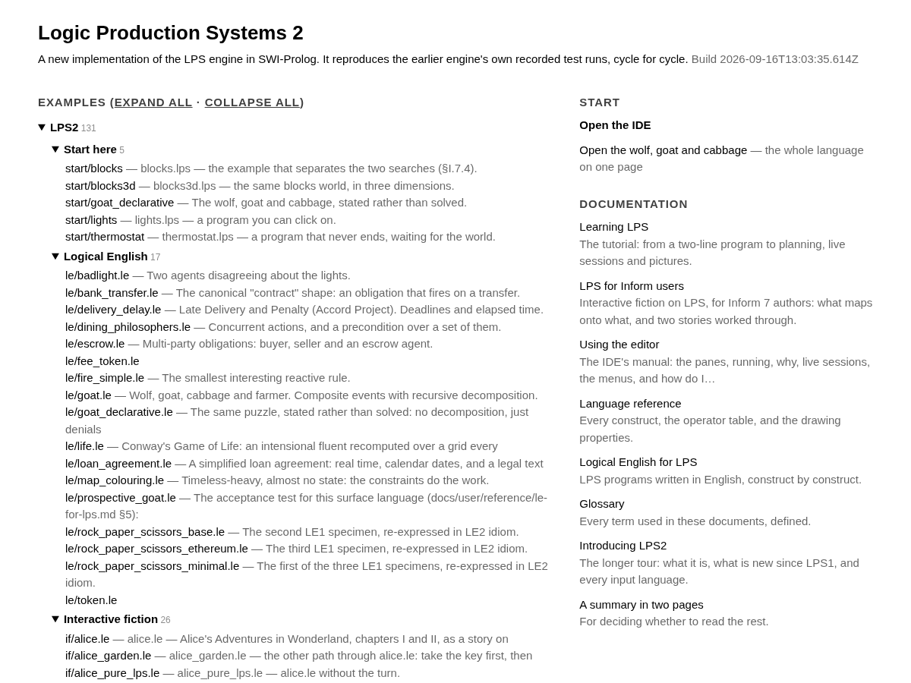
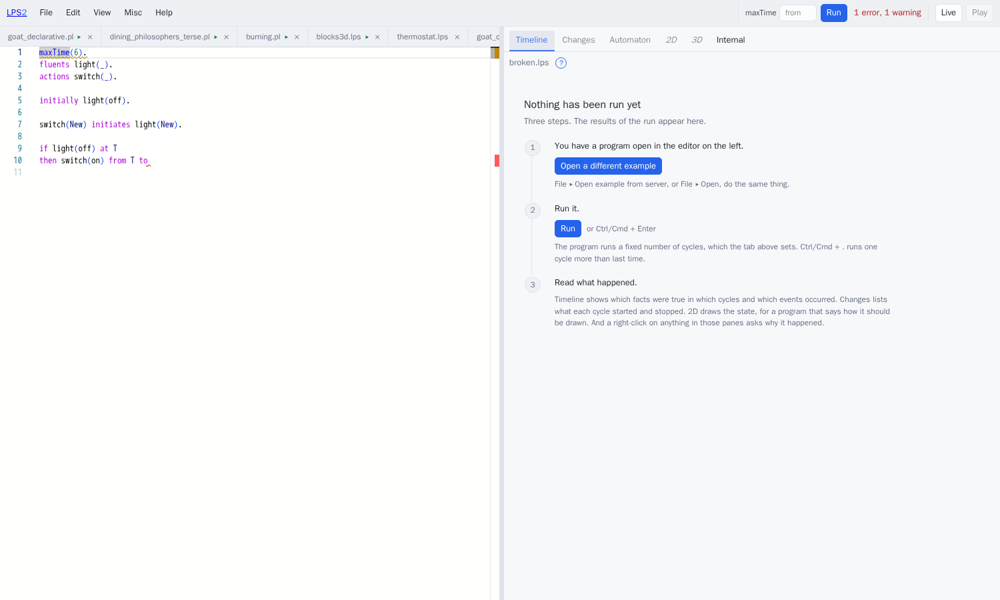
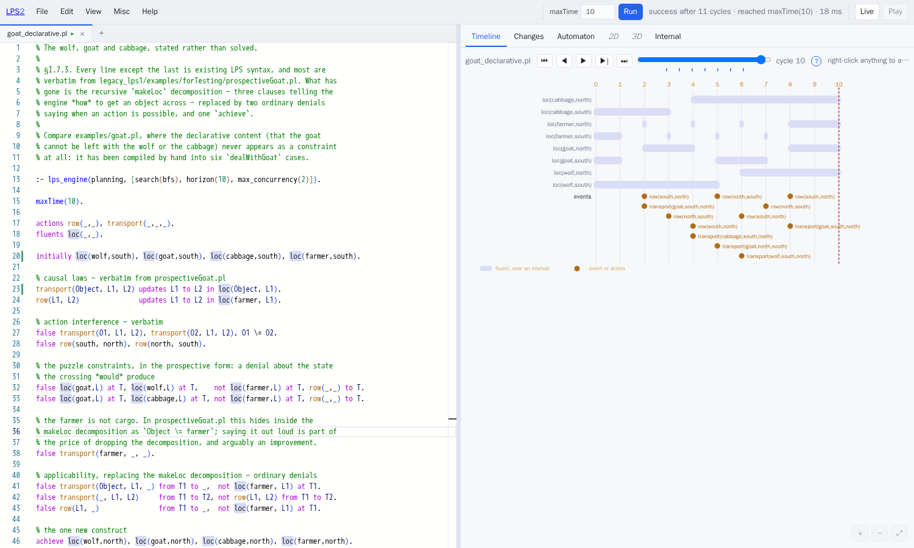
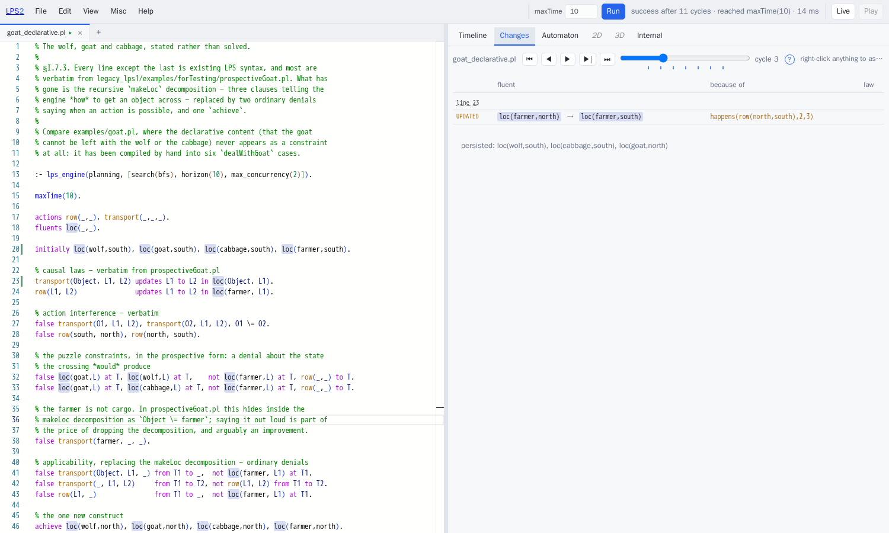
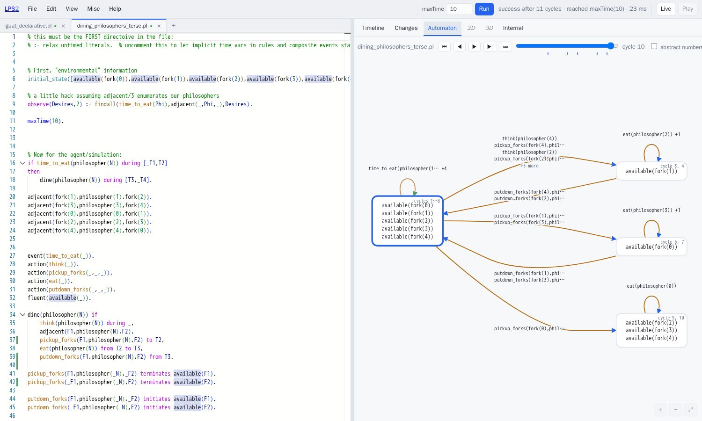
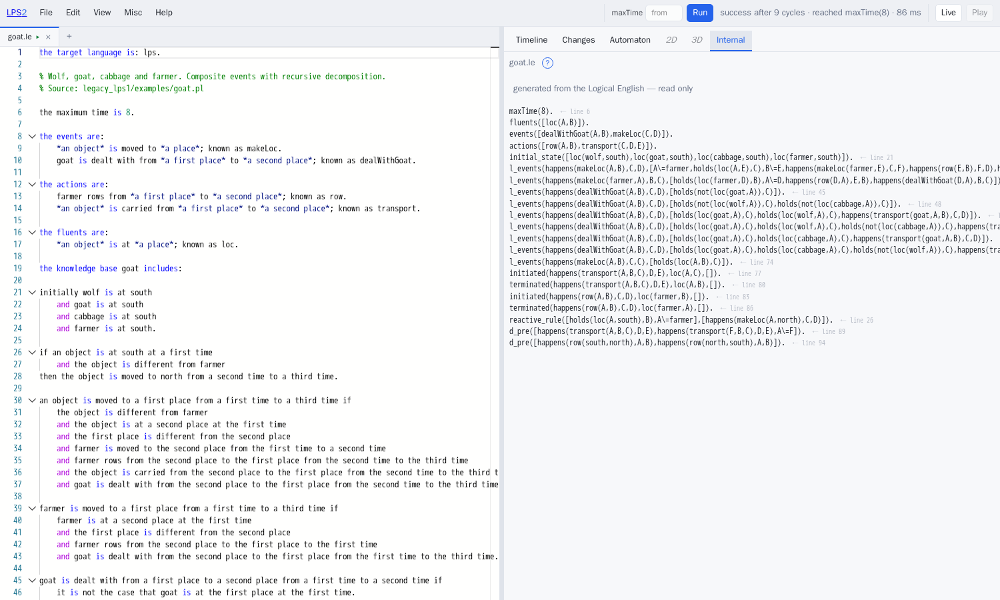
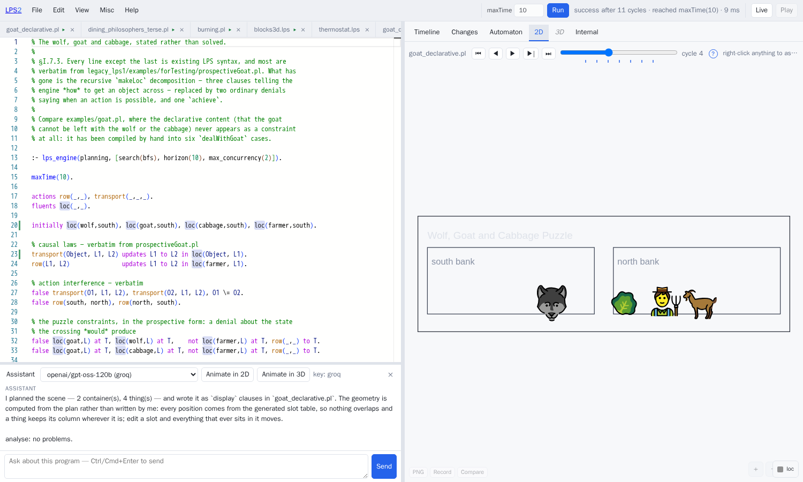
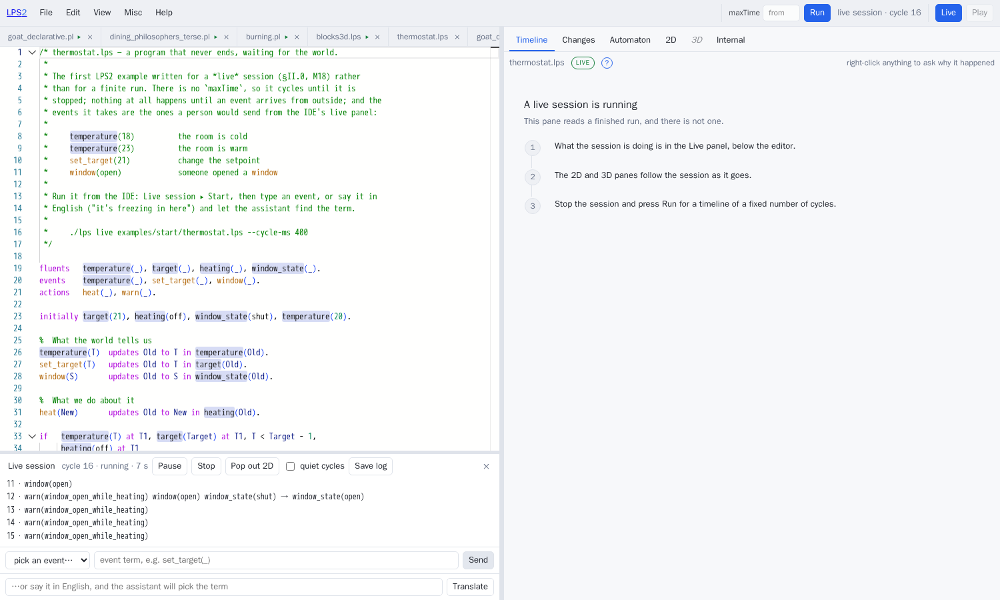

# Using the editor

*Kind: guide · Audience: users · Status: current (2026-09-16)*

`./lps ide` starts a server on <http://localhost:3060>. LPS stands for Logic
Production Systems. This document describes each part of what that server puts
on the screen, and ends with a **[how do I …](#how-do-i-)** section that answers
the questions people actually arrive with.

**<http://localhost:3060/> is a start page, not the editor.** The start page
lists every program on the server, arranged by folder, with the folders you left
open still open, and it lists the documents as well. The editor itself is at
<http://localhost:3060/ide>. Every link on the start page opens the editor with
that program already loaded.



Everything the editor does, it does by sending a request to one web address,
`POST /lpsapi`. Nothing described below is available only from the editor: every
one of these things can be asked for from the command line as well, with `curl`.
Keeping to that rule is what stops the editor from quietly becoming the only way
to use the system.


---

## Contents

- [The start page](#the-start-page)
- [The layout](#the-layout)
- [Running a program](#running-a-program)
- [The editor itself](#the-editor-itself)
- [The six panes](#the-six-panes)
- [Asking why](#asking-why)
- [Logical English](#logical-english)
- [The assistant](#the-assistant)
- [Sessions that do not stop](#sessions-that-do-not-stop)
- [The menus](#the-menus)
- [How do I …](#how-do-i-)
- [Keyboard shortcuts](#keyboard-shortcuts)

---

## The start page

`/` lists the programs as a tree of folders. The examples of LPS2, the second
version, come first, grouped by purpose — *Start here*, *Logical English*,
*Interactive fiction*, *Planning* (PDDL, the Planning Domain Definition
Language), *Agents* (the examples that use a large language model, and the
Minecraft ones), *Collections* and *Migration twins* — and each folder takes its
name from its own README file. The examples of LPS1, the first version, come
after, with their own folders inside them. Each folder remembers whether you
left it open, in this browser. Adding `?expand=all` to the address opens every
folder at once. Each folder has a small link symbol (🔗) after its name. A
click on the symbol copies the web address of that folder, ready to paste into
a message. The address is the start page with `?dir=` and the folder's path.
Opening the address opens that folder, and the folders around it, and scrolls
to it. The browser's own right-click command **Copy link** on the symbol copies
the same address. A folder that has a README (a short text saying what is in
the folder) also has a **📖 About this folder** button after its name. The
button opens the README in a panel beside the list, without opening or closing
the folder: where to start, a few steps to try, and further reading. A link in
it to a program opens that program in the editor. **Close** or the Escape key
closes the panel, and `?readme=` with the folder's path opens it. The column on the right says where to start and what to
read.

## The layout

The screen has one row of controls and two columns.

**The row of controls at the top** is the only place anything is operated from.
From the left: the menus; then `maxTime` and **Run**; then how the last run
ended; then **Live**, which opens the live panel, and **Play**, which opens the
play panel. **Play** is greyed out, and says so when you rest the pointer on it,
unless the document on screen is a story — a Logical English document that
includes the interactive-fiction library, with the line
`includes these resources: world`.

In the play panel, **Commands** lists what would work from where you are: every
command that succeeds when it is tried on a copy of the game. Click one and the
game does it, and typing `commands` gives the same list. The panes follow the
game. After each turn the Timeline, Changes, Automaton and the 2D and 3D panes
show the game so far, and the slider moves through it.

The transcript keeps track of turns. Every line you type carries its turn number
and the number of cycles the turn took, and the opening of the game has a
heading of its own. So the transcript and the panes can point at each other. A
click in the Timeline, or a nudge of the slider, marks the turn that cycle fell
in. A click on a turn's line takes the panes to the end of that turn. A click on
a thing in the 2D or 3D pane marks the turn in which that thing last changed, as
of the cycle the slider is on, and says what changed; move the slider back and
click again to walk through the thing's history.

The three panels you can turn on are listed in the **View** menu as well:
**Assistant panel**, **Live execution panel** and **Play panel**. A button that
is lit means the panel it belongs to is open. A closed panel takes up no room
and shows no controls at all.

**The play panel** is for a story: a Logical English document that includes the
interactive-fiction library (`examples/if/`, with `docs/project/plans/InformPlan.md` for why).
Start plays the document that is in the editor. Type what a player types —
`open the door`, `e`, `og, get donuts` — and read what happened. **Why?** asks
the engine why the last turn went as it did, and a refusal such as *You can't
open the case: the case is locked* is already the engine's own reason, written
out.

No key for a language model is needed, because the story's own command templates
are the grammar. With a key set (Misc ▸ API keys — an API key is what lets the
editor use somebody else's language model), a line the story cannot make sense
of is shown to the model along with the commands the story could take. The model
then either picks one of them, which is played as though you had typed it, after
the words *I take that as: …*, or picks none and says *I really don't understand
that*. While the model is thinking, the input box reads *let me see if I
understand…*.

The **each turn** box beside Commands lists what would work after every turn.
The games picker moves between a game and the games forked from it, and its last
item, **Fork this game…**, starts a second game from exactly where you are.
**Diff**, which works only on a forked game, says what happened in this game and
not in the game it was forked from.

**The left column** is your program: one tab for each open file, and the text
itself.

**The right column** shows the run belonging to whichever tab is lit, in six
different ways. Before anything has been run, the right column says what to do
instead, and offers the buttons that do it.

| region | what it is |
|---|---|
| **file tabs** | one tab for each open file. A tab owns its *run* as well as its text |
| **the editor** | one set of colouring rules covering both LPS and the Prolog written inside it |
| **the panes** | six ways of looking at the run belonging to the lit tab |
| **Assistant** | a language model with the same tools you have. Closed until you open it |
| **Live** | a program that keeps cycling and takes in events. Closed until you open it |

Everything can be resized, and the sizes are remembered between visits. Drag the
upright bar between the editor and the panes, and double-click that bar to put
it back in the middle. When a panel is open, drag the bar lying above it.

**Each tab owns its own run.** Open two programs and run both, and switching
tabs switches everything on the right: the timeline, the scene, the cycle, the
errors. A tab whose program has been run carries a green dot. Switching tabs is
how to compare two versions of a program: open both, run both, and move between
them.

## Running a program

**Run** compiles the program and runs it to the end. Ctrl/Cmd + . — or **Run one
more cycle** in the editor's right-click menu — runs one further cycle of the
run already under way, so you can carry a run on without starting it again.

The status line says how far the run got *and why it stopped there*, as in
`success after 21 cycles · reached maxTime(20) · 34 ms`. Those are two separate
facts. A run that reached `maxTime` and a run that had nothing left to do both
report success, and only the second of the two has really finished.

The **maxTime** box takes the place of the program's own value, for the next run
only. Your file is not changed. Leave the box empty to use whatever the program
says.

When a run finishes, the panes show the last cycle for which a state was
recorded. That is neither cycle 0, which is the state the program started in,
nor the engine's final reading of the clock, which is one cycle past the last
cycle in which anything happened.

Beside the cycle slider are ⏮ ◀ ▶ ▶| ⏭ — first, back, play, forward, last. The
arrow keys, Home, End and the space bar do the same from anywhere outside a text
box.

## The editor itself

Fluents, events and actions are **coloured according to what the program
declared them to be**. A fluent is dark text on a pale blue background; an event
or an action is amber. Those are LPS1's own colours, taken from its own style
sheet, so a program looks here as it looked in SWISH.

No colouring that went by the shape of the text alone could manage that.
`loc(wolf,north)` and `row(south,north)` look exactly alike, and which of the
two is a fluent is stated in the declarations. The colouring follows what the
program was found to mean, so adding a name to a `fluents` declaration at once
colours every use of that name.

Clauses that fired during the last run carry a mark in the margin. A rule that
never fires is the commonest mistake in a first LPS program, and nothing else
reveals it: the program runs, and simply does nothing.

Rest the pointer on a name and the editor says what the name is — *a fluent this
program declares* — and how many places it has. Rest the pointer on an operator
and the editor says what the table of operators records about that operator.

Mistakes are reported **in the text**, not in a strip underneath it. You get a
wavy underline on the line, the message when you rest the pointer on it, and a
mark on the right-hand edge of the scrollbar. The count in the top bar is a
button: click it to go to the first problem, and press **F8** for the next
one.



The editor looks the program over about a second after you stop typing. The
server does the looking, and reports exactly what the compiler reports. A file
the server cannot read to the end still gets everything the server managed to
work out before it gave up.

**Right-click** in the text for a menu:

| item | |
|---|---|
| Run | compile and run, the same as Ctrl/Cmd + Enter |
| See internal syntax | what the engine actually runs |
| Why did this happen? | explain the term under the cursor, at the current cycle |
| Observe this (live session) | send the term under the cursor as an event to a running session |
| Show definition | go to the first clause with that name; on a Logical English `includes these resources:` line, open the resource under the cursor — a local document in a tab of its own, a URL in a new window |
| Go back | return to where you came from |
| Show occurrences | every use of the name, as a list you can click |
| Fold / unfold all clauses for this predicate | |
| Copy URL | a link with the program inside it |

The same menu has cut, copy and paste, and everything the editor underneath
brings with it: **Ctrl/Cmd + F** to find, **Ctrl/Cmd + H** to replace, several
cursors at once, moving lines, and commenting out. Select a term and its other
occurrences are highlighted, and resting the cursor on a name does the same.

As you type, the editor offers to complete both the language's own words *and*
this program's: the events and actions the program declares, as they stood the
last time the server looked the program over.

## The six panes

Five of the six move together on one cycle slider. The slider appears when there
is a run to move through, and stays away when there is not. Underneath the
slider, a tick marks every cycle in which something changed, so you need not
hunt through a quiet run by dragging. Click a tick to go to that cycle.

**What the row of tab names is telling you.** A dimmed tab is dimmed for one of
two reasons, and resting the pointer on the tab says which:

- *"run the program first"* — it will fill as soon as you press Run;
- *"this program declares no display/2 clauses"* — it will not fill however many
  times you press Run, and the empty pane offers the button that would change
  that.

A tab that is not dimmed has something in it now.

Two more markers appear in the strip above the panes. **LIVE** means the panes
are following a running session rather than the last press of Run. *"was run
before your last edit"* means you have typed something since the run the panes
are showing.

**If you leave the page open for a long time**, the run behind the panes can
outlive the server. A server out on the internet shuts its machine down when
nobody is asking it for anything, and every run, along with everything the panes
read from a run, lives in that machine's memory. You need do nothing about it.
Your next click says *"the server restarted — running again…"*, the program in
the editor is run afresh, and the pane you asked for comes back at the cycle you
were on.

### Timeline

One row for each fluent, drawn across the stretch of time the fluent holds for;
then the events of each cycle; then a row for composite events — events made up
of other events — which appears only if the program has any. Click the picture
to move to that cycle.

A fluent declared with a default (`defaults/1`, or `; 0 by default` in Logical
English) has one dashed *every other: …* line beside the rows of the entries
actually stored: every key with no row of its own holds the default. An observed
event that a constraint refused is drawn crossed out in red (see
[Asking why](#asking-why)).



### Changes

What was started, stopped and updated at this cycle, grouped under *the causal
law that did it*. Click the law to go to that clause.

Everything that did not change is listed separately as having *persisted*,
because the engine knows the difference between "still true" and "made true
again". If nothing changed at this cycle, the pane offers the nearest cycle in
each direction where something did.

If nothing changed in *any* cycle, the pane says so, and says why. A program
whose fluents only move when an event arrives does nothing at all in an ordinary
run, and wants a session that does not stop rather than another press of Run.
`lights.lps` and `thermostat.lps` are both programs of that kind.



### Automaton

The run drawn as its states and the steps between them: each distinct state
appears once, so a program that comes back to a state it has been in before
shows that as a loop. A run whose states form a simple chain is drawn as a
column, and a run that branches is drawn from left to right.

Two switches: *abstract numbers* merges states that differ only in a number, and
*hide self-loops* removes the arrows a state draws to itself.



Clicking a state moves the cycle slider to it.

### 2D

The picture described by the program's `display/2` clauses. The point [0, 0] is
at the bottom left, and y grows upwards. Use the wheel to zoom in and out, drag
to move the picture, and double-click to fit everything into view.

Rest the pointer on an object and the pane names the fluent that object stands
for, and the cycle. A key in the corner gives the colours. Along the bottom:
**Scenes** lays the whole run out as a strip, described below; **PNG** saves the
picture on screen as an image file; **Record** plays the run and records it as a
video file; **Compare** puts this cycle beside the one before it; and
**◀ change** / **change ▶** step to the cycles at which the picture *becomes a
different picture* — four such cycles in an eight-cycle run of the Underground
notice, where the slider offers eight. The marks under the slider are those same
cycles; an amber mark is a state the run has been in before.

#### One picture, or the whole run: **Scenes**

The **Scenes** button in the pane's own row of controls — or View ▸ *Split the
run into scenes* — changes what the 2D and 3D panes draw. Switched off, a pane
shows one picture, which you move through with the slider. Switched on, the pane
shows the run laid out as a **strip**: one picture for each moment at which the
picture changed, in order, with what moved the story on written between the
frames and what began, ended or changed value written under each frame. The
strip answers "what happened?", where the single picture answers "what is true
now?". The strip has controls of its own: **◀ Single scene** goes back to the
single picture, and **PNG** saves the whole strip as one image.

Click a frame and the full picture at that cycle opens: the strip is the map,
and the single picture is the place. The first button then reads **◀ Scenes**,
which takes you back to the strip, scrolled to where you left it. Your choice
between the two is remembered from one program to the next. A live session
always draws the single picture, because there is no finished run to lay out
while the run is still going on.

If the program is a Logical English document, the captions, the lines written
between frames, the key and the messages you get by resting the pointer are all
in **the document's own words**. A document that declares
`*a payer* transfers *an amount* to *a payee*; known as transfer` gets *"fariba
transfers 10 to bob"* rather than `transfer(fariba,10,bob)`. A term with no
template behind it is printed as a term.

### 3D

The picture described by `display3d/2`. Drag to turn the scene, use the wheel to
move towards or away from it, and press ⤢ to fit everything in view.

Your view stays where you put it when you move the cycle slider, because a
camera declared in the program sets where you *start* from and is not an
instruction repeated at every frame.

**Scenes** works here too. The strip is then a row of pictures of the scene, one
for each moment at which the scene changed, drawn by the same machinery. Each
picture is framed on what that picture contains, rather than on the camera the
program declared, which was chosen for a pane of the full size.

**While a session is running, the 2D and 3D panes follow the session** rather
than the last finished run. Clicks in those two panes reach the program, exactly
as they do in a window popped out on its own.

### Internal

The form the engine actually runs: `reactive_rule/2`, `d_pre/1`, `updated/4`,
`initial_state/1`. The pane is worth looking at once. Looking makes clear that
`false X, Y, Z` is a constraint, and that `at`, `from` and `to` are a convenient
way of writing a time out as one more place of a relation.

**Copy this text** takes the whole of it, which is what a report of a fault
wants. Click a line and the editor looks for that predicate in your own
program.

## Asking why

There is no pane for explanations. **Right-click anything a pane has drawn** — a
bar on the timeline, an event, a row of the changes table, a state, the label on
an arrow, a shape in two dimensions, a solid in three — and the explanation for
that term at that cycle appears.

The dialog that opens also has a **why not** box, because the interesting
question is often about something that is *missing*, and you cannot click on
something that was never drawn. The box comes filled in with a question of the
right shape: edit the question and press the button. The forms of question the
box accepts are printed underneath it.

The dialog keeps what you asked before, so asking a further question does not
take away the answer you were reading. **Copy** takes the question and its
answer together. The cycle box asks the same question at a different cycle
without closing the dialog. *Why not earlier?* asks the question about the cycle
before.

Every part of the answer that names a clause is a link into the editor, and the
link selects the whole clause rather than putting the cursor on its first line.

`why_not` has six different answers, and no two of them say the same thing:

- **scheduled_for_another_cycle** — the plan does mean to do it, later, as step
  *n*.
- **no_goal_created** — nothing ever asked for it.
- **refused_by_constraint** — the event was *observed*, which means it was a
  call made from outside: from the program's scenario, or as a live
  observation. An integrity constraint held in the state the call arrived in,
  so the call was refused entirely. The answer names the constraint, and the
  values the constraint held on. The timeline shows such a call as well, crossed
  out in red; in a contract, the same thing is a revert.
- **blocked_by_denial** — something did ask for it, and a named constraint on
  the state it would have started from forbade it.
- **rejected_by_prospective_constraint** — something did ask for it, and a named
  constraint on the state it would have brought about refused it.
- **no_plan_found** — it was asked for, and no plan was found as far ahead as
  the engine looks.

Outside those six the answer is a plain "no applicable rule". Where the record
of the run says nothing, the answer is *not recorded*, rather than a likely
story put together after the event. Holding back in that way is the whole worth
of the feature when something has gone wrong.

## Logical English

A `.le` file opens here like any other file, and everything to the right of the
dividing bar works on a `.le` file unchanged: run it, move through the cycles,
ask why, have it drawn.



What is different is the left-hand column.

- **The colouring is built from the list of words belonging to LE2 — Logical
  English, version 2.** The section headings, the joining words and the
  `*slots*` are coloured from LE2's `i18n/keywords.csv`, which the editor
  fetches when it starts rather than keeping a copy of its own. A copy would go
  wrong for every language but English as soon as either side changed.
- **What the editor offers to complete comes from the document's own
  templates**, each labelled with the part it plays. Two templates that read
  alike may be one fluent and one action, and which is which is the first thing
  an author needs to know.
- **Errors are reported on the English line.** LE2's own complaints and LPS2's
  are shown one after the other and never mixed together, because the two are
  different claims about different texts. Both kinds land on the line of the
  `.le` file, because every term the translation produces remembers which
  sentence it came from.
- **The program that was generated sits beside the document.** The Internal pane
  shows what your English compiled to. That pane cannot be edited, and every
  line in it links back to the sentence that produced the line. Click a term to
  go to that sentence.
- **Prolog goes in the companion file.** `badlight.le` and `badlight.lps` are
  one program. The English says what is true and what happens, and the `.lps`
  half holds what is not English and gains nothing from being written as though
  it were — the drawing clauses above all. Opening either half opens the other,
  and the two compile, run and are drawn together. Each half keeps its own
  colouring and its own errors, so a mistake in the companion is marked in the
  companion. Pressing Run in either tab runs the whole program.
- **Edit ▸ Say it in English…** turns a sentence into Logical English using only
  the templates this document declares, checks the result against the program,
  improves the result, and shows it to you. Nothing is put into your document
  until you say so.

LE2 does the reading of the English. LE2 owns the grammar, the dictionary and
the part that writes English back out. LPS2 loads LE2 as a library, so
translating a document is one predicate call inside the same program rather than
a request sent over the network. Start the server with a copy of LE2 for it to
load:

```sh
LPS_LE2_LIB=/path/to/LogicalEnglish2 ./lps ide
```

Two other settings do the same job. `LPS_LE2_URL` names an LE2 server that is
already running, at a URL (a web address). `LPS_LE2_DIR` names a copy of LE2 on
this machine, loaded in the same way — or run as a program of its own, if
`LPS_LE2_SUBPROCESS=1` is set as well.

**With none of the three set, Logical English is simply absent.** A `.le` file
still opens, and says which setting to fill in, and nothing else in the editor
changes. The editor never guesses which copy of LE2 to use, because a `.le` file
compiled by the wrong copy is a program whose meaning nobody has stated.

## The assistant

A language model with the same tools you have. The assistant compiles, runs,
asks why, and checks what its own drawing clauses produced. The assistant's idea
of "this compiles" is the editor's own idea, because both make the same call.

Open the assistant with **View ▸ Assistant panel**. Choose a model at the top of
the panel to use that model for one question, or set the model you usually want
in **Misc ▸ API keys, models & Assistant settings**.

The list of models is the list the providers themselves report. The server reads
the list when it starts, and again whenever you press *Re-read from providers*.
A key set where the server itself can see it is preferred to a key typed into
the browser. With no key at all, the panel says so and offers the button that
sets one.

You can ask the assistant about LPS, or about the IDE — the editor and
everything around it — as well: *How do I observe an event in a live session?*
The assistant searches this documentation for what you asked, answers briefly,
and ends with a few links, at most three, to the sections that say more; those
links open in a new browser tab. The search happens on the server before the
model sees your question, and the model can search again with other words. A
request to change the program gets no links.

Two buttons ask a question that is already written.

**Animate in 2D** asks the model for a *plan*: which containers there are, what
moves between them, which fluent puts a thing in a container, and what each
thing looks like. The editor then works out the positions and the sizes itself.
The model never writes a coordinate, which is why nothing in the result ever
overlaps:



The clauses produced are ordinary Prolog written over a table of positions,
`lps_slot/4`. Move a position in the table and everything that ever sits at that
position moves with it.

**Animate in 3D** asks for the same plan and draws it again in three dimensions.
The grid of containers becomes a floor plan, things stand up out of the floor,
and a stack becomes a tower.

Nothing is put into your file until you press **Apply to editor**, and one undo
takes it back out.

For a Logical English document the clauses go into its `.lps` companion, which
is opened for you if there is not one yet. The clauses are Prolog, and Prolog
inside an English document is not merely a poor edit but an impossible one: LE2
reads a clause as a section gone wrong, and the document stops compiling.

## Sessions that do not stop

Leave out `maxTime` and a program runs until it is stopped, doing nothing until
an event arrives. Open the **Live** panel from the top bar.



While no session is running, the panel offers a rate and a Start button, and
nothing else. The rest of the controls appear once there is a session for them
to act on.

- **every N ms** — how long a cycle should take. The engine still works its own
  idea of time out from the cycle number, and this setting only sets the pace at
  which one cycle follows another.
- **Send** — sends an event term. The menu beside Send lists the events *this*
  program declares, and choosing one fills the box in and selects the arguments.
  Rest the pointer on that menu and it says whether the program handles mouse
  events at all.
- **quiet cycles** — also record the cycles in which nothing happened. Off by
  default: at two cycles a second, "nothing happened" would be most of what you
  read.
- **Save log** — writes the whole record to a file. A session that runs in real
  time cannot otherwise be repeated.
- **Translate** — say what you want in English and let the assistant choose the
  term. The term is shown to you before it is sent, because an event translated
  wrongly is an event you did not mean.
- **Pop out 2D / Pop out 3D** — a window that follows the running session. Those
  two buttons appear only for a program that has something to draw.

The record shows one line for each cycle in which anything happened: the events
observed, the actions taken, and the fluents that started (`+`), stopped (`-`)
or changed value (`→`). The heading counts the cycles and the time that has
passed, and, when the session cannot keep up with the rate you asked for, says
what rate it is actually managing.

An event that arrives part-way through a cycle is delivered at the start of the
next cycle. The record says *queued for cycle N*, so you know which cycle to
look in for that event.

**A program that declares `lps_mousedown/3`, `lps_mouseup/3` or
`lps_mousedrag/3` as events can be clicked on.** The popped-out windows send
those events in the program's own coordinates. A program that declares none of
the three is not watched for clicks at all. `examples/start/lights.lps` is the
demonstration.

## The menus

Rest the pointer on any menu item and it says what it does. An item that needs
something the file on screen or the server does not have is greyed out, and
resting the pointer on that item says why.

**File** — *New LPS program* (`.lps`, the written form) and *New Logical English
program* (`.le`: a small Logical-English-for-LPS program to start from, with an
action, a fluent, a causal law, a constraint and a scenario; greyed out when
this server has no LE2). Then Open, which takes several files at once; Open
example from server, which shows every program on the server in a tree of
folders — LPS2's own, the Migration twins with one folder for each source system
and twin, and the collection of LPS1 programs — with a box to narrow the list
and a name column you can widen; and then Save, Save As, Close file and Copy
share link.

`.pddl` and `.drl` files open like any other file. The server translates them
into LPS, and the tab carries a note saying what the program was translated from
and when. Files that belong together are chosen together: a PDDL domain with its
problem, a `.drl` file with its `.wording` file. An Inform 7 story (`.ni`) opens
as the Logical English story its assertions add up to. With Logical English
loaded (`LPS_LE2_LIB`), File ▸ Open also takes every kind of file the Logical
English installation can read — a Solidity contract, a Miniscript policy, a
zipped project, and the other systems on its own list of readable formats
(operation `import_formats`) — and opens it as a Logical English document. Rest
the pointer on the menu item and it lists what this server converts, and the
notes a conversion leaves behind are written as a comment at the top of the
document.

**Edit** — undo and redo, find, replace, go to line, comments on one line and on
a block, collapse all clauses, expand them all again, next problem, and **Insert
a construct…**, which offers the shapes of rule for when you know what you want
to say but not which word says it. For a Logical English document there is also
**Say it in English…**.

**View** — the original that a translated file came from, the *legal view* of a
Logical English LPS document, a comparison of this run with the previous one, a
pane of documentation beside the editor, and the two optional panels: the
assistant and the live session.

The legal view (LE2's `le_lps_legal.pl`, operation `le_legal_view`) turns the
document's integrity constraints into one rule for each action, saying who may
perform that action, and turns its causal laws into rules about effects — *a
sender may transfer an amount to a recipient if …*, *a sender transferring …
results in the balance of … being …*. The result is a Logical English program
with no time in it, opened in a tab of its own.

The legal view is worked out afresh each time from the document and from its
run, and this server runs the program first. The view carries a scenario that
holds the state just before each call of the document's own scenario, together
with two questions: whether that call may be made, which is expected to hold
exactly when the run accepted the call, and what the call changes. The questions
the view can be asked — may this call happen? what does it change? what would
have to change for it to be allowed? — are answered by LE2's own editor, not by
this engine. The menu item is greyed out unless the file on screen is a Logical
English document that declares `the target language is: lps.`

**The original this was converted from** shows the file a program came from:
either the file that was converted when you opened it — a Solidity contract, a
PDDL or Drools file, an Inform story — or, for a program opened from the server,
the files in the `sources/` folder beside it, where LE2's migrations keep what
each twin was translated from. The original opens in a window of its own, titled
"Original that was converted into" followed by the program's file name, so that
the two can be read side by side. A browser that blocks the new window shows the
original in a dialog instead.

**Misc** — the theme (dark, light, high contrast), the font size, the API keys
and models for the language models, the server's access token, *Deploy as WASM*,
*Deploy as Solidity* and *Export to another system*.

**Export to another system…** writes a Logical English document out in another
system's format, using one of the writers that come with the Logical English
installation (LE2's list in `le_import.pl`, reached through
`le_service:le_export/4`; operations `export_formats` and `export`). Only the
writers that can handle this document are offered. The result is shown with
**Copy**, **Save…** and a button for each public place to try it out that the
writer names — a Miniscript policy, for instance, opens in Minsc.

**Deploy as Solidity…** writes the program in the editor — LPS, or Logical
English for LPS — as a Solidity contract (operation `to_solidity`, and `lps
solidity FILE` from the command line). The translator behind the menu item,
`lps_solidity.pl`, is one of two this server loads from the private lpsPlus
collection of files (`src/syntax/lps_plus.pl`). Where the server has neither,
the menu item is disabled and says so, and nothing else in the editor changes.

The way one thing becomes the other is fixed. Each fluent becomes state: a
mapping from its keys to its value, with a `has…` flag beside it, because a
fluent can be *absent* and a mapping cannot. A fluent declared with a default,
`; 0 by default`, is the exception, because such a default is exactly a
mapping's zero: that fluent gets the mapping alone. A named constant becomes a
Solidity `constant`. Each action becomes a function, and where that function's
first argument is somebody, the argument is `msg.sender`. Each integrity
constraint on an action becomes a `revert` at the start of the call, or at the
end of the call for a constraint on the state the call leaves behind. Each
causal law becomes a write to the state, in LPS2's own order: every law's
conditions are read on the state as it stood before the call, then come the
fluents that stop, then those that start, then the updates. Parameters take the
addresses first and the values after (Solidity's own convention:
`transfer(to, value)` keeps the ERC-20 selector although the sentence reads
"a sender transfers an amount to a recipient"), and events list their arguments
in the same order. The public getters are named after the fluents (`balance`,
not `balanceOf`), as the dialog says. `initially` becomes the constructor, whose
parameters are the accounts the program names (`alice`, `the owner`), since a
program cannot know their addresses. The program's own scenario is written at
the top as the calls to make. A Logical English document gives the functions and
the parameters their names, and gives every line its own sentence as a
comment.

The dialog shows the source, with **Copy source**, and **Open in Remix IDE**,
which opens the contract in [Remix](https://app.remix.live), the Ethereum
Foundation's public editor, which runs in a browser. The source travels inside
the address (`#code=<base64>`), Remix compiles it in a workspace of its own, and
*Deploy & run ▸ Remix VM* puts it on a chain inside the page, with test accounts
already funded. There is nothing to install, and no wallet is needed.

**Some programs have no straight translation, and are refused rather than
approximated.** The dialog lists each reason with a link to the line it is
about: a reactive rule, because a contract does nothing on its own and only
answers calls; an intensional fluent or a composite event; planning; an event
the world outside observes rather than an action somebody calls; a constraint
over two actions at once; a timeless rule, though timeless *facts* are written
out, as lookups; the program's own Prolog; a fraction (`/`, where the EVM — the
Ethereum Virtual Machine — has only whole numbers, so write `//`); a read that
would have to search a mapping, which is a set fluent with an argument not yet
known; and a fluent the program lets hold two values for one key. lpsPlus's
`migration/solidity/lps_solidity_test.pl` is what holds the line. It checks the
refusals and, for lpsPlus's Solidity twins (ERC-20, Ownable, Pausable, the three
composed, and Circle's FiatToken), it checks that the contracts compile without
a warning and that, replayed on an EVM with the program's scenario, they end in
the state LPS2's run ends in.

**Help** — the start page, the keyboard shortcuts, this document, the tutorial,
the language reference, the glossary, the tour, the map of the other systems
LPS2 reads and writes ([other systems](../integrations/index.md)), **Search the
documentation…**, the licences of the icons, and About, which says which build
you are running.

The search looks in the text of every document. All the words you type have to
appear in one section, and a phrase in quotation marks has to appear as written.
The sections found come grouped by document, the best first, and in the same
order every time. Every document has a search box at its top, and so does the
start page. **Documentation for this**, in the editor's right-click menu,
searches for what the word under the cursor *is*: a variable finds the
documentation about variables; a name the program declares as a fluent finds the
documentation about fluents; `initiates` finds that keyword; and a date finds
the documentation about dates.

---

## How do I …

**…run a program?** Ctrl/Cmd + Enter, or the Run button. The panes fill in.

**…see why something happened?** Right-click the thing, in any pane.

**…see why something *did not* happen?** Right-click anything, and then edit the
*why not* box in the dialog that opens.

**…compare two programs?** Open both — File ▸ Open takes several at once, or use
the + on the tab strip — run both, and switch tabs. Each tab keeps its own run.

**…find where a predicate is defined?** Right-click it ▸ Show definition, or
Ctrl/Cmd + F12. *Go back* brings you back. The same action on a resource named
in a Logical English `includes these resources:` line opens that resource: a
document on this machine (`world` in a story) opens in a tab, along with its
companion, and a URL opens in a new window.

**…give my program an animation?** Open View ▸ Assistant panel and press
*Animate in 2D*. Or write the `display/2` clauses yourself:
[`lps.md`](../reference/lps.md) §18 lists the properties.

**…use one of the built-in pictures?** `[type:raster, icon:NAME]`.
Help ▸ About the icons, fills and objects lists every name, with its picture.

**…fill a shape with something other than a colour?** `pattern:NAME` — `hatch`,
`bricks`, `waves` and sixteen others, in two dimensions and three. The same
dialog lists them.

**…make a 3D scene out of things rather than boxes?** `[type:model,
model:NAME]` — `person`, `tree`, `house`, `truck` and thirty others, again in
that dialog.

**…see the whole run at once instead of one cycle?** Press *Scenes* in the 2D
or 3D pane's toolbar (or View ▸ *Split the run into scenes*).

**…send a program events while it runs?** Open the Live panel and press Start.
Then type an event term, or say it in English and press Translate.

**…make an animation respond to clicks?** Declare `lps_mousedown/3` — and, if
you want them, `lps_mouseup/3` and `lps_mousedrag/3` — as events, and write a
rule that reacts to those events. Then pop out the 2D window and click. See
`examples/start/lights.lps`.

**…run a PDDL problem?** File ▸ Open, and choose the domain *and* the problem
together. The two arrive as one LPS program with `achieve` at the end.

**…run a set of Drools rules?** File ▸ Open the `.drl` file. Add an `initially`
line to put some facts into the working memory — the note at the top of the
generated program says as much — and run the program.

**…see what a translated file said originally?** View ▸ The original this was
converted from.

**…see what changed between two runs?** Run, edit, run again, then View ▸
Compare with the previous run. The cycles that differ are highlighted.

**…get my unsaved work back after reloading the page?** Your work is already
there. Files with unsaved changes are kept in this browser and brought back on
your next visit.

**…write my program in English?** That is Logical English. Start the server with
`LPS_LE2_LIB=/path/to/LogicalEnglish2`, put `the target language is: lps.` at
the top of a `.le` file, and edit it here. There is no second server to run. See
[Logical English](#logical-english).

**…share a program?** File ▸ Copy share link. The program travels inside the
address, so nothing is uploaded anywhere.

**…run a program with no server at all?** Misc ▸ Deploy as WASM — WASM is
WebAssembly, a way of running the engine inside the browser itself. You get a
single HTML page, an ordinary web page, with the engine and your program inside
it. The dialog explains what the page still fetches from elsewhere, and how to
serve it.

**…use an editor served by a server that requires a token?** Open the editor
once as `…/ide?token=<the token>`. The token is kept in this browser and taken
out of the address bar. Or set the token in **Misc ▸ Server token…**. If you do
neither, the first thing that needs the server opens that dialog and says which
operation was refused. On such a server *nothing* works without the token,
because everything the editor does is a request to the server.

**…point the editor at a different LPS2 server?** Set `window.LPS_API_BASE`
before the page's script is loaded, or serve the page from that server itself.
LE2's own editor takes `?lpsapi=…` in the address instead.

**…get rid of the assistant's "this needs a key" message?** Misc ▸ API keys. Or
start the server with `ANTHROPIC_API_KEY`, `OPENAI_API_KEY`, `GROQ_API_KEY`,
`GEMINI_API_KEY` or `TOGETHER_API_KEY` set where the server can see it, which is
preferred to anything typed into the browser.

**…stop the 3D scene resetting when I move the slider?** The scene does not
reset any more. If you want the program's own camera back, press ⤢.

**…read the error messages, now that there is no strip for them?** The messages
are on the line itself: rest the pointer on the line for the message, press F8
to step through them, and click the count in the top bar for the first one.

---

## Keyboard shortcuts

| | |
|---|---|
| Ctrl/Cmd + Enter | run |
| Ctrl/Cmd + . | run one more cycle |
| ← → | previous / next cycle |
| Home / End | first / last cycle |
| space | play or pause |
| Ctrl/Cmd + F | find |
| Ctrl/Cmd + H | replace |
| F8 | next problem |
| Ctrl/Cmd + F12 | show definition |
| Ctrl/Cmd + / | comment or uncomment the line |
| Alt + ↑/↓ | move the line up or down |
| Shift + Alt + ↑/↓ | duplicate the line |
| Ctrl/Cmd + D | select the next occurrence |
| Escape | close a dialog |
| Middle-click a tab | close that file |
