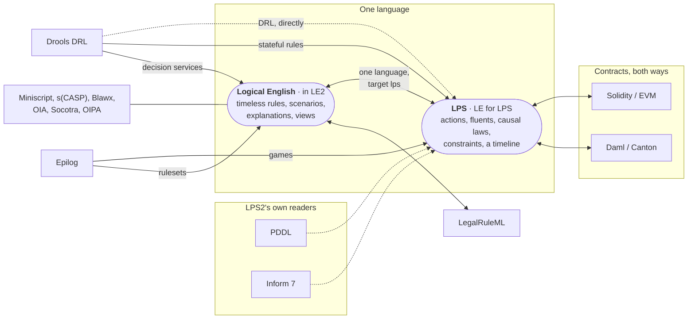

# Other systems and LPS

*Kind: integration guide · Audience: users · Status: current (2026-09-16)*

The IDE opens the programs of some other systems as LPS, and writes LPS
programs for some others. Every translation is deterministic, with no language
model involved, and says what it could not carry over. This page is the map:
which systems, which ways, and what the IDE's menus do with them. Each system
has a document of its own, linked below.

Some doors are LPS2's own and always there (PDDL, Drools DRL, Inform 7, Deploy
as Solidity). Programs of the original LPS (LPS1) need no door: its written
syntax is LPS2's own, and they open as ordinary LPS programs. The others go through Logical English: a
file is translated into **Logical English for LPS** (`the target language is:
lps.`) by a translator of the Logical English installation beside LPS2. They
need LE2 on this server (`LPS_LE2_LIB`, `LPS_LE2_URL` or `LPS_LE2_DIR`) with the
InsurLE extensions, as on the hosted service. Without them the menus say so.

## Contents

- [The map](#the-map)
- [The systems](#the-systems)
- [Opening another system's file](#opening-another-systems-file)
- [Seeing the original](#seeing-the-original)
- [Writing a program for another system](#writing-a-program-for-another-system)
- [See also](#see-also)

## The map

A plain arrow is a way in; a double arrow means the way back exists too. A
dotted arrow is one of LPS2's own readers. The systems drawn on the Logical
English side are documented in the Logical English IDE. Click a system for its
document.

## The systems

| System | Ways | Document |
|---|---|---|
| PDDL (planning domains and problems) | in | [PDDL](pddl.md) |
| Drools rule base (DRL) | in: LPS2's own reader (File ▸ Open…), or the Logical English translator (its twins, and the LE editor) | [Drools](drools.md) |
| Inform 7 story | in | [Inform 7](inform-7.md), and the tutorial [LPS for Inform users](../tutorials/inform-users.md) |
| Solidity contract | in (through Logical English), out (**Deploy as Solidity…**) | [Solidity](solidity.md) |
| Daml (Canton) | in and out (through Logical English) | [Daml](daml.md) |
| Epilog games | in (through Logical English) | [Epilog, in the LE2 documentation](https://le2.logicalcontracts.com/docs/user/integrations/epilog) |
| Bitcoin Miniscript, s(CASP) and Prolog, Blawx, Oracle Intelligent Advisor, Socotra, OIPA | into Logical English (timeless rules), which the LE2 editor runs | [Other systems, in the LE2 documentation](https://le2.logicalcontracts.com/docs/user/integrations/index) |

## Opening another system's file

**File ▸ Open…** takes LPS programs (`.lps`, `.pl`, `.P`), Logical English
programs (`.le`), and the files of other systems, which are converted on
opening: a Drools rule file (`.drl`), and, when the Logical English
installation has translators, their files too (a Solidity contract `.sol`, a
Daml source, …). Each file you pick is converted on its own, and as text, so
three doors are, for now, only in **File ▸ Open example from server…** (and
on the command line): a PDDL domain with its problem, an Inform 7 story
(`.ni`), and a zipped project. The same dialog lists the *migration twins*:
programs translated from published sources of Drools, Solidity and Daml,
under `migration/`.

A file translated through Logical English opens as a Logical English document
for LPS; its note says which translator was used and what could not be
translated. What could not be translated stays in the program as a comment
starting `% TODO`, or as a `RESIDUE` block
([what could not be translated](https://le2.logicalcontracts.com/docs/user/integrations/index#what-could-not-be-translated)).

## Seeing the original

**View ▸ The original this was converted from** shows the file a program was
converted from: the one opened in this session, or the files in the `sources/`
folder beside a program opened from the server.

## Writing a program for another system

- **Misc ▸ Deploy as Solidity…** checks whether the program can be written as
  a Solidity contract, lists why not if it cannot, and otherwise shows the
  contract to copy and open in the Remix online IDE ([Solidity](solidity.md)).
- **Misc ▸ Export to another system…** writes a Logical English document in
  another system's format with an exporter of the Logical English installation
  (Daml for LE for LPS documents; LegalRuleML and Miniscript for plain
  Logical English ones). An export the target cannot state faithfully
  is refused, with the list of problems and their lines.
- **Misc ▸ Deploy as WASM…** is not another system: it bundles the program
  with SWI-Prolog's WebAssembly runtime into a page that runs LPS in a browser.

## See also

- [Logical English for LPS](../reference/le-for-lps.md), [the language reference](../reference/lps.md), [using the editor](../guide/ide.md).
- [Introducing LPS2, part four: other languages, in and out](../overview/introducing-lps2.md#part-four--other-languages-in-and-out).
- In the Logical English IDE: [other systems: importing and exporting](https://le2.logicalcontracts.com/docs/user/integrations/index).
