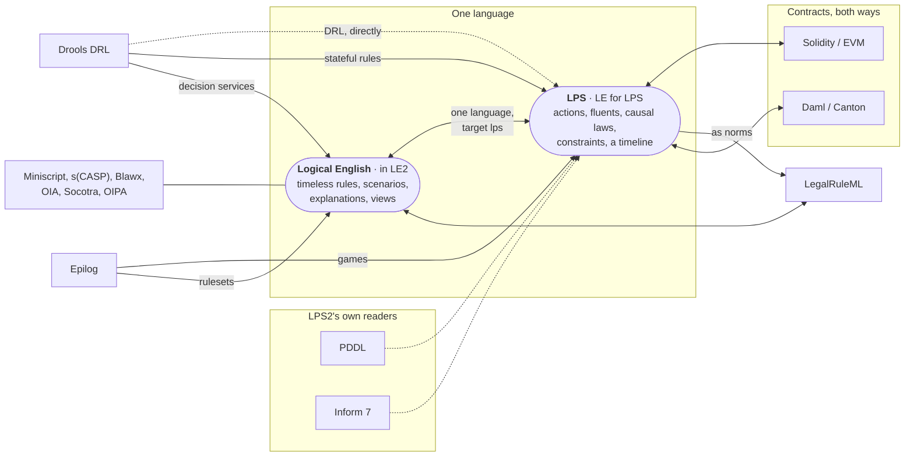

# Other systems and LPS

*Kind: integration guide · Audience: users · Status: current (2026-09-16)*

The IDE (the editor you write and run programs in) opens the programs of some
other systems as LPS (Logic Production System) programs, and writes an LPS
program out for some other systems. Every translation follows fixed rules, with
no language model involved, and every translation tells you what it could not
carry over. This page is the map: which systems, which directions, and what the
editor's menus do with them. Each system also has a document of its own, linked
below.

Some doors are LPS2's own and are always there: PDDL, Drools DRL, Inform 7 and
Deploy as Solidity. Programs of the original LPS (LPS1) need no door at all,
because LPS1 writes its sentences the way LPS2 writes them, so an LPS1 program
opens as an ordinary LPS program. The remaining systems go through Logical
English. A translator belonging to the Logical English installation that sits
beside LPS2 turns the file into **Logical English for LPS** (`the target
language is: lps.`). Those translators need LE2, the Logical English editor, to
be present on this server (`LPS_LE2_LIB`, `LPS_LE2_URL` or `LPS_LE2_DIR`), with
the InsurLE extensions, as on the hosted service. When the translators are
missing, the menus say so.

## Contents

- [The map](#the-map)
- [The systems](#the-systems)
- [Opening another system's file](#opening-another-systems-file)
- [Seeing the original](#seeing-the-original)
- [Writing a program for another system](#writing-a-program-for-another-system)
- [See also](#see-also)

## The map

A plain arrow is a way in. A double arrow means the way back exists too. A
dotted arrow is one of LPS2's own readers. The systems drawn on the Logical
English side of the picture are documented in the Logical English editor rather
than here. Click a system to open its document.

## The systems

| System | Ways | Document |
|---|---|---|
| PDDL (planning domains and problems) | in | [PDDL](pddl.md) |
| Drools rule base (DRL) | in: LPS2's own reader (File ▸ Open…), or the Logical English translator (its twins, and the LE editor) | [Drools](drools.md) |
| Inform 7 story | in | [Inform 7](inform-7.md), and the tutorial [LPS for Inform users](../tutorials/inform-users.md) |
| Solidity contract | in (through Logical English), out (**Deploy as Solidity…**) | [Solidity](solidity.md) |
| Daml (Canton) | in and out (through Logical English) | [Daml](daml.md) |
| Epilog games | in (through Logical English) | [Epilog, in the LE2 documentation](https://le2.logicalcontracts.com/docs/user/integrations/epilog) |
| LegalRuleML | out, as norms (through Logical English) | [LegalRuleML, in the LE2 documentation](https://le2.logicalcontracts.com/docs/user/integrations/legalruleml) |
| Bitcoin Miniscript, s(CASP) and Prolog, Blawx, Oracle Intelligent Advisor, Socotra, OIPA | into Logical English (timeless rules), which the LE2 editor runs | [Other systems, in the LE2 documentation](https://le2.logicalcontracts.com/docs/user/integrations/index) |

## Opening another system's file

**File ▸ Open…** takes LPS programs (`.lps`, `.pl`, `.P`) and Logical English
programs (`.le`). The same menu item also takes the files of other systems and
converts them as it opens them: a PDDL domain with its problem (`.pddl`), a
Drools rule file (`.drl`, together with its `.wording`), an Inform 7 story
(`.ni`), and, when the Logical English installation has the translators, their
files too (a Solidity contract `.sol`, a Daml source, a zipped project, …).
Rest the pointer on the menu item and the tip lists what this server can
convert. Choose files that belong together in one go. The editor pairs them the
way **File ▸ Open example from server…** and the command line pair them — a
problem with the domain it names, a `.drl` with the `.wording` of the same name
— and each pair opens as one program. A `.zip` file is sent to the server
unchanged, byte for byte. The dialog of examples also lists the *migration
twins*, which are programs translated from published Drools, Solidity and Daml
sources and kept under `migration/`.

A file translated through Logical English opens as a Logical English document
for LPS. The translator writes its notes — what it encoded, and what it could
not translate — in a comment at the top of the document, and the status line
tells you to look there. Whatever could not be translated stays in the program
either as a comment starting `% TODO` or as a `RESIDUE` block
([what could not be translated](https://le2.logicalcontracts.com/docs/user/integrations/index#what-could-not-be-translated)).

## Seeing the original

**View ▸ The original this was converted from** shows you the file that a
program was converted from. For a file you opened yourself in this session, the
menu item shows that file. For a program opened from the server, the menu item
shows the files in the `sources/` folder that sits beside the program.

## Writing a program for another system

- **Misc ▸ Deploy as Solidity…** first checks whether the program can be
  written as a Solidity contract. If the program cannot, the editor lists the
  reasons. If the program can, the editor shows you the contract, ready to copy
  into the Remix online editor ([Solidity](solidity.md)).
- **Misc ▸ Export to another system…** writes a Logical English document out in
  another system's format, using a writer belonging to the Logical English
  installation. A Logical English for LPS document can go out as Daml or as
  LegalRuleML norms; a plain Logical English document can go out as LegalRuleML
  or as Miniscript. When the other system cannot say faithfully what the
  document says, the editor refuses to write the file and lists the problems
  with the lines they sit on.
- **Misc ▸ Deploy as WASM…** does not aim at another system at all. Deploy as
  WASM packs the program together with SWI-Prolog's WebAssembly runtime into a
  single web page, so that the program runs as LPS inside a browser.

## See also

- [Logical English for LPS](../reference/le-for-lps.md), [the language reference](../reference/lps.md), [using the editor](../guide/ide.md).
- [Introducing LPS2, part four: other languages, in and out](../overview/introducing-lps2.md#part-four--other-languages-in-and-out).
- In the Logical English IDE: [other systems: importing and exporting](https://le2.logicalcontracts.com/docs/user/integrations/index).
