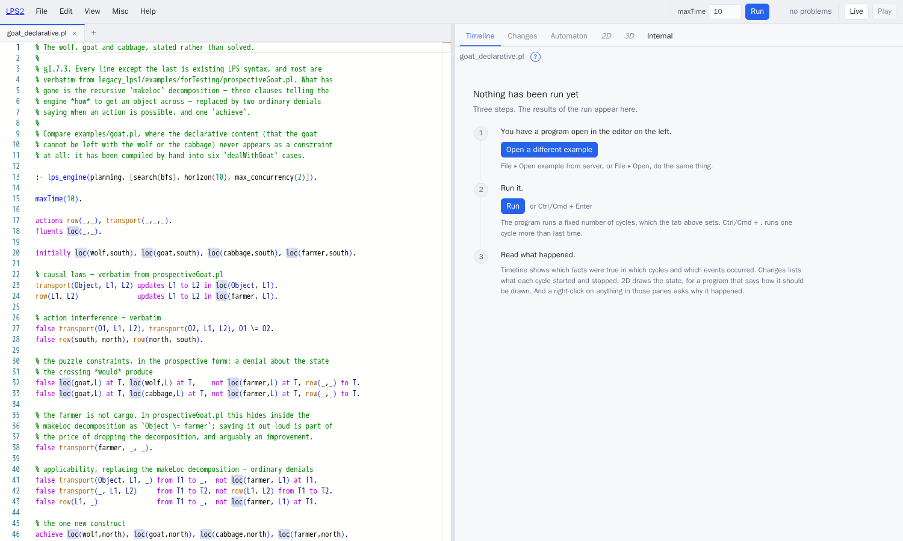

# LPS2 — a summary in two pages

*Kind: overview · Audience: newcomers · Status: 2026-08-20, to be updated*

LPS2 is a new implementation of the LPS engine, written in SWI-Prolog, together
with the tools needed to write and run LPS programs: a command line, a web
editor, diagrams, animation and explanations.

LPS — Logic Production System, of Kowalski and Sadri — is a language for
programs that act over time. A program is written in terms of

- **fluents**, facts that hold over an interval of time;
- **events** and **actions**, which occur between two time points;
- **causal laws**, which say which fluents an event starts and which it stops;
- **reactive rules**, of the form *if this happens, then do that*;
- **integrity constraints**, which say what must never be true.

LPS2 was written from a specification rather than by copying the earlier
implementation. Where a design decision was not recorded anywhere, it was
recovered by observing what the earlier engine does, and written down before
being implemented (see *Checking the two engines agree* below).



## Does it behave like the earlier engine?

The earlier implementation, which this document calls **LPS1**, comes with 108
recorded test runs. Each records, cycle by cycle, which fluents held, which
events occurred, and which composite events were recognised.

LPS2 reproduces **99 of those 108 recordings exactly**. For the remaining nine
the recording itself is out of date: it was made before LPS1's own behaviour
last changed. Each of the nine is documented individually, with the evidence,
in `conformance/adjudicated.pl`. Running both engines side by side on those
nine shows that they agree with each other. There is no case where the two
engines differ and the reason is unknown.

"Reproduces exactly" is a strong requirement. It means the same actions in the
same cycles, described by the same terms, differing at most in the names of
variables. It is stronger than "the examples still give sensible answers".

Every test is also run three more times: once with the clauses of the program
in reverse order, once with the initial state reversed, and once with the order
in which the engine takes goals off its queue inverted. If a program's result
depended on an accident of ordering, one of those three runs would expose it.
None does.

LPS2 runs in about **0.4 times** the wall-clock time of LPS1, using between a
third and a half of the memory.

## What LPS2 has that LPS1 did not

| | LPS1 | LPS2 |
|---|---|---|
| **planning** | goal reduction | `achieve`, searching either breadth-first or greedy best-first, whichever suits the problem, chosen without being told; several actions may be taken in one cycle; it plans again if a plan fails |
| **explanation** | — | every run records how each conclusion was reached; five kinds of question can be asked of it, and *why not* has four distinct answers |
| **trying something out** | — | a session can be copied and the copy run forward independently. The copy costs about 5 microseconds however large the session is |
| **running without end** | yes | and now events may arrive over the network while it runs, each channel restricted to the events it is allowed to send; the stored history is bounded; the mouse can be an input |
| **animation** | paper.js, inside SWISH | Konva in two dimensions, drawing everything LPS1 could draw; three.js in three dimensions, driven by `display3d/2`; a library of icons held locally |
| **editor** | SWISH | Monaco: several files open at once, one grammar covering both LPS and Prolog, errors shown in the text itself, explanations available where the thing being explained is |
| **assistant** | — | a language model that can read the program and answer questions about it, using the editor's own operations as its tools |
| **input languages** | LPS syntax | and Logical English, PDDL and Drools |
| **ways to run it** | a SWISH server | a command line, one HTTP endpoint, a container image, and WebAssembly, which needs no server at all |

## How it is put together

About ten thousand lines of SWI-Prolog, in three layers.

- `src/core/` is the engine.
- `src/syntax/` converts between the languages people write and the form the
  engine runs.
- `src/edges/` is everything that touches the outside world: files, the command
  line, HTTP, language models, and so on.

One rule is enforced mechanically: **nothing in `src/core/` may use threads,
sockets, the clock, files, randomness, or code written in C.** A program called
`tools/lint_core.pl` checks this and is run before every commit.

That one rule has three consequences that would each have been hard to arrange
deliberately. A session is an ordinary Prolog term that is never modified, so
copying one is free. Runs are repeatable, because the engine works out the time
from the cycle number instead of asking the operating system. And the whole
engine compiles to WebAssembly and runs inside a browser, because there is
nothing in it that a browser cannot provide.

## Checking the two engines agree

Before any engine code was written, the choices LPS1 makes were written down as
twenty numbered rules, in `docs/dev/semantics/selection-spec.md`. Each rule says where the
engine has more than one option and which one it takes — for instance, in what
order candidate actions are tried.

LPS1 never recorded these rules anywhere. Without them, "reimplement LPS"
does not say enough to be carried out: two implementations could both be
faithful to the published description of LPS and still disagree on every test
recording.

Fifteen of the twenty rules were found by reading LPS1. The remaining five were
found only by building LPS2 and seeing where it diverged, because they are
properties of the Prolog environment the engine runs in rather than of the
algorithm it implements.

## Programs written in other languages

Three other notations can be run on this engine.

**PDDL**, the planning-competition language. A precondition becomes an
integrity constraint, an effect becomes a causal law, and the problem's goal
becomes `achieve`. Because the competition benchmarks have known shortest plan
lengths, they double as a test of LPS2's planner.

**Drools**, the business-rules language. A `when`/`then` rule becomes a
reactive rule, and `modify(){}` becomes `updates … to … in …`. Two features
have no LPS equivalent — rule priorities (`salience`), and conditions written in
Java — and these are reported as errors rather than translated by guesswork.

**Logical English**, which compiles to the same internal form as the others.
Each translated term remembers which English sentence it came from, so an error
found by the engine is reported against that sentence.

For each of the three, a checker was written *before* the translator, and
independently of it. That order matters: a checker written afterwards tends to
agree with the translator by construction. It is also what showed that the
harder PDDL problems are limited by LPS2's planner and not by the translation.

## Using LPS as the safe part of an agent

An agent built on a language model can do things its designer did not intend.
Part II of the plan asks whether an LPS program can be the part of such an
agent that decides what is permitted, with the model confined to the parts
where a mistake is recoverable.

`examples/agents/llm/` is a working demonstration. The model's only job is
perception: it turns an English sentence into an event term. The fluent that
authorises a destructive action can only be started by a causal law, and that
law is triggered by an event the model is not permitted to send. The constraint
that stops the action is checked by the engine, not by the model.

The demonstration holds with a deliberately weak model, and with a model
instructed to lie, because the restriction is in how the parts are connected
and not in what the model is asked to do.

`examples/agents/minecraft/` puts the same arrangement in a game. A conventional
library plays Minecraft at the game's twenty steps a second, handling walking
and collisions. An LPS session runs above it at two cycles a second and decides
what should be done. The upper layer can be wrong without being dangerous,
because every instruction it issues is checked against the program's
constraints first.

## Where to start

```sh
./lps run examples/start/goat_declarative.pl     # the wolf, goat and cabbage puzzle
cd ui && npm install && npm run build      # build the editor, once
./lps ide                                  # start the server on port 3060
                                           #   /      the examples and the documents
                                           #   /ide   the editor
```

- **[`glossary.md`](../reference/glossary.md)** — every term used in these documents, defined.
- **[`lps_tutorial.md`](../tutorials/lps-tutorial.md)** — how to write LPS programs, starting
  from a two-line one.
- **[`UsingTheIDE.md`](../guide/ide.md)** — how to use the editor, with a
  "how do I …" section.
- **[`IntroducingLPS2.md`](introducing-lps2.md)** — a longer tour, illustrated
  with pictures taken from the running system.
- **[`lps_summary.md`](../reference/lps.md)** — the reference: every construct of the
  language.
- **[`LPSplusLLM.md`](../../project/plan-of-record.md)** — the development plan, and the one place
  where the state of the project is recorded.
