# Introducing LPS2

*Kind: overview · Audience: users, newcomers · Status: current (2026-09-15)*

LPS2 is a new version of the engine that runs programs written in LPS (Logic
Production Systems). The engine is the part that actually carries a program
out, and LPS2 writes that engine afresh in SWI-Prolog, a widely used system for
the Prolog language. Around the engine sits everything that has since been built on
top of it: a planner, explanations, an editor that runs in a web browser with
animation in two and three dimensions, an assistant driven by a language model
(the kind of program that answers questions in ordinary English), sessions that
never stop, ways of bringing in programs written for PDDL (the Planning Domain
Definition Language, in which planning problems are usually written) and for
Drools (a widely used business rules system), a version that runs inside a
browser with no server at all, and two agents — one that
plays Minecraft, and one that stops a language model from authorising its own
dangerous action.

This document is the tour. [`lps_tutorial.md`](../tutorials/lps-tutorial.md) teaches the
language. [`lps_summary.md`](../reference/lps.md) is the reference.
[`glossary.md`](../reference/glossary.md) defines the terms used here.
[`LPSplusLLM.md`](../../project/plan-of-record.md) is the development plan, including everything
not yet built.

Every picture below was taken by working the running system in a browser. Every
number below was measured. Where something does not work, this document says
so.

---

## Contents

**Part one — what it is**
1. [The short version](#1-the-short-version)
2. [What LPS is](#2-what-lps-is)
3. [Why implement it again](#3-why-implement-it-again)
4. [What "behaves like LPS1" is taken to mean](#4-what-behaves-like-lps1-is-taken-to-mean)
5. [How the system is arranged, and what that buys](#5-how-the-system-is-arranged-and-what-that-buys)

**Part two — what is new**
6. [Differences from LPS1, in one table](#6-differences-from-lps1-in-one-table)
7. [Planning](#7-planning)
8. [Explanations](#8-explanations)
9. [The state-transition diagram](#9-the-state-transition-diagram)
10. [Asking what would have happened](#10-asking-what-would-have-happened)
11. [Sessions that do not stop](#11-sessions-that-do-not-stop)

**Part three — the ways of using it**
12. [The editor](#12-the-editor)
13. [Animation, in two dimensions and three](#13-animation-in-two-dimensions-and-three)
14. [The assistant](#14-the-assistant)
15. [The command line and the web interface](#15-the-command-line-and-the-web-interface)
16. [In a browser, with no server](#16-in-a-browser-with-no-server)

**Part four — other languages, in and out**
17. [Logical English](#17-logical-english)
18. [PDDL](#18-pddl)
19. [Drools](#19-drools)
20. [Kowalski's book](#20-kowalskis-book)
20a. [Interactive fiction](#20a-interactive-fiction)

**Part five — agents**
21. [A language model that cannot authorise itself](#21-a-language-model-that-cannot-authorise-itself)
22. [Minecraft](#22-minecraft)
23. [Industrial control, still on paper](#23-industrial-control-still-on-paper)

**Part six**
24. [Deploying it](#24-deploying-it)
24a. [How it was built, and what that cost](#24a-how-it-was-built-and-what-that-cost)
25. [What is not there](#25-what-is-not-there)
26. [Where to start](#26-where-to-start)

---

# Part one — what it is

## 1. The short version

LPS2 is about 10,000 lines of SWI-Prolog in three layers — an engine that
touches nothing outside itself, the translators that carry a program between
one notation and another, and the parts that deal with the world — together
with the editor that runs in the browser.

LPS2 reproduces **99 of LPS1's 108 recorded runs exactly**, LPS1 being the
earlier version of the engine. The other nine recordings are out of date, and
each of the nine is written up separately, with the evidence. There is no case
where the two engines differ and the reason is unknown. LPS2 finishes a run in
about **0.4 times** the time LPS1 takes on a clock, using between a third and a
half of the memory.

On top of that: `achieve`, backed by a real planner; a record of how the engine
reached each of its conclusions, kept on every run, so that the engine can
answer *why* and *why not*; copying a session in a single step, which brings
the cost of asking "what if?" down to about five microseconds; sessions that
run on indefinitely and take in events over the network; an editor with six
ways of looking at a run, animation in two and three dimensions, and an
assistant; ways of bringing in programs written for PDDL and Drools; a version
that runs in a browser with no server; and Logical English translating straight
down into the form this engine runs.


## 2. What LPS is

LPS — Logic Production System, of Kowalski and Sadri — is a language for programs
that *act over time*. A program is made of five kinds of thing:

- **fluents**, which stay true over a stretch of time: `light(off)`,
  `balance(alice, 100)`;
- **events and actions**, which happen between one state of the world and the
  next;
- **causal laws**, saying what an event does to the state:
  `switch(New) initiates light(New)`;
- **reactive rules**, which set standing goals: `if C at T1 then A from T1 to T2`
  means *whenever C becomes true, bring A about*;
- **constraints**, which forbid: `false execute(A), destructive(A), not
  approved(A)`.

The engine goes round the same cycle again and again — observe, think, decide,
act — and the interesting part of the cycle is *decide*. Several rules may want
things that cannot all happen at once. The constraints rule some of those
things out, and whatever survives becomes the set of actions the engine commits
to for that cycle.

Two properties of the language matter for everything that follows.

First, the causal laws are stated once, and every rule gets the benefit of
them. How the world works is therefore written in one place, instead of being
spread through the parts of the program that act.

Second, the engine enforces a constraint, rather than the thing being
constrained enforcing it on itself. Because the engine does the enforcing, the
safety argument in §21 is a fact about how the parts are wired together, and not
a matter of how carefully somebody instructed a language model.

### A whole program, and what it does

`legacy_lps1/examples/CLOUT_workshop/bankTransfer.pl` is short enough to read in
full and contains almost every construct:

```prolog
maxTime(10).
actions          transfer(From, To, Amount).
fluents          balance(Person, Amount).

initially        balance(bob, 0), balance(fariba, 100).
observe          transfer(fariba, bob, 10)        from 1 to 2.

if      transfer(fariba, bob, X)     from  T1 to T2,
        balance(bob, A) at T2, A >= 10
then    transfer(bob, fariba, 10)    from T2 to T3.

if      transfer(bob, fariba, X)     from  T1 to T2,
        balance(fariba, A) at T2, A >= 20
then    transfer(fariba, bob, 20)    from  T2 to T3.

transfer(F,T,A) updates Old to New in balance(T, Old) if New is Old + A.
transfer(F,T,A) updates Old to New in balance(F, Old) if New is Old - A.

false   transfer(From, To, Amount), balance(From, Old),  Old < Amount.
false   transfer(From, To1, Amount1), transfer(From, To2, Amount2),  To1 \=To2.
false   transfer(From1, To, Amount1), transfer(From2, To, Amount2),  From1 \= From2.
```

An event from outside sets the program going. Two reactive rules send the money
back and forth. Two causal laws say what a transfer does to a balance. Three
constraints say what must never happen: an overdraft, and two transfers in one
cycle sharing a payer or sharing a payee. Running the program gives this:

```
fluents/0        [balance(bob,0),balance(fariba,100)]
fluents/1        [balance(bob,0),balance(fariba,100)]
events/2         [transfer(fariba,bob,10)]
fluents/2        [balance(bob,10),balance(fariba,90)]
events/3         [transfer(bob,fariba,10)]
fluents/3        [balance(fariba,100),balance(bob,0)]
events/4         [transfer(fariba,bob,20)]
fluents/4        [balance(bob,20),balance(fariba,80)]
…
```

Three things about that record are the whole language in miniature.

Nothing in the program says *when* the reply transfer happens. No line fixes a
value for `T3`, and the engine chose the next cycle.

Nothing in the program says what a balance *is*. The two `updates` lines are
the only place where any arithmetic appears, and both reactive rules get the
benefit of those two lines.

And the two constraints about doing things at the same time are what make a set
of actions a *set*. Those two constraints are the reason the engine cannot
commit two transfers from bob in one cycle, and neither of the two rules had to
know that the other one existed.

### When rules disagree

The genuinely hard part of an LPS engine is what happens when several rules want
things that cannot all happen. LPS1 had an answer, and the answer sits in LPS1's
own code, but nobody ever wrote the answer down. Without it, the instruction
"reimplement LPS" does not say enough for anybody to carry it out.

[`selection_spec.md`](../../dev/semantics/selection-spec.md) is that missing document: twenty
numbered points at which the engine has a choice to make. Points SP1 to SP15
were worked out by reading LPS1; points SP16 to SP20 came to light while LPS2
was being built. Each point says which way the engine actually goes.

Here are two examples of the kind of question the document settles.

**The phases of the cycle are not what the plan first said they were.** A single
step called `updateFluents` does not, by default, move the state forward. Two
later phases move the state forward instead, `updateNextStateFluents` and
`copyNextState`. The plan's own description of those phases was wrong, and the
specification records the correction.

**Phase 10 is one step rather than three.** Bringing in what has been observed,
working out the goals, and checking the preconditions of the next state all
happen together, and the engine may go back and try a different way through any
part of the phase. So a precondition broken at the *end* of the phase can send
the engine back to the point at the *start* of the phase where events come in.
That behaviour is part of what the language means, and not a detail of how the
engine happens to be built.

Each of the twenty points is also marked either *load-bearing* or *incidental*.
The incidental points mark the places where a future engine is free to differ
from LPS1. The load-bearing points are what the recorded runs are really
testing.

## 3. Why implement it again

LPS1 is about 5,000 lines: `engine/interpreter.P`, `utils/psyntax.P`, a table of
the symbols the notation uses, and a small store. LPS1 works, and the collection
of example programs that comes with it is the accumulated knowledge of what LPS
is for.

What LPS1 also has is everything in the same place. One file, `interpreter.P`,
holds the cycle, the part that works out goals, the part that updates the state,
the tests, the connections into SWISH — the web system through which LPS1 was
used — the handling of work done in parallel, and the machinery of the server.
That one file mentions threads, which are strands of work running at the same
time as one another, 48 times, most of them around the layer that answers
questions. The program, which does not change, and the session, which does, both
live in the same Prolog module, a module chosen while the system is running and
reached through `u_call/1` and its relatives.

None of that is a criticism. A research engine that later grew a web interface
looks exactly like that. But that same arrangement is what stands between LPS and
a planner, a session that can be copied, a version that runs in a browser, or a
second way of writing a program. Every one of those four follows from one change:
**separate the program from the session, and keep the engine free of everything
else.**

LPS2 was written from the plan, from `selection_spec.md`, and from watching what
LPS1 does. Reading `interpreter.P` was always intended — `interpreter.P` is the
user's own code, and the plan treats the table of symbols and the internal
vocabulary as stated parts of the agreement between the two engines. What nobody
did was copy LPS1 line by line into the new engine. The part that works out goals
was written against the twenty numbered rules, so LPS1's accidents are carried
over only where the specification says they matter.

## 4. What "behaves like LPS1" is taken to mean

Section 4 is the part that makes everything else in this document trustworthy,
so it is worth stating precisely.

A recorded run is a file of Prolog facts: `lps_test_result(Stage, Cycle, Count)`
and `lps_test_result_item(Stage, Cycle, Term)`, where the stage is `fluents`,
`events` or `composites`. For two runs to count as the same, the number of
items must match exactly. The two sets of items are then sorted and compared,
and only the names of the variables are allowed to differ.

So the order of items *within* a cycle does not matter. **Which cycle something
belongs to, how many items there are, and the shape of each term all matter
exactly.**

Those three requirements make a much harder target than "the examples still give
sensible answers". A program that reaches the same answer by a different route
fails the test.

| result | meaning | count |
|---|---|---:|
| a | the same under every deliberate disturbance | **99** |
| b | sensitive to a choice; needs a stated rule | 0 |
| c | differs when run again unchanged | 0 |
| documented | the recording is out of date | 3 |
| documented | out of date, recorded in 2019 | 6 |
| **unexplained failure** | | **0** |

The deliberate disturbances were built into the testing from the start, rather
than added as an afterthought. Each program is run again four more ways: with
its rules and facts in reverse order; with the list of fluents it starts from
reversed; with new goals put at the front of the waiting list instead of the
back; and — as a check on the check itself — written out again unchanged. A
test whose result changes under any of those four depends on a choice, and a
choice like that has to be *stated* rather than left as an accident. No test
changes.

Each of the nine documented cases names its evidence in
`conformance/adjudicated.pl`. Six of the nine are recordings made in 2019 on
SWI-Prolog 8.1.1, before LPS1 began recording `real_date_begin/1` as a composite
event; LPS1 itself fails those six today, and gives exactly the diagnosis LPS2
gives. One covers ten cycles of a program that now declares `maxTime(8)`. One
was recorded before a `maxRealTime` declaration was added. The last is
`prospectiveGoat`, whose 2017 recording contains no `composites` records at all.

One further finding is worth recording, about the way LPS1 runs its own tests.
**LPS1 compares only the cycles the run actually produced**, so a run that dies
half way through is scored as a pass. The testing described here makes its own
strict judgement, and reports LPS1's verdict beside it. Two of LPS1's own tests
pass under LPS1 while leaving recorded cycles untouched.

`--engine cross` runs both engines and compares them with each other rather than
with the recording. Comparing the two engines directly is the only comparison
that means anything once a recording is older than the behaviour it recorded.

**Speed.** Taking the middle program of the collection, LPS2 uses about 0.4
times the time LPS1 takes on a clock, and a third to a half of the memory
(`tools/compare_engines.pl`). One program is slower: `prospectiveGoat2` takes
2.4 times as long, because it checks the look-ahead constraints again for every
action it considers. Making that faster means rearranging the check, and a
change of that size needs a run of the whole test suite of its own, rather than
an edit chased by a stopwatch, so the matter is left open.

## 5. How the system is arranged, and what that buys

```
src/core/     the engine. No input or output, no threads, no clock, no C.  5,449 lines
src/syntax/   between the written forms and the internal form              1,681 lines
src/edges/    everything that touches the world: files, CLI, HTTP          3,314 lines
```

`tools/lint_core.pl` is the program that enforces the first of those three
lines. Nothing in `src/core/` may mention threads, sockets — connections to
other machines — HTTP, which is how requests travel over the web,
`process_create`, `shell`, `get_time`, predicates written in the C language,
randomness, or the reading and writing of files. There is one deliberate
exception, `b_setval` and `nb_setval`, kept to a single file whose opening
comment explains why the engine cannot be written without those two.

That rule was not kept for its own sake. Four good things follow from it.

**A session is a term that nothing ever alters.** So `lps_session_fork/2` makes
a copy in one step: the copy and the original are the same term under two
names. The plan had designed a store in two halves, which would copy the state
only when something wrote to it; that store turned out not to be needed. Making
a copy was measured at **about 5 microseconds, whatever the size of the
session** (`tools/bench.pl`).

**Something outside tells the engine the time; the engine never reads a clock.**
The engine has no idea what the clock on the wall says. Setting the pace of a
session at two cycles a second is a job for the outer edge of the system, and
that job lives in one predicate in `src/edges/lps_live.pl`. So a session running
in real time and an ordinary run are the same engine doing the same work.

**The whole engine can be turned into WebAssembly** (§16), which is a form a web
browser can run. Gathering `src/core/` and `src/syntax/` into one page that needs
nothing else took a day, because the half of the system that touches the world
was already a separate half.

**A run can be checked for repeatability.** The disturbances described above are
only possible because a run depends on the program, the options and the
observations, and on nothing else at all.

---

# Part two — what is new

## 6. Differences from LPS1, in one table

| | LPS1 | LPS2 |
|---|---|---|
| **Language** | reactive rules, causal laws, constraints, composite events, intensional fluents | the same, plus `achieve` and `display3d/2` |
| **Planning** | goal reduction; `prospectively` for looking ahead | `achieve`, searching breadth-first or greedy best-first, or choosing between the two by itself; a set of actions in each cycle; planning again when a plan fails |
| **Explanation** | — | a record of how the engine reached each conclusion, kept on every run; five forms of question; four different answers to *why not* |
| **What if** | — | `lps_session_fork/2`, about 5 microseconds; `what_if` compares two runs |
| **Running without end** | yes, with real-time options | yes, and events may now arrive over the network while the program runs, with each channel allowed to send only certain events; only so much history is kept |
| **Errors** | Prolog errors | orderly reports carrying `src(File,Line,Col,Kind)`, which survive the translation from Logical English |
| **2D animation** | paper.js, inside SWISH | Konva, the same `display/2` vocabulary, the y axis the right way up, a library of pictures kept on the same machine, and shapes you can click |
| **3D animation** | — | three.js, driven by `display3d/2` |
| **State diagram** | `godfa/1`, one column | arranged in layers, arrows that run side by side merged into one, a return to an earlier state drawn as a loop, in the editor and on the command line |
| **Editor** | SWISH | Monaco: one set of colouring rules for both LPS and Prolog, generated from the engine's own table of symbols; errors shown on the line they are on; menus; a list of examples; every panel resizable |
| **Assistant** | — | a language model, from any of five suppliers, whose tools are the editor's own operations |
| **Ways in** | LPS syntax, `.lpsw`, lps.js | LPS syntax (LPS1's own), the internal form, Logical English, PDDL, Drools, Inform 7; not lps.js's syntax |
| **Ways to run it** | a SWISH server | command line, one web address, a packaged image ready to run on a server, WebAssembly |
| **Keeping the engine self-contained** | not attempted | checked by machine |

The rest of Part two takes the interesting rows one at a time.

## 7. Planning

`examples/start/goat_declarative.pl` states the wolf, goat and cabbage puzzle rather
than solving it:

```prolog
:- lps_engine(planning, [search(bfs), horizon(10), max_concurrency(2)]).

actions row(_,_), transport(_,_,_).
fluents loc(_,_).

initially loc(wolf,south), loc(goat,south), loc(cabbage,south), loc(farmer,south).

transport(Object, L1, L2) updates L1 to L2 in loc(Object, L1).
row(L1, L2)               updates L1 to L2 in loc(farmer, L1).

%  the rules of the puzzle, written as constraints on the state a crossing
%  *would* produce
false loc(goat,L) at T, loc(wolf,L) at T,    not loc(farmer,L) at T, row(_,_) to T.
false loc(goat,L) at T, loc(cabbage,L) at T, not loc(farmer,L) at T, row(_,_) to T.

false transport(farmer, _, _).
false transport(Object, L1, _) from T1 to _,  not loc(farmer, L1) at T1.
false transport(_, L1, L2)     from T1 to T2, not row(L1, L2) from T1 to T2.
false row(L1, _)               from T1 to _,  not loc(farmer, L1) at T1.

achieve loc(wolf,north), loc(goat,north), loc(cabbage,north), loc(farmer,north).
```

Compare `examples/goat.pl`, where the same knowledge — that the goat cannot be
left alone with the wolf or with the cabbage — never appears as a constraint at
all. Whoever wrote that program worked the knowledge out by hand into six
`dealWithGoat` cases. The version above is shorter, and what the version above
says out loud is exactly the thing a reader wants to check.

**Two searches, and the engine chooses between them.** `search(auto)` is what
the engine uses unless it is told otherwise. The engine starts with
breadth-first search, which finds the shortest plan, and allows that search a
fixed number of states to look at. If the search uses up its allowance, the
engine changes over to greedy best-first search.

Greedy best-first search gives a state a score by solving an easier version of
the problem — one in which no action ever undoes anything — and counting how
many rounds that easier problem needs. The score is not exact, so the plan that
comes out is not guaranteed to be the shortest one, but the search is far
faster.

`examples/start/blocks.lps` shows the difference between the two searches. Seven
blocks in one tower, to be rebuilt in reverse order:

```
./lps run examples/start/blocks.lps --search greedy      0.4 s
./lps run examples/start/blocks.lps                      5.3 s   (auto)
./lps run examples/start/blocks.lps --search bfs        25.5 s
```

and the gap grows exponentially with the number of blocks — each extra block
multiplies it — rather than staying where it is.

**A plan is a sequence of *sets* of actions.** `max_concurrency(2)` lets two
actions that get on with each other share a cycle, which is what the goat puzzle
needs: rowing and carrying happen together.

**A plan can fail.** If the world moves on — the tree is gone, somebody took the
log — the plan stops being valid, carrying it out fails, and the engine plans
again from the state the program is actually in. Planning again is what makes
planning useful to an agent, rather than only to a puzzle.

The picture below is `examples/start/blocks3d.lps`, which is
`achieve on(c,b), on(b,a)` together with a `display3d/2` clause that works out
each block's height by walking up the tower in the state:

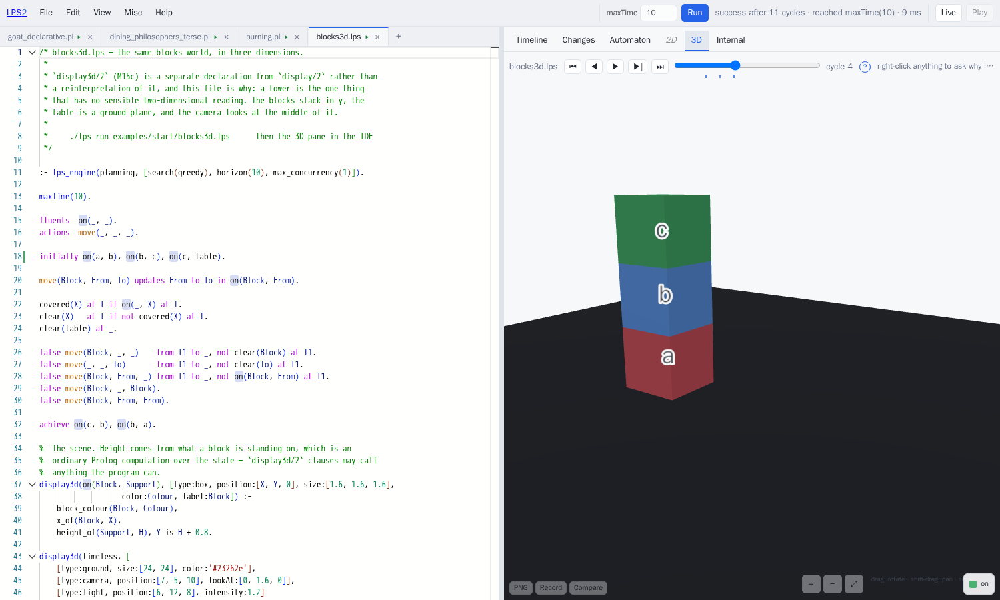

## 8. Explanations

Every run records how the engine reached each of its conclusions, always, and not
behind a switch — a switch you have to have set in advance is no use after
something has gone wrong.

**You ask the question where the thing itself is.** There used to be a pane —
one of the panels the editor is divided into — set aside for explanations: a box
in a tab nobody opened, which asked you to type in a term you had just read off
another pane. That arrangement is the wrong way round, because the panes are
*full* of terms, and any one of those terms might be the one you want explained.

So each pane now labels what it draws with the term that thing stands for.
Right-click any of them — a bar on the timeline, a row of the changes table, a
state, the label on an arrow, a shape in two dimensions, a solid in three — and
the explanation for that term at that cycle opens.

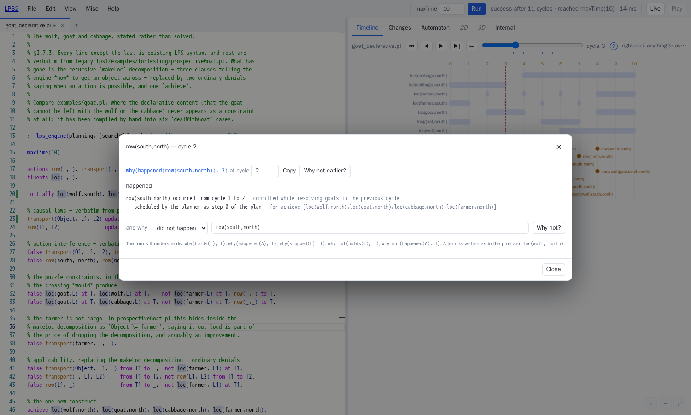

There are five forms of question: `why(happened(A),T)`, `why_not(happened(A),T)`,
`why(holds(F),T)`, `why(stopped(F),T)`, and `what_if(Events,T)`.

`why_not` is the one worth dwelling on. `why_not` has a box of its own in the
dialog, because you cannot right-click something that was never drawn at all.
"It did not happen" has four different causes, and treating those four alike is
how an afternoon of hunting for a fault goes wrong:

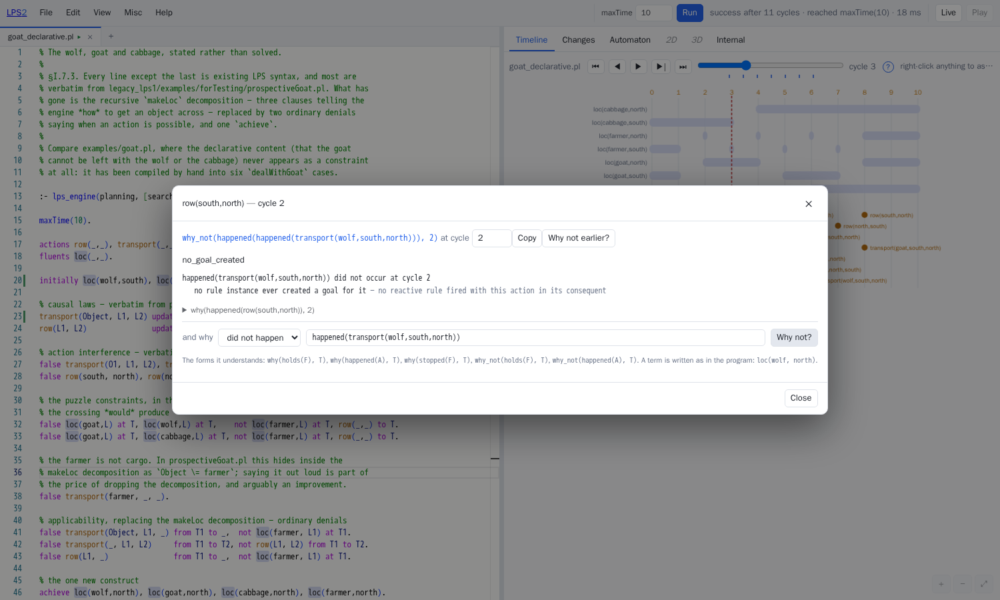

- **`scheduled_for_another_cycle`** — the plan does intend to, at cycle 6, as
  step 4.
- **`no_goal_created`** — nothing ever asked for it.
- **`rejected_by_prospective_constraint`** — something did ask, and a named
  constraint refused it.
- **`no_plan_found`** — it was asked for, and no plan was found within the
  horizon.

Outside those four, the answer is a plain "no applicable rule". The pane never
puts together a plausible-sounding story: where the record cannot settle the
question, the pane says *not recorded*. `tools/explain_test.pl` covers all
thirteen cases.

## 9. The state-transition diagram

LPS1 had `godfa/1`, which drew every state in one column, with the arrows between
them routed as long parallel horizontal lines, one per transition. Five `pickup`
events between the same two states drew five labels on top of one another.


LPS2 draws the same kind of diagram, with three things put right. Arrows that
run side by side are merged into one arrow carrying a list of labels. The states
are laid out in layers from left to right, so a state the program comes back to
is visibly a loop. The arrows curve, they have heads, and each label is
outlined, so a label stays readable over whatever lies behind it.

The picture above is the dining philosophers. The box on the left that
everything meets at is the state in which all five forks are free — cycles 1 to
8. Each box on the right is somebody eating, with a loop back to itself for as
long as that person carries on. Every distinct state appears **once**, which is
the point: a program that returns to a state it has been in before should read
as a loop, not as a long chain.

`./lps automaton PROGRAM` prints the diagram. The `automaton` operation hands it
back as JSON, which is JavaScript Object Notation, a plain-text way of writing
data down so that another program can read it. Both editors have a pane for the
diagram. There are two switches: *abstract numbers*, which merges states that
differ only in a number, and *hide self-loops*.

## 10. Asking what would have happened

```prolog
lps_session_fork(Session, Session2)
```

A session is a term that nothing ever alters, so making the copy is a single
step rather than a piece of work that grows with the session.
`tools/bench.pl` measures the copy at about five microseconds, however long the
session has been running.

`what_if(Events, T)` uses that copy: it takes a copy of the session, runs the
copy on with the different observation, and compares the two records in the way
the tests compare a run against a recording — matched by stage and by cycle,
with only the names of the variables allowed to differ. So the answer to "what
would have happened?" reads in the same terms as a failing test.

## 11. Sessions that do not stop

Leave `maxTime` out, and the program goes round its cycle until somebody stops
it, doing nothing until an event arrives.


That is `examples/start/thermostat.lps`. Two events went in from the panel —
`temperature(14)`, then `window(open)` — and the program answered with
`warn(window_open_while_heating)`.

Notice the lines reading *queued for cycle N*. An event that arrives part-way
through a cycle waits, and the engine delivers it at the start of the next
cycle. The record of a session therefore stays an orderly sequence, instead of
depending on the exact moment at which each thing arrived. The warning repeats
in every cycle because a reactive rule sets a standing goal and the window is
still open.

The pace is set by a loop that watches the clock, in `src/edges/lps_live.pl` —
the one place in the whole system that reads the clock in order to keep to a
*rate*. The engine's own idea of when things happen is left untouched. Only so
much history is kept, 400 cycles unless you say otherwise, so a session can be
left running overnight.

**Channels.** Starting a session takes a list saying which kinds of event, named
as predicates, each source is allowed to send:

```json
{ "llm":   ["task_request/2"],
  "human": ["approval/2", "task_request/2"] }
```

An event whose predicate is not on its channel's list is dropped, and the
dropping is *reported*. Nothing is dropped in silence: a caller that believes
its event has been observed needs to be told when it has not been. That
arrangement is the one §21 rests on.

The **Pop out 2D** and **Pop out 3D** buttons open a window that follows the
running session, rather than one you move back and forth through. The two
buttons appear only for a program that says how it should be drawn.

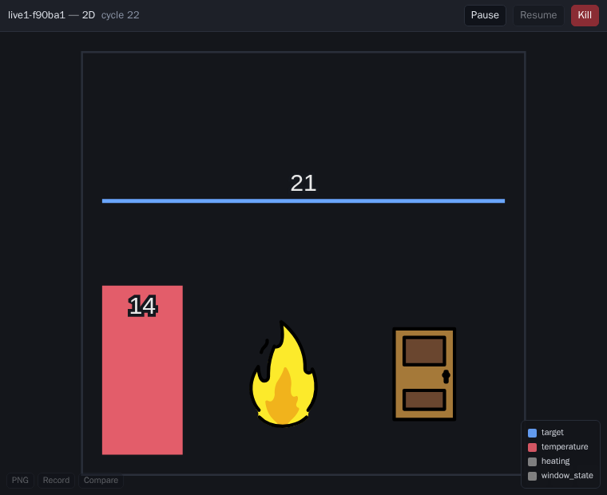

**And the animation can be a way in, not only a way of looking.** A program that
declares `lps_mousedown/3`, `lps_mouseup/3` or `lps_mousedrag/3` as events
receives those events from that window, in the program's own coordinates. A
program that declares none of the three has nothing listening for the mouse at
all, so a click on a picture stays a click on a picture.

The server makes that decision by looking at the program itself. The mouse
events a program may receive **are** exactly the ones the program has said it
deals with, so opening an animation can never become a way of manufacturing an
event.

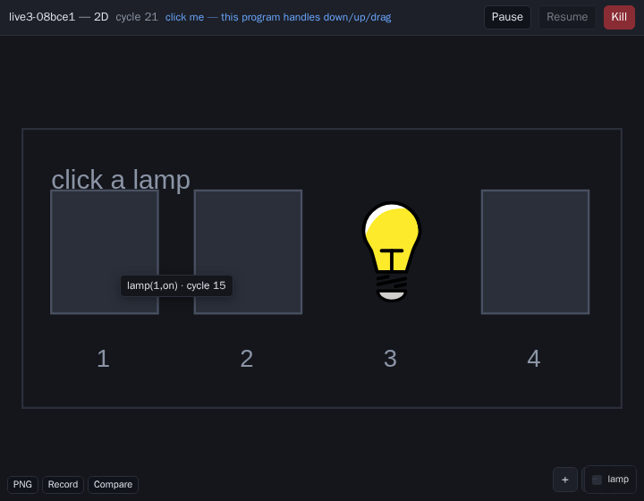

That is `examples/start/lights.lps` — four lamps, click to toggle one, and a constraint
that will not let you turn off the last one that is on.

---

# Part three — the ways of using it

## 12. The editor

`./lps ide` serves the editor on port 3060, a port being one numbered door on
the machine. (The letters `ide` stand for integrated development environment:
an editor together with everything you need around it.) The address `/` is a
**start page**, which lists every example on the server as a tree of folders you
can open and close, remembers which folders you left open, and puts the
documents beside them. The address `/ide` is the editor itself, and every entry
on the start page opens the editor with that program already loaded.


A tool called esbuild builds the editor from the files in `ui/` and puts the
result in `src/ide/dist/`. Node.js is needed to build the editor, and not to run
it: the packaged image that serves the finished editor has no Node.js in it.

**One row of controls.** Everything that acts on the program sits in the bar
along the top: the menus, then `maxTime` and Run, then how the last run ended,
then the button that opens the live panel. Both of the optional panels are in
the View menu as well. A closed panel takes up no space and shows no controls at
all. Until the controls were gathered into that one bar, they were divided
between the bar and two panels in the opposite corner of the screen, and the
first question every newcomer asked was which of the two sets to use.

**Several files at once.** A tab owns its text *and* its run — the session, the
program, the cycle, the errors. So everything on the right is about the file
whose tab is lit, and coming back to a tab restores what you were looking at.
Comparing two versions of a program takes two tabs rather than two browser
windows.

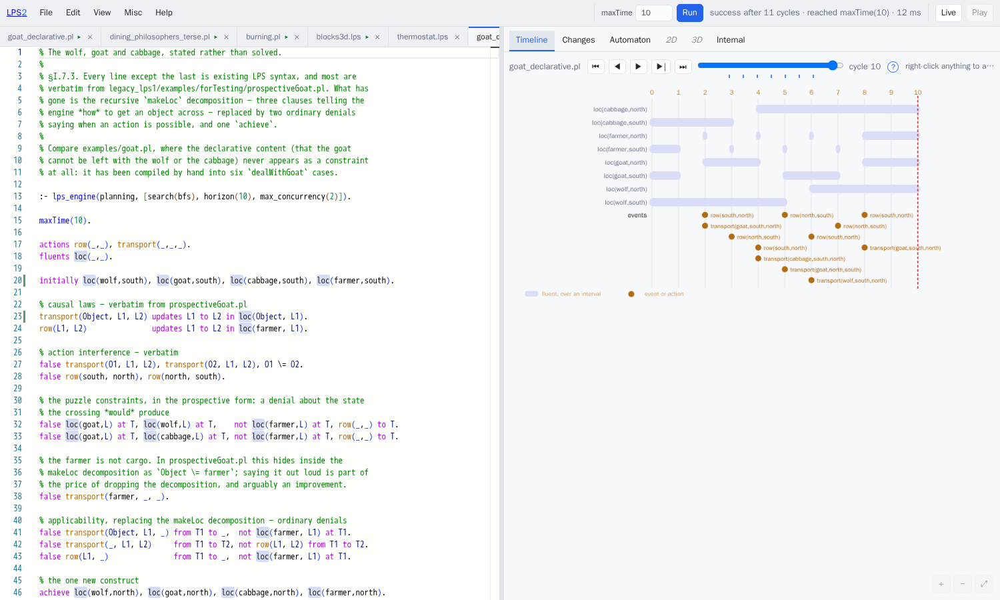

**One set of colouring rules** covers LPS and the Prolog you can write inside an
LPS program. The table of symbols those rules work from is *generated* from the
engine's own table (`tools/gen_monarch.pl`), so the editor cannot drift away
from the part of the system that reads a program.

The editor component brings features of its own — the right-click menu, find and
replace, folding a passage away, marking the other places a name appears — but
each of those features has to be asked for separately. The simplest way of
putting an editor on a page gives you none of them, which is why an earlier
version of this editor had a right-click menu that did nothing.

**Errors in the text.** A wavy underline on the line, the message when you hover
over it, a mark on the edge of the scrollbar, F8 to step through the errors one
by one, and a count in the top bar that takes you to the first. There used to be
a strip under the editor repeating all of that. The strip spent its life saying
"no problems", and it put the message a long way from the line the message was
about.

When the system cannot make sense of a program, it does not stop with an error.
The system writes a report instead, so you still get everything the part that
reads the program did manage to work out:


**Fluents, events and actions are coloured according to what was declared** —
LPS1's own colours, a pale blue background for a fluent and amber for an event or
an action. Colouring by the shape of the text alone could never manage this:
`loc(wolf,north)` and `row(south,north)` have exactly the same shape, and which
of the two is a fluent is stated in the declarations. So the colouring comes from
the same examination of the program that offers you completions as you type.

**Six panes**: Timeline, Changes, Automaton, 2D, 3D, Internal. Five of them move
together on one cycle slider, and all of them zoom and pan the same way. (There
used to be a seventh; see §8.)

The timeline gives each fluent a row of its own, drawn across the stretches of
time in which that fluent holds, with the events of each cycle below. The
timeline is not a separate piece of machinery. The records it draws from,
`stage(fluents, Cycle, Items)`, are the very records the tests compare against
LPS1's recordings, so nothing in the engine has to be switched on for the
timeline to be drawn.


**Menus** — File, Edit, View, Misc, Help — modelled on LE2's, and holding the
places to put the API keys (an API is the way one program asks another for
something, and a key is the password that goes with such a request), the
server's token, and *Deploy as WASM*:

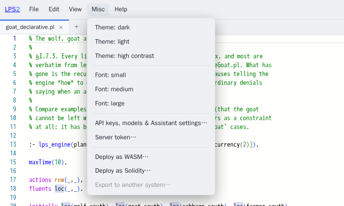

**A list of every program on the server**, each with the first line of its own
comment as a description, and a name column you can drag wider:

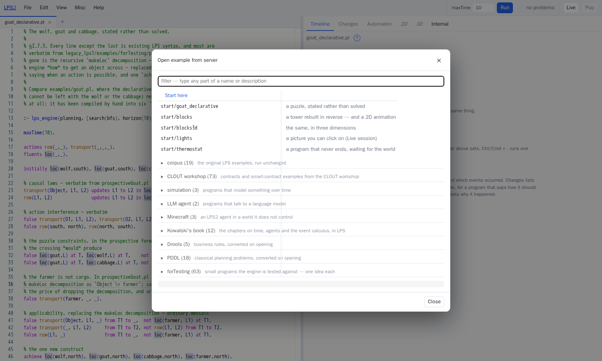

**The Internal pane**, worth a look once because it shows how much of the written
form is a convenience:

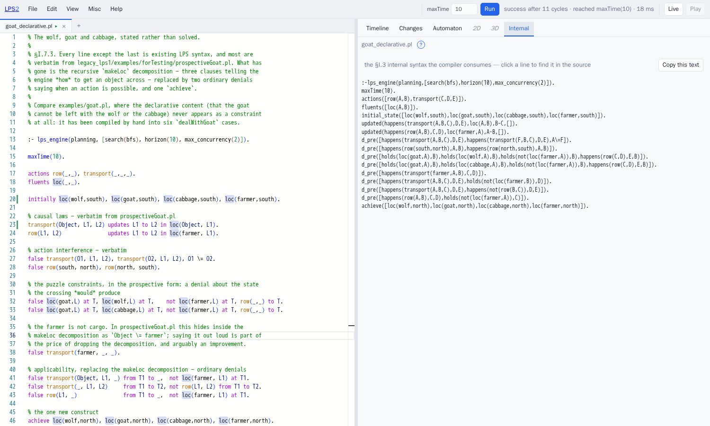

The **Changes** pane answers one narrow question about a single cycle: what
changed, and which causal law made the change.


`line 24` is a line in the file in front of you. Everything that did not change
is listed separately as having *persisted*, because the engine knows the
difference between "still true" and "made true again".

**There are two editors, deliberately.** `/LogicalEnglish2/editor/lps.html` is
LE2's editor, which offers two languages and has two servers behind it.
`src/ide/` is this project's own editor. Both editors talk only to `/lpsapi`,
the single web address described in §15, and that is what keeps the arrangement
honest: everything either editor can do can also be done with `curl`, the
ordinary command-line tool for sending a request to a web address, and can
therefore be tested with no editor at all.

## 13. Animation, in two dimensions and three

`display/2` says how a fluent or an event should be drawn. The vocabulary is
LPS1's:

```prolog
display(burning(X,Y), [type:circle, center:[CX,CY], radius:10, fillColor:yellow]) :-
	pixels(X, Y, CX, CY).
display(ignite(X,Y),  [type:star, fillColor:red, center:[CX,CY],
		       points:6, radius1:10, radius2:6, opacity:0.5]) :-
	pixels(X, Y, CX, CY).
display(timeless, [[type:rectangle, from:[0,0], to:[200,200], strokeColor:green]]).
```

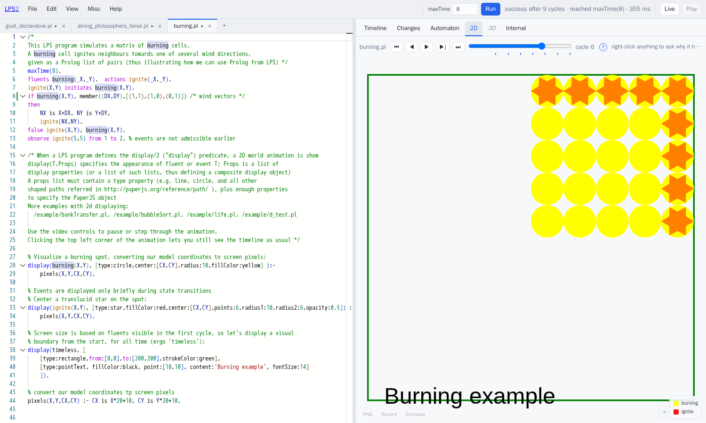

That is `CLOUT_workshop/burning.pl`, unchanged, at cycle 6: a fire spreading
across a grid. LPS2 draws every shape in LPS1's vocabulary. The origin sits at
the bottom left with y increasing upwards, as it did in LPS1. And where
`display/2` offers more than one answer for the same subject, only the first
answer is drawn, which is again what LPS1 did.

**A library of pictures**, because several of LPS1's examples point at clipart
on sites that no longer serve it, and so come out full of holes. There are 134
pictures — from OpenMoji (CC BY-SA 4.0), game-icons.net (CC BY 3.0) and Material
Symbols (Apache-2.0) — chosen by counting which predicates the examples actually
use: finance and contracts, law and governance, puzzles and games, places and
movement. The pictures are kept in this project and served from this server, so
a machine with no connection to the internet can still show an animation. Ask
for one by writing `[type:raster, icon:fire]`.

**A library of fills, and one of objects**, sit beside the pictures.
`pattern:hatch` fills the surface of a shape with one of nineteen tiles — hatch,
bricks, waves, grid, checker, scales, noise and the rest — in two dimensions and
in three. A fill says what a surface is *like*, where a picture says what a
thing *is*, and a fill takes the shape's own colour, so it never fights with the
colours around it. `[type:model, model:tree]` puts one of thirty-four named
things on a floor in three dimensions — person, tree, house, truck, crate, coin,
key, flag, … — each built up from simple shapes in the object's own colour. Both
libraries were made here rather than fetched from elsewhere: no licence, no
attribution, nothing that can rot away, and they work with no connection to the
internet, just as the pictures do.

`display3d/2` is a declaration of its own, rather than a second reading of
`display/2`. Properties that make sense in two dimensions cannot be carried over
into three without misrepresenting what the author meant, and a program may
quite reasonably want both at once, each showing something different. The types
are `box`, `sphere`, `cylinder`, `cone`, `plane`, `ground`, `line`, `arrow` and
`text`, with `camera` and `light` in the `display3d(timeless, …)` background.

## 14. The assistant

The assistant is a loop written in Prolog, modelled on LE2's own. Five suppliers
of language models are supported: OpenAI, Groq, Anthropic, Together and Gemini.
Where the server itself holds a key, that key is used in preference to any key
the browser is carrying, so one key can be set up centrally for everybody.

The assistant's tools are the panes' own operations, called inside the same
running program rather than fetched from anywhere else: `analyse` (translate the
program and report the errors), `run` (run it and get the record back),
`explain` (the questions of §8), and `scene` (what the drawing clauses actually
produced). A model that asks "does this program translate?" gets exactly the
answer the editor shows, because the model and the editor make the same call.

The list of models comes from the suppliers themselves. When the server starts,
`lps_models.pl` reads each supplier's catalogue of models, and does that work
alongside everything else so that one slow supplier cannot hold `./lps ide` up.
The settings dialog shows how many models each supplier offers, and reads the
lists again when asked. The table kept by hand in `lps_llm.pl` stays as a
fall-back for when there is no connection.

Two buttons ask a question that is already written: **Animate in 2D** and
**Animate in 3D**.

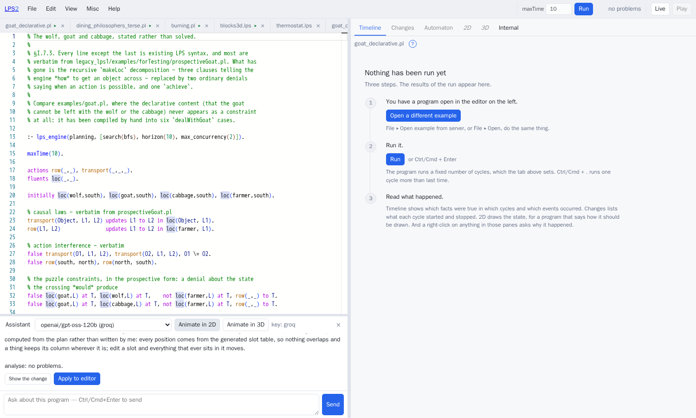

and one click later:


That is the wolf and goat program — which said nothing at all about how it should
be drawn — animated by `openai/gpt-oss-120b`.

**The model does not write coordinates**, and that is the whole design. Asking
the model to write them produced exactly what you would expect: positions that
look plausible and overlap each other, three animals in the same place, a label
off the edge of the picture. Models know that a goat belongs on a river bank.
Models are bad at arithmetic over a picture. And telling a model to check its
own work does not make it better at arithmetic.

So the work is split in two.

  **First**, the model returns a *plan*: which containers there are, which things
  move between them, which fluent puts a thing in a container, and what each
  thing looks like.

  **Second**, `src/edges/lps_scene.pl` works out where everything goes. That
  program lays the plan out by flowing boxes one after another, the way a web
  browser lays out a row of items on a page, and boxes laid out that way cannot
  overlap. A constraint solver — a program that finds an arrangement meeting a
  list of requirements — would be the right tool if the model were producing
  requirements about how things line up. The model is not producing those, and
  asking it to would put the hard part straight back where it was.

Several other systems have arrived at the same split for putting diagrams
together: describe the arrangement first, and work the positions out separately.

What ends up in your file is ordinary Prolog: a table of positions
(`lps_slot/4`), a background, and one `display/2` rule for each layer. So the
program stays readable and stands on its own, and nothing calls back to the
assistant while the program runs. Every container is given the *same* grid, so a
thing keeps its column wherever it goes. That grid is what makes the animation
readable, and packing each container separately would have destroyed it.

**Animate in 3D uses the same plan.** That button used to ask the model for
`display3d/2` clauses with coordinates in them — the one job the plan exists to
take away from the model, handed back with an extra axis to get wrong. The
results were what you would expect: everything at the origin, or a camera inside
a wall. Now both buttons ask for a single plan, and `lps_scene.pl` draws that
plan twice.

**And nobody asks the model what the engine already knows.** Before the model
plans anything, the program is *run*. Three things are then read off the record
of that run (`lps_scene_focus/3`): which fluents tell the run's states apart,
which cycles are worth a picture, and which states the run comes back to. The
question put to the model carries all three, together with the rule that the
plan must cover every one of them; a plan that leaves one out is handed back
with the missing one named. Which fluents are *derived*, and the order in which
the rules mention things, are read off the program in the same way. What is left
to the model is the part that needs a model: which fluent is drawn as which
shape, and what each thing looks like.

**A run can also be drawn as a strip.** *Split into scenes*, beside those two
buttons, draws the whole run instead of one cycle of it: one picture for each
moment at which the picture changed, in order, saying what moved the story on
between one frame and the next, and what began, ended or changed value under
each frame. Click a frame and the full scene at that moment opens. The strip
answers the question "what happened?", where a single picture answers "what is
true now?". In three dimensions the frames are photographs, taken by one drawing
engine used again for each frame.

## 15. The command line and the web interface

```sh
./lps run examples/start/goat_declarative.pl
./lps step PROGRAM --cycles 3
./lps live examples/start/thermostat.lps --cycle-ms 400
./lps explain PROGRAM --ask "why_not(happened(a), 4)"
./lps timeline PROGRAM
./lps changes  PROGRAM --at 2
./lps automaton PROGRAM
./lps dump PROGRAM
./lps pddl domain.pddl problem.pddl
./lps drools rules.drl
./lps ide --port 3060
```

The web interface is **a single address**, `/lpsapi`. Every request carries an
`operation` field, and that field says which piece of work the server is to do.
A token may be demanded, and requests that come from a page served by another
site are accepted. There are about thirty operations: `compile`, `session_new`,
`observe`, `step`, `run`, `state`, `fork`, `trace`, `dump`, `analyse`, `explain`,
`timeline`, `changes`, `scene`, `scene3d`, `automaton`, `example`,
`list_examples`, the `live_*` family, the `assistant_*` family, and
`wasm_bundle`.

One address rather than many is a deliberate choice. A single address means the
whole interface can be driven from one shape of `curl` command, and a single
address is what lets the two editors, the Minecraft bot and the demonstration in
§21 all talk to exactly the same thing.

## 16. In a browser, with no server

**Misc ▸ Deploy as WASM** produces a single page for a web browser with
everything inside it — WASM being short for WebAssembly, the form a browser can
run: swipl-wasm, the whole of `src/core/` and `src/syntax/` as Prolog text, and
your program.

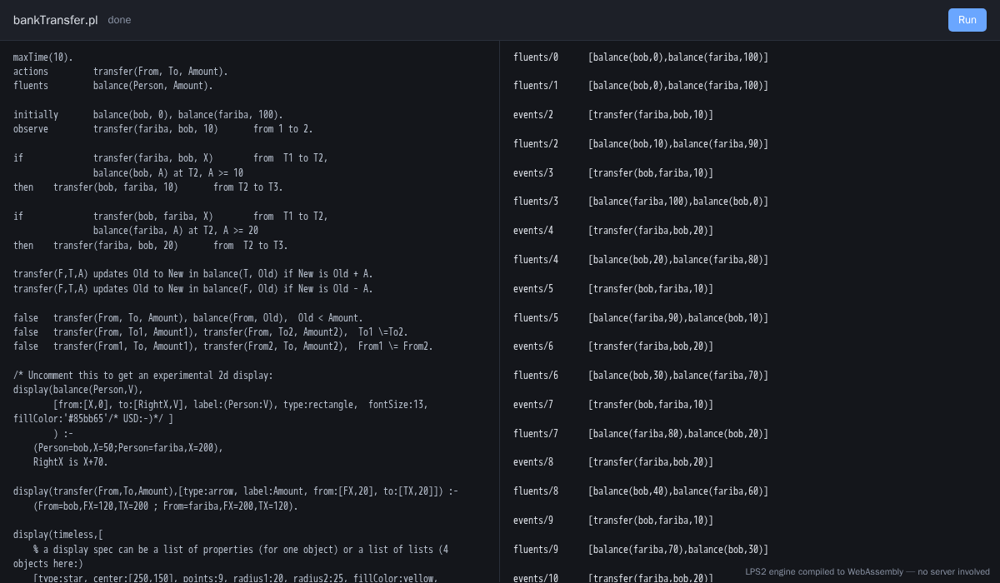

That is `CLOUT_workshop/bankTransfer.pl` running in a browser with no server
involved at all. The parts that touch the world — requests over the web, the
assistant, sessions that keep running, the connection to LE2 — are not in that
page, and could not be. Those parts are the half of the system that touches the
world, and the page has no world to touch.

The whole content of the demonstration is that the other half loads at all. The
other half loads because `tools/lint_core.pl` has been enforcing that separation
since the very first milestone, and not because anything was arranged specially
for the occasion.

---

# Part four — other languages, in and out

## 17. Logical English

The LogicalEnglish2 project, which lives in `/LogicalEnglish2`, translates
Logical English into the LPS internal form — the shape the engine actually
runs — and runs the result on this engine. What the two projects agree on is
written down in `docs/dev/le-lps-interface.md`, and that file is kept word for word the
same in both projects.


That is LE2's own editor: an English program on the left, translated by LE2 and
run by LPS2, with this project's timeline on the right. The two servers talk to
each other directly, with nothing in between, which is why the web interface has
to accept requests that come from a page served by another site.

**And here it is in *this* editor, with no second server at all:**


LE2 offers a single module, `le_service.pl`, and LPS2 loads that module into
itself (`LPS_LE2_LIB=/path/to/LogicalEnglish2`). Translating a document then
costs no more than an ordinary call inside the running program — about 0.2
seconds — rather than the cost of starting a second program up. That difference
is the difference between translating a `.le` file when somebody asks for it and
translating it on every key you press.

The colouring for a `.le` tab is built when the editor starts, from LE2's own
tables of keywords rather than from a copy of them. A copy would go wrong for
every language except English as soon as either side changed. The completions
offered come from the document's own templates, each one labelled with the part
it plays. And a pane you cannot type into shows the program that was generated,
with every line in it linking back to the English sentence that produced it.

Nobody has to hope the result is the same either way, because it is checked.
`tools/m8a_test.pl` runs the seventeen programs in `examples/le/*.le` through
the loaded module *and* through the separate program, and demands that the terms
come out equal, allowing only the names of the variables to differ, with the same
information about where each term came from and the same complaints.

Two smaller things followed. Turning ordinary English into Logical English —
LE2's `nl_to_le`, which asks a language model and then checks the answer against
the program — works here too, through *this* project's own connection to the
language models, so the keys and the choice of model are the ones the user has
already set.  And `./lps dump foo.le --syntax legacy` puts the two halves of this
work together: English goes in, and the written form of LPS comes out.

**LE2 remains optional.** Nothing in LPS2 loads LE2 when the system is built.
With LE2 absent, opening a `.le` file tells you which setting to fill in, and
everything else works exactly as before.

Here is the bank transfer program of §2, in English:

```
the target language is: lps.

the maximum time is 10.

the actions are:
    *a payer* transfers *an amount* to *a payee*; known as transfer.

the fluents are:
    the balance of *a person* is *an amount*; known as balance.

the knowledge base bank transfer includes:

initially the balance of bob is 0
    and the balance of fariba is 100.

if fariba transfers an amount to bob from a first time to a second time
    and the balance of bob is a second amount at the second time
    and the second amount >= 10
then bob transfers 10 to fariba from the second time to a third time.

when a payer transfers an amount to a payee
then the balance of the payee that is a number becomes number + amount
    and the balance of the payer that is a second number becomes second number - amount.

it must not be true that
    a payer transfers an amount to a payee from a first time to a second time
    and the balance of the payer is a second amount at the first time
    and the second amount < the amount.

scenario one is:
    fariba transfers 10 to bob from 1 to 2.
```

and here is what LE2 makes of it — the internal form this engine runs:

```prolog
maxTime(10).
fluents([balance(A,B)]).
actions([transfer(A,B,C)]).
initial_state([balance(bob,0),balance(fariba,100)]).
observe([transfer(fariba,10,bob)],2).
updated(happens(transfer(A,B,C),D,E), balance(C,F), F-G, [G is F+B]).
updated(happens(transfer(A,B,C),D,E), balance(A,F), F-G, [G is F-B]).
reactive_rule([happens(transfer(fariba,A,bob),B,C), holds(balance(bob,D),C), D>=10],
              [happens(transfer(bob,10,fariba),C,E)]).
d_pre([happens(transfer(A,B,C),D,E), holds(balance(A,F),D), F<B]).
```

Four things are worth noticing. `known as transfer` is what ties an English
template to the name of a predicate. `when … then … becomes …` is the English for
a causal law, and it lands on `updated/4` — the very thing an LPS author writes
as `updates … to … in …`. `it must not be true that` is `false`, and lands on
`d_pre/1`. And `scenario one is` is `observe`. The English is not a thin covering
over a different language. The English is the same language.

What makes all of this usable is that **every term remembers where it came
from**. LE2 produces `t(Term, src(File,Line,Col,Kind))`, and the `compile`
operation takes a matching list of sources. Every error comes back with the file,
the line and the column set out separately, so an error found in the generated
internal form is reported against the **English** line that produced it. Without
that, somebody who writes in Logical English and then has to track an LPS error
down is reading a program they never wrote. `tools/m8a_test.pl` checks the point
in six cases, among them "an error lands on the `.le` line it came from" and "a
`.le` file with no LE2 set up is refused, not guessed at".

Seventeen programs live in `examples/le/`. All seventeen translate into the
internal form, and most of them run through to success under `./lps run foo.le`.
Put a `.lps` file beside a `.le` file and the two are translated together, which
is the way round those constructs the English does not reach.

The journey runs in the other direction too. `le_lps_write.pl` writes the
internal form back out as Logical English, and 13 of the 15 test programs
survive the round trip — English, internal form, English again, internal form
again — unchanged, with only the names of the variables allowed to differ. The
two that do not survive are named: a fixed calendar date has no form in the
English.

## 18. PDDL

```sh
./lps pddl examples/planning/blocks-domain.pddl examples/planning/blocks-p1.pddl
```

```
; plan for examples/planning/blocks-p1.pddl (6 steps)
0: (pick-up b)
1: (stack b a)
2: (pick-up c)
3: (stack c b)
4: (pick-up d)
5: (stack d c)
; VALIDATION: valid
```

The translation is the obvious one, and the ease of it is an argument for the
shape of LPS. A PDDL **precondition becomes a constraint**. An **effect becomes
a causal law**. A predicate that never changes becomes a timeless fact. The
problem's `:goal` becomes `achieve`. Types become declarations. Nothing in the
planner is particular to PDDL: this is the same `achieve` that the goat puzzle
uses.

The rule the plan sets for every way in is **write the checker before writing the
translator**, and that rule was followed here. `pddl_plan_valid/4` is a separate
checker, which applies the meaning of PDDL directly, and it was written first.
The test reports the length of each plan beside the shortest length known for
that problem:

```
domain                 problem         steps   opt     validation
blocks-domain          blocks-p1       6       6       valid
blocks-domain          blocks-p2       10      10      valid
blocks-domain          blocks-p3       6       6       valid
gripper-domain         gripper-p1      15      11      valid
gripper-domain         gripper-p2      23      -       valid
hanoi-domain           hanoi-p2        3       3       valid
hanoi-domain           hanoi-p1        7       7       valid
elevator-domain        elevator-p1     7       7       valid
elevator-domain        elevator-p2     4       4       valid
rover-domain           rover-p1        3       3       valid
rover-domain           rover-p2        7       7       valid
lights-domain          lights-p1       6       6       valid
lights-domain          lights-p2       3       3       valid
logistics-domain       logistics-p1    …still searching…
```

Thirteen of the fourteen problems are solved and checked, and twelve of those
thirteen plans are the shortest possible. (`lights`, added later, exercises
negative and disjunctive goals, quantifiers, conditional effects and types; see
[PDDL and LPS](../integrations/pddl.md).) Hanoi is the useful one for that
claim, because 2ⁿ − 1 is a number you can work out for yourself rather than look
up.

**And a PDDL file opens like any other file.** File ▸ Open takes the domain and
the problem together, translates them, and gives you an LPS program with a note
at the top saying what it was translated from and when, plus the directive that
makes the program runnable as it stands. Open only one of the two files, and the
editor says which one is missing rather than producing half a program.

What you get is the **written form** of LPS, not the internal form the translator
produces:

```prolog
'pick-up'(A) from T1 to T2 terminates ontable(A).
false 'pick-up'(A) from T1 to T2, not clear(A) at T1.
```

`src/syntax/lps_surface_write.pl` runs the ordinary translation backwards, and
checks itself every time it is called. The program reads back what it has just
written, puts that text through the same reader the rest of the system uses, and
compares the result term by term, allowing only the names of the variables to
differ. If the round trip fails, whoever asked keeps the internal form and is
told why. A translated program that no longer means what the translator said
would be worse than an ugly one.

`tools/surface_test.pl` runs that check over every translated example: 17 of 17.
The check found two real defects on the way, one of them a fluent in
`gripper-domain.pddl` called `at/2`, which is also the name of an operator.

PDDL is the way in that pays back *inwards*. Benchmark problems with known
shortest plans test the planner in a way no LPS program was ever going to, and
the numbers above are the honest ones. Greedy best-first search finds valid plans
that are not the shortest — 15 steps against a known shortest of 11 on
`gripper-p1` — which is exactly what greedy best-first search does. The logistics
domain is worse: the search was still going after forty minutes.

Both of those are findings about the planner rather than about the translation,
which is exactly what a way in with an independent checker is for. Neither would
have come to light from LPS programs alone.

## 19. Drools

```sh
./lps drools examples/migration/drools/drl/fire-alarm.drl
```

`lps_drools.pl` is one of the two translators the server loads from the private
lpsPlus project (`src/syntax/lps_plus.pl`). The translator reads DRL, the
language in which Drools rules are written — `declare` types, `when`/`then`
rules, `insert`, `retract`, `modify(){}` and `not` patterns — and produces
reactive rules and causal laws. In LPS, an action or an event is something that
happens in the world, and not an operation on a store of facts. So the reading
is about the world that Drools's working memory, the facts Drools is holding at
that moment, describes. An insert of a Fire is a fire starting
(`fire_starts(Room)`), and a delete is that fire ending.
`modify(s) { setOn(true) }` is the sprinkler turning on
(`sprinkler_turns_on(Room)`: a field that is only ever true or false counts as a
state of its own). A change to any other field is that field becoming its new
value (`order_state_becomes(Id, shipped)`, which is `updated/4`, exactly LPS's
`updates … to … in …`). A rule
that only inserts is guarded by a condition saying that the inserted fact does
not hold yet, because Drools fires such a rule once where LPS would fire it in
every cycle. A field to which every fact gives the same value, such as an
alarm's name, is left out. Those default readings read plainly enough, and a
`fire-alarm.wording` file beside the DRL file supplies the words and names a
person would actually choose (`alarm_goes_on`), as in
`examples/migration/drools/drl/fire-alarm.drl`:

```
if   fire(A) at T1, not alarm at T1
then alarm_goes_on from T1 to T2.
alarm_goes_on from T1 to T2 initiates alarm.
```

Where Drools and LPS do not agree, the translator says so rather than guessing.
`salience` is Drools's way of deciding which rule wins, and LPS has nothing of
the kind: LPS decides by constraint, not by priority. A Java expression in the
conclusion of a rule is something this engine cannot work out, so the rule
performs the external action `java_leaf(Rule)` in its place. (A plain reader of
a field, such as `$p.getName()`, and arithmetic over values of that sort, are
worked out; anything else leaves its change out altogether, and never puts a
made-up constant in its place.) The translator reports both of those as
warnings, and reports in the same way any rule attribute LPS has nothing for,
such as `agenda-group` or a timer, while `no-loop` becomes a condition and
`enabled false` leaves its rule out. A condition the translator cannot translate
(`eval`, `forall`, `collect`) leaves its rule out, with a warning, rather than
being read as something it is not. What LPS does have is read as itself. `or`
between patterns becomes one rule for each alternative, just as Drools makes one
subrule for each alternative. `accumulate` becomes an aggregate over the state,
such as a total or a count. And `insertLogical`, a fact that holds only for as
long as whatever supports it holds, becomes an intensional fluent.

`.drl` files open through File ▸ Open as well, translated the same way, with the
same note at the top and in the same written form. The note says to add an
`initially` line for the facts.

lpsPlus's `migration/drools/lps_drools_test.pl` runs eighteen sets of rules
against the behaviour expected of them, and all eighteen pass; the same test
also checks what eleven of the readings come out as. Eight of the eighteen are
the example rule bases, and the other ten exercise one construct each. Among the
examples, the three newest — a traffic light as a state machine, insurance
eligibility, and order shipping — are there because an example earns its place
by breaking something, and order shipping did. `retract(o)`, where `o` is a
variable that a pattern has given a value to, was producing an action named
after the variable itself, and an action of that name stopped no fluent at all.
So the rule fired for ever and the fact stayed where it was.

## 20. Kowalski's book

*Computational Logic and Human Thinking* is the book that both LPS and Logical
English descend from. LE2 had already catalogued **226 examples** from the book,
and had written out the **22** of them that fit Logical English.

The interesting number is the other 132, and particularly *why* those were left
out. LE2's own list of what it could not express reads like a description of
LPS: standing goals and the observe-think-decide-act cycle, the basic notions of
the event calculus and the situation calculus, constraints and prohibitions
stated out loud, and condition-action rules that work forwards from what is
already true.

Counting by machine, **68 of those 132 are held up only by constructs that LPS
has**.

`examples/collections/kowalski-book/` has twelve of them, chosen to cover the chapters whose subject
*is* the agent cycle, and to put at least one program against each construct
Logical English could not express: the Underground Emergency Notice, the penalty
sentence as something that discourages an action, the fox and the crow, the wood
louse, the Mars explorer, the trolley problem, citizenship over time, violations
and obligations that arise from breaking other obligations, the event calculus,
and generating a plan. Each of the twelve has a test of its behaviour, and `tools/rkbook_test.pl`
runs 12 of 12.

## 20a. Interactive fiction

A text adventure is a model of a world that takes a typed command each turn,
together with a program that says what the world and the people in it do about
that command. A model of that kind is an LPS session running on without
stopping, with the player sending events down a channel. That likeness is why
`docs/project/plans/InformPlan.md`
concluded that LPS should *be* an engine for interactive fiction, rather than
translate to or from Inform 7, the language in which most such games are
written. Inform is borrowed from all the same: its model of a world, its
vocabulary of actions, its scenes, and its collection of some seven hundred
scripted programs with their ideal transcripts, which is what the stories here
are checked against.

`examples/if/world.le` is the library: rooms, things, containers, supporters,
doors, people, the map, and a dozen actions with their preconditions, their
effects and their scenes, all written as Logical English. `examples/if/turns.le`
is the clock — Inform's turn, offered as a layer a story may include or leave
out. Thirteen stories include the library: seven of Inform's own test cases and
Recipe Book examples, which play their `Test me with` scripts and are checked
against Inform's transcripts (`tools/if_test.pl`), and *Alice's Adventures in
Wonderland*, chapters I and II, done twice — once with the turn, and once
without it.

Three things about the way all of this is built are worth knowing, because those
three are what LPS brings and the other engines do not have.

**A command is a `try`, never an obligation.** `the command is to open X` becomes
`player tries to open X`, a composite event whose first clause is the action and
whose second clause is a refusal. When a precondition refuses the action, the
engine goes back and takes the refusal instead, and the message of that refusal
is the engine's own explanation put into words: *You can't open the case: the
case is locked.* Inform writes messages like that by hand, one for every check
rule; here nobody wrote them at all.

**The story's own templates are the grammar.** What you type is matched against
the command templates the story declares. So a story that adds `the command is to
drink *a thing*` has, merely by saying so, taught the game a new command. No key
for a language model is needed; the assistant is only a fall-back for what the
templates do not accept.

**A game can be copied in mid-play.** A session is a term that nothing ever
alters, so a copy is the same game under a second name, and the two games part
company according to what is typed into each. Take Alice at the bottle: drink,
and the key on the glass table is out of reach, the cake makes you nine feet
tall, you cry a pool and end chapter II swimming in it. Or copy the game first,
take the key, then drink, and walk into the garden, which the Alice of the book
never does. *Diff* says what happened in one game and not in the other, in the
words of the story.

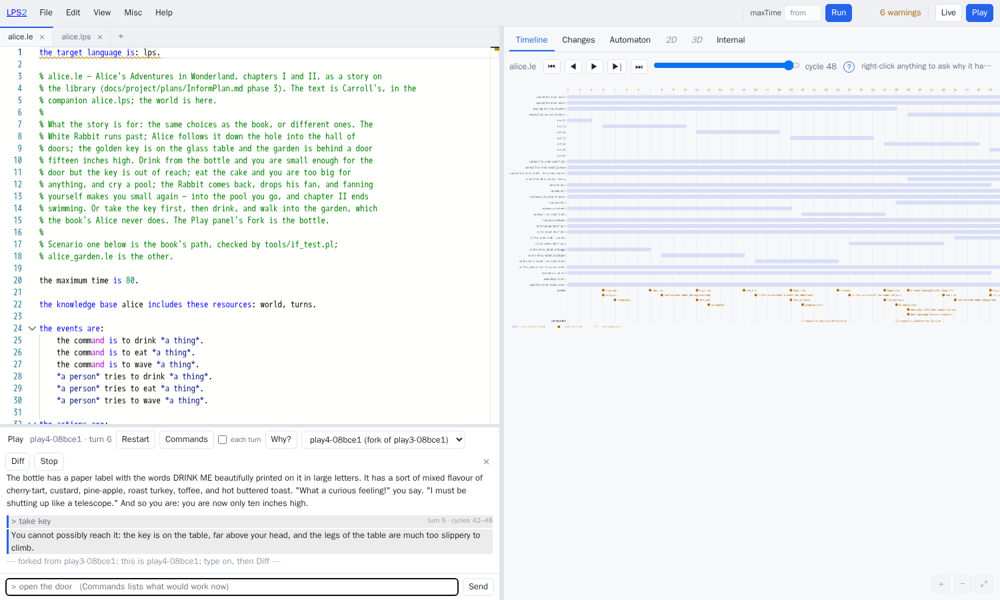

```sh
LPS_LE2_LIB=/LogicalEnglish2 ./lps play examples/if/alice.le
```

`why` on the terminal, or *Why?* in the panel, asks the engine why the last turn
went as it did; `fork`, `switch` and `diff` are there too.

---

# Part five — agents

## 21. A language model that cannot authorise itself

The claim Part II of the plan rests on is that **the model is never the thing
that authorises the dangerous action** — and not because anybody asked the model
nicely, but because the fluent that grants the authority cannot be reached from
the model's channel.

`examples/agents/llm/approval.lps`:

```prolog
%  Causal laws
request_approval(A) initiates pending(A).
approval(grant, A)  initiates approved(A).
execute(A)          initiates done(A).
execute(A)          terminates approved(A).      % approval is good for one use

%  The gate
if   task_request(delete, File) from _ to T1, destructive(delete_file(File))
then request_approval(delete_file(File)) from T1 to T2,
     approved(delete_file(File)) at T3,
     execute(delete_file(File)) from T3 to T4.

%  The constraint
false execute(A), destructive(A), not approved(A).
```

`examples/agents/llm/demo.mjs` drives that program against a running session, with the model's
channel allowed to carry `task_request/2` and nothing else:

```
live session live6 — the llm channel may carry task_request/2 only

human:  “the application logs are stale, please delete app.log”
model:  perceived ["task_request(delete,app.log)"]
lps:    the gate fires — approval requested, execution withheld
        │ cycle 4: [request_approval(delete_file('app.log')),task_request(delete,'app.log')]

model:  now tries to approve its own request
        │ refused: ["approval(grant,delete_file('app.log'))"]
        │ REFUSED on channel llm: [approval(grant,delete_file('app.log'))]

lps:    at cycle 11 the state is ["pending(delete_file('app.log'))"]
        │ pending, never approved — the constraint is not advice

human:  approves, on the human channel
        │ cycle 12: [execute(delete_file('app.log')),approval(grant,delete_file('app.log'))]

lps:    it executed — the state is now ["done(delete_file('app.log'))"]
```

The model does the one thing only a language model can do — turn a sentence into
an event term — and nothing else. Everything after that is the engine.

Run the demonstration with a weak model, or with instructions telling the model
to lie, and the outcome is the same. `approved/1` can be reached only through a
causal law that an `approval/2` event sets off; `approval/2` is not on the list
of what the model's channel may send; and the engine checks the constraint that
blocks `execute`, rather than leaving that check to the thing being constrained.

The program above is a demonstration, and not the whole of Part II. What the demonstration
establishes is that the safety comes from the way the parts are connected
together, and that was the open question.

## 22. Minecraft

`examples/agents/minecraft/` is an LPS agent playing Minecraft, in two layers:

| layer | what runs there | rate |
|---|---|---|
| **controller** | mineflayer and its path-finder: walking, jumping, swinging, collisions, following a path | 20 steps a second |
| **supervisor** | an LPS session: standing goals, constraints, plans, explanations | 2 cycles a second |

The split into two layers is the point. The same arrangement is what Part V of
the plan proposes for industrial control, moved here from a drilling rig into a
game. The supervising layer **can be wrong without being dangerous**, because
the program's constraints sift every action that layer issues before the
controlling layer ever sees it.

**The two rates are deliberately not aligned.** LPS cycles are not tied to the
game's own step. A step is 50 milliseconds, and thinking does not have to happen
twenty times a second. Tying the two rates together would make the engine's rate
a property of the game rather than of the agent. Anything that has to react
faster than one cycle — falling, drowning, a creeper two blocks away — belongs
in the controlling layer, and some of it is there.

You need no account, no copy of the game and nothing to buy. **flying-squid** is
a Minecraft server written in JavaScript, and the bot connects to that server
without signing in anywhere.

```sh
node world.mjs &                # a local server on port 25565
node bot.mjs --program safety.lps
```

```
[bot] spawned
[lps] safety.lps running as live3, one cycle every 500 ms
[lps→bot] place_torch
[lps→bot] place_torch
```

`craft.lps` is the same bot planning instead of reacting:
`achieve has(wooden_pickaxe)`, with the recipes as causal laws and the tool
requirements as constraints:

```
events/2         [walk_to(tree)]
events/3         [chop(tree)]
events/4         [craft(plank)]
events/5         [craft(stick)]
events/6         [craft(wooden_pickaxe)]
```

Nothing in that file says *how* to get a pickaxe. The order comes out of the
search.

`prismarine-viewer` serves a view in a browser and draws the bot's current path
as a blue line — the supervising layer's decision made visible, with the
controlling layer walking it:

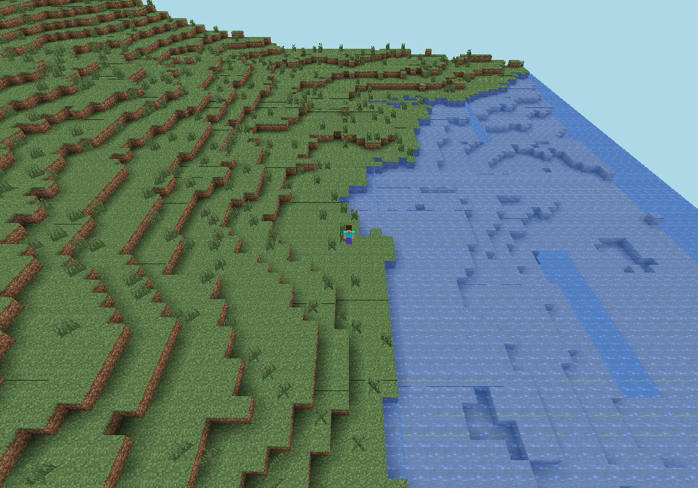

`prismarine-viewer` draws the map on the server rather than in the browser, and
so it needs the `canvas` module, which is written in the C language. That module
is something the example genuinely needs, not a footnote. On macOS, Windows and
mainstream Linux, npm downloads a ready-built copy. Where no ready-built copy
exists, the module wants Cairo and Pango, and `examples/agents/minecraft/DETAILS.md`
says which packages to install. The bot loads the viewer only when somebody asks
for it, so a machine without the viewer still runs the agent — only without the
picture.

## 23. Industrial control, still on paper

Part V of the plan is the industrial-control direction: LPS as a supervising
layer over controls that already exist, and in time a program that writes out
IEC 61131-3 Structured Text, the language such controllers are programmed in. No
code exists for any of that yet.

What the plan now names is the set of tools a demonstration would use: MATIEC to
turn Structured Text into C, Beremiz as the editor, and OpenPLC — a programmable
logic controller made of software rather than hardware — to run the result.
Naming those tools means the first piece of work in that direction starts from a
known target rather than from a survey.

The nearest thing to ready is the **supervising layer**: no writing out of code
at all, just this engine and the packaged image, running alongside existing
controls and changing nothing. Sessions that do not stop were the thing that
layer was waiting for.

---

# Part six

## 24. Deploying it

The packaged image is built in two stages. First Node.js builds the editor from
`ui/` into `src/ide/dist/`. Then SWI-Prolog serves the engine, the web interface
and the editor on one port. The image that actually runs has no Node.js in it.

`fly.toml` and `buildPush.sh` put the image on a server.
[`deploy.md`](../../dev/deploy.md) covers running LPS2 alongside LE2. One
browser has to be able to reach both servers, so the settings that let a page
from one site call the other have to be right.

`LPS_TOKEN` sets the token, the secret word, that the web interface demands.
`LPS_ORIGIN` limits which other sites may call the web interface. The server
reads the five suppliers' keys from its own settings, and a key set there takes
precedence over anything a browser sends.

## 24a. How it was built, and what that cost

Six practices did most of the work, and those six are the part of this project
that would carry over to another one.

**Check against the old engine first, and let nothing past until it passes.** The
very first piece of work was not code but the testing: run *LPS1* over all of its
own examples, sort each example according to whether its recorded run survives
being disturbed, and write the numbers down. Nothing else was allowed to begin
until the new engine reproduced those runs.

That order of work is uncomfortable, and it means several weeks with nothing to
show. That order is also why every feature added since could go in without
anybody wondering whether it had broken the meaning of the language.

**Write down what the old code chooses.** `selection_spec.md` exists because a
recorded run captures *the choice the 2021 engine happened to make*, and
reproducing that choice without naming it is imitation without understanding.
Twenty numbered points, each marked load-bearing or incidental. Five of them,
SP16 to SP20, came to light when the new engine failed a test.

**Write the checker before the translator.** For PDDL, a separate plan checker
was written first. For Drools, the behaviour expected of each set of rules was
written first. A translator checked only by "the result looks like PDDL" is
checked by nobody.

**Let a machine enforce the rule about how the system is arranged.**
`tools/lint_core.pl` runs before every change is recorded. Keeping the engine
free of everything else was not a principle anybody had to remember: breaking it
stopped the build. Keeping to that rule is why turning the engine into
WebAssembly took a day rather than a rewrite.

**Never guess where you could report.** A `.le` file with no LE2 set up is
refused, not approximated. `salience` in a Drools file becomes a warning.
An explanation the record cannot support is "not recorded".

**Take the pictures from the running system.** `tools/doc_shots.cjs` illustrates
both this document and the tutorial from a running server, and that run fails if
the browser reports an error or if any request fails. Photographing the panes for
this document, rather than merely using them, turned up three real defects in the
interface: overlapping labels on the timeline, a state diagram cut off at the
edge, and a scene left over from the previous program.

The last of the six generalises: **writing the documentation is a test**. Writing
§21 is what uncovered that `app.log`, written without quotation marks around it,
was being read as a compound term rather than as a plain name, so the
demonstration had been reporting a success it never achieved.

## 25. What is not there

- **`dumplps/0`**, the direction from the internal form back to LPS1's written
  form. `./lps dump --syntax legacy` says as much rather than producing an
  approximation, because the plan treats that round trip as a *test*, and a
  reverse translator that half worked would claim an agreement it had not
  earned. The other direction, from the internal form back to Logical English —
  the one the plan actually depends on — is done.
- **The 2D canvas follows the theme, and LPS1's programs do not know that.**
  Every shape is drawn and the y axis is the right way up, but a program that
  assumed a white background — black text set with `fillColor:black`, as
  `burning.pl` does — is hard to read on the dark one. A program has no way of
  stating its own background, and inventing one would be a change to the
  language rather than a repair to the drawing. Switching theme is the way round
  the problem.
- **`prospectiveGoat2` is 2.4 times slower than LPS1.** Everything else is
  faster.
- **PDDL plans are not always the shortest** on gripper-style problems, and the
  logistics domain was still searching after forty minutes (§18). The planner is
  the limitation, not the translation, and `tools/pddl_test.pl` therefore does
  not finish either.
- **Ways in not attempted**: Jason, DECLARE/BPMN, behaviour trees.
- **Ways out: none.** Part V is entirely on paper.
- **Part II beyond the demonstration**, and the MCP interface — MCP being the
  Model Context Protocol, an agreed way of offering tools to a language model —
  which is probably the single most useful thing left to do.
- **`conformance_report.md`** — LPS1's own numbers — is kept with the project,
  but the file of results it was made from is not, so making it again needs a
  complete LPS1 run of about 35 minutes.
- **LE2's own verifier does not know about the `lps` target.** A document aimed
  at LPS is reported as having "only facts and no rules", and its templates are
  reported as unused, because both of those checks count Prolog clauses and an
  LPS program asserts none. The program still translates and runs. A fix of two
  predicates in `le_verifier.pl` has been written and deliberately *not*
  committed: the fix belongs to the other project, which this work does not
  change.

## 26. Where to start

```sh
./lps run examples/start/goat_declarative.pl        # the puzzle, stated rather than solved
cd ui && npm install && npm run build         # once
./lps ide                                     # everything else
```

Then:

- **[`lps_tutorial.md`](../tutorials/lps-tutorial.md)** — how to write LPS programs, from a
  two-line one to sessions that do not stop.
- **[`glossary.md`](../reference/glossary.md)** — every term used in these documents.
- **[`UsingTheIDE.md`](../guide/ide.md)** — the environment, part by part, with a
  "how do I …" section.
- **[`LPS2abstract.md`](abstract.md)** — two pages, for someone deciding
  whether to read any of this.
- **[`lps_summary.md`](../reference/lps.md)** — the reference.
- **[`LPSplusLLM.md`](../../project/plan-of-record.md)** — the development plan: the milestones,
  the obligation to reproduce LPS1's behaviour, and everything above stated as a
  requirement before it was stated as a fact.
- **[`selection_spec.md`](../../dev/semantics/selection-spec.md)** — for anyone who wants to know
  what the engine actually does when two rules want things that cannot both
  happen.
- **`examples/`**, and the 178 programs two clicks away in the list of examples.
